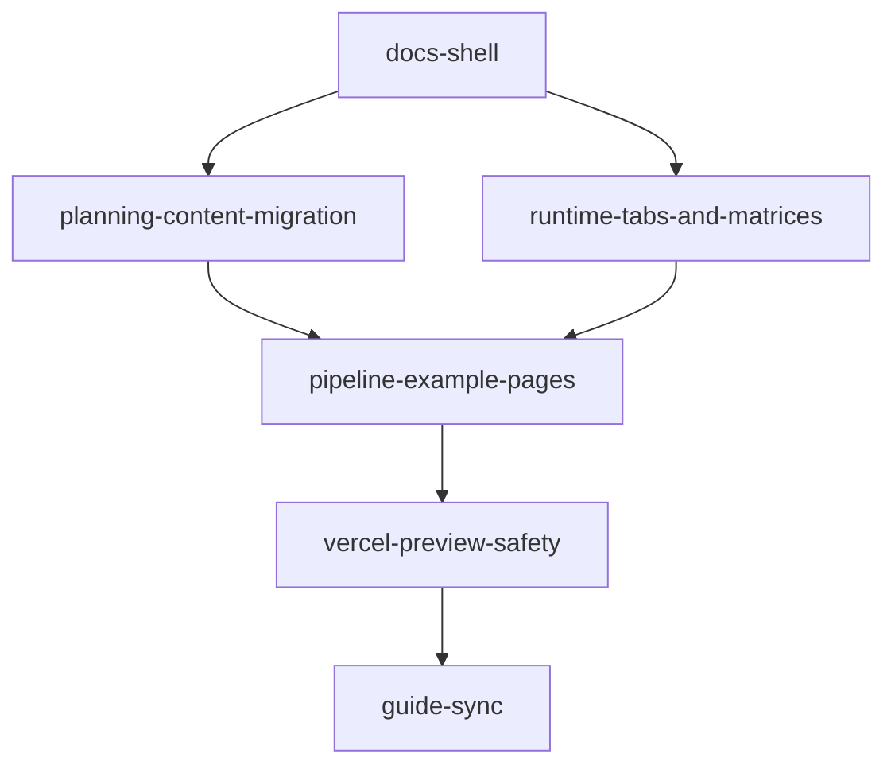

# Children Features: EPIC-20260527-001

## Feature 목록

| Feature | 우선순위 | 시작 조건 | 권장 시작점 | 완료 기준 |
| --- | --- | --- | --- | --- |
| `docs-shell` | P0 | Epic 승인 | `/plan-draft` | 홈, planning index, docs shell route가 렌더링된다. |
| `planning-content-migration` | P0 | `docs-shell` 기본 route | `/plan-draft` | 기존 planning HTML 핵심 내용이 route data로 이동한다. |
| `runtime-tabs-and-matrices` | P1 | content model 확정 | `/plan-prd` | Claude/Codex 탭과 capability matrix가 접근 가능하게 동작한다. |
| `pipeline-example-pages` | P1 | Epic 산출물 존재 | `/plan-draft` | 웹사이트 구현 과정 예시 route가 제공된다. |
| `vercel-preview-safety` | P1 | 주요 route 구현 | `/plan-prd` | build, link, protected path, Preview 기준이 문서화되고 검증된다. |
| `guide-sync` | P2 | 구현 결과 확정 | `/plan-bridge` | `docs/guide`, `docs/meta-tooling`, README 반영 여부가 정리된다. |

## 의존성

## Feature별 pipeline 결정

| Feature | idea/screen | draft | PRD | wireframe | design | stitch | bridge | dev |
| --- | --- | --- | --- | --- | --- | --- | --- | --- |
| `docs-shell` | full | required | required | required | required | checkpoint | required | required |
| `planning-content-migration` | full | required | required | optional | required | checkpoint | required | required |
| `runtime-tabs-and-matrices` | lightweight | optional | required | optional | required | checkpoint | required | required |
| `pipeline-example-pages` | full | required | required | required | required | checkpoint | required | required |
| `vercel-preview-safety` | full | optional | required | not needed | applicability | applicability | required | required |
| `guide-sync` | brief | not needed | optional | not needed | applicability | applicability | required | docs-only |

## 공통 완료 조건

- 각 Feature는 `Feature idea brief`를 가진다.
- P5.5 `/plan-design`과 P6 `/plan-stitch`는 실제 활용 여부와 관계없이 checkpoint를 남긴다.
- core protected path 변경은 Feature 범위 밖으로 본다.
- 각 구현 단위는 review와 commit으로 닫는다.

