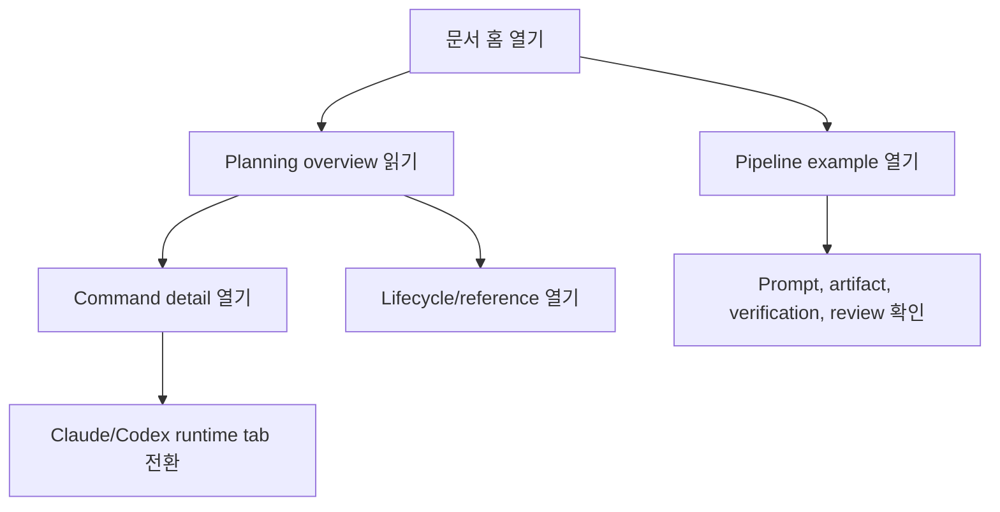
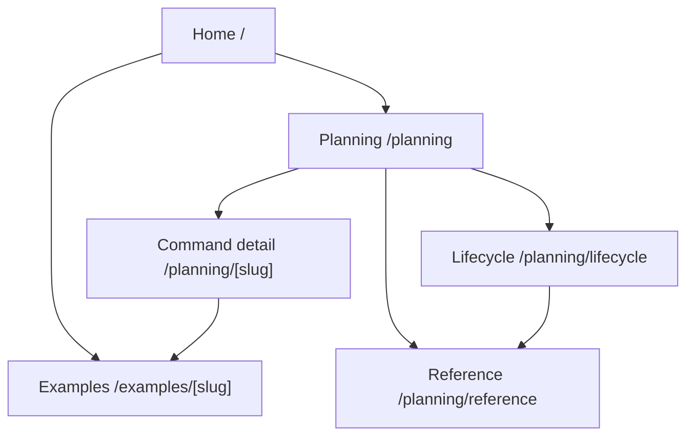

# Archive: `claude-kit` 사용자 가이드 웹사이트

> **Key**: UGW | **Slug**: `user-guide-website` | **IDEA**: `IDEA-20260527-001`
> **Category**: Standard | **RICE Score**: 60.0 | **Archived**: 2026-05-27
> **Code Location**: `src/app`, `src/components/docs`, `src/lib/docs` | **Improvements**: 0
> **Pipeline**: P1 -> P2 -> P2.5 -> P3 -> P4 -> P5 -> P5.5 -> P6 -> P7 -> D1 -> D2 -> R1 -> R2 -> A1 -> A2

## 1. Metadata

| Field | Value |
| --- | --- |
| Title | Next.js 기반 `claude-kit` 사용자 가이드 웹사이트 |
| Status | archived |
| Archive root | `.plans/archive/user-guide-website/` |
| Source count | 37 files |
| Verification | `pnpm test`, `pnpm docs:build`, `pnpm check:docs`, route smoke, protected path diff |

## 2. Source Manifest

| Source | Size |
| --- | ---: |
| `sources/bridge/03-bridge-wireframe.md` | 759 bytes |
| `sources/bridge/04-bridge-stitch.md` | 611 bytes |
| `sources/bridge/05-bridge-context.md` | 1357 bytes |
| `sources/epic/EPIC-20260527-001/00-epic-brief.md` | 1931 bytes |
| `sources/epic/EPIC-20260527-001/01-children-features.md` | 3464 bytes |
| `sources/feature/00-context/00-index.md` | 774 bytes |
| `sources/feature/00-context/01-prd-freeze.md` | 641 bytes |
| `sources/feature/00-context/02-decision-log.md` | 993 bytes |
| `sources/feature/00-context/03-design-checkpoint.md` | 1190 bytes |
| `sources/feature/00-context/06-architecture-binding.md` | 1382 bytes |
| `sources/feature/00-context/08-epic-binding.md` | 644 bytes |
| `sources/feature/01-draft/01-feature-draft.md` | 1683 bytes |
| `sources/feature/02-package/00-overview.md` | 1566 bytes |
| `sources/feature/02-package/01-requirements.md` | 1057 bytes |
| `sources/feature/02-package/02-ui-spec.md` | 1033 bytes |
| `sources/feature/02-package/03-flow.md` | 465 bytes |
| `sources/feature/02-package/04-api-spec.md` | 410 bytes |
| `sources/feature/02-package/05-db-migration-spec.md` | 215 bytes |
| `sources/feature/02-package/06-domain-logic.md` | 921 bytes |
| `sources/feature/02-package/07-error-handling.md` | 484 bytes |
| `sources/feature/02-package/08-dev-tasks.md` | 1032 bytes |
| `sources/feature/02-package/09-test-cases.md` | 764 bytes |
| `sources/feature/02-package/10-release-checklist.md` | 766 bytes |
| `sources/feature/03-dev-notes/dev-output-summary.md` | 1926 bytes |
| `sources/feature/04-review/01-self-review.md` | 1917 bytes |
| `sources/feature/04-review/02-route-gap-review-pipeline.md` | 10077 bytes |
| `sources/feature/04-review/03-route-gap-review-results.md` | 7800 bytes |
| `sources/feature/09-archive/01-archive-readiness.md` | 2609 bytes |
| `sources/ideas/IDEA-20260527-001.md` | 2374 bytes |
| `sources/ideas/SCREENING-20260527-001.md` | 2113 bytes |
| `sources/prd/user-guide-website-prd.md` | 4802 bytes |
| `sources/stitch/context.md` | 709 bytes |
| `sources/stitch/mapping.md` | 945 bytes |
| `sources/stitch/validation.md` | 382 bytes |
| `sources/wireframes/components.md` | 942 bytes |
| `sources/wireframes/navigation.md` | 758 bytes |
| `sources/wireframes/screens.md` | 2556 bytes |

## 3. Improvement History

| ID | Status | Summary |
| --- | --- | --- |
| none | none | 최초 archive 시점 개선 요청 없음 |

## 4. Inlined Sources

---

### Source: `sources/bridge/03-bridge-wireframe.md`

# Bridge Wireframe: user-guide-website

## 입력

- PRD: `.plans/prd/10-approved/user-guide-website-prd.md`
- Wireframes: `.plans/wireframes/user-guide-website/`
- Stitch mapping: `.plans/stitch/user-guide-website/mapping.md`

## 화면과 구현 대상 매핑

| SCR-ID | 구현 대상 |
| --- | --- |
| `SCR-001` | `src/app/page.tsx`, `src/components/docs/DocsShell.tsx` |
| `SCR-002` | `src/app/planning/page.tsx`, `src/lib/docs/navigation.ts` |
| `SCR-003` | `src/app/planning/[slug]/page.tsx`, `src/components/docs/PlanningCommandPage.tsx`, `src/components/docs/RuntimeTabs.tsx` |
| `SCR-004` | `src/app/planning/lifecycle/page.tsx`, `src/app/planning/reference/page.tsx` |
| `SCR-005` | `src/app/examples/[slug]/page.tsx`, `src/lib/docs/examples.ts` |

---

### Source: `sources/bridge/04-bridge-stitch.md`

# Bridge Stitch: user-guide-website

## Stitch 결정

`review-only`.

이번 재시작에서는 Google Stitch를 외부 산출물 source로 사용하지 않는다. P6는 PRD, wireframe, content alignment를 확인하고 design checkpoint를 생략하지 않기 위해 수행했다.

## 구현에 주는 의미

| 항목 | 규칙 |
| --- | --- |
| 디자인 source | 기존 HTML guide와 현재 docs-first Next prototype |
| Stitch asset | 없음 |
| 필수 검증 | `REQ/SCR` mapping과 content parity 확인 |
| 후속 작업 | 새로운 시각 아이덴티티가 필요할 때 별도 feature로 다룬다. |

---

### Source: `sources/bridge/05-bridge-context.md`

# Bridge Context: user-guide-website

- **단계**: P7 `/plan-bridge`
- **프롬프트 출처**: `docs/plans/user-guide-website/06-pipeline-prompt-runbook.md#9-p7-plan-bridge`

## 개발 handoff

승인된 PRD와 package 구조를 기준으로 사용자 가이드 웹사이트 구현을 검증하거나 보정한다.

## 허용 대상 경로

| 경로 | 목적 |
| --- | --- |
| `src/app/**` | Next.js routes |
| `src/components/docs/**` | 문서 UI 컴포넌트 |
| `src/lib/docs/**` | 정적 문서 content와 navigation model |
| `docs/plans/user-guide-website/**` | 파이프라인 문서와 실행 로그 |
| `.plans/**` | 파이프라인 산출물 |
| `package.json`, `next.config.mjs`, `tsconfig.json` | docs build/runtime 설정 |

## 보호 경로

다음 경로는 수정하지 않는다.

- `src/claude/**`
- `src/codex/**`
- `src/templates/**`
- `scripts/setup.js`
- `.claude/**`
- `.agents/**`
- `.codex/**`

## Task 분리

| Task | 연결 요구사항 |
| --- | --- |
| `TASK-UGW-001` | `REQ-UGW-001` |
| `TASK-UGW-002` | `REQ-UGW-002` |
| `TASK-UGW-003` | `REQ-UGW-003` |
| `TASK-UGW-004` | `REQ-UGW-004` |
| `TASK-UGW-005` | `REQ-UGW-005` |
| `TASK-UGW-006` | `REQ-UGW-006` |

## 검증 handoff

1. `pnpm docs:build`
2. 주요 docs route smoke
3. protected path diff
4. `.plans/features/active/user-guide-website/02-package/` 기준 review

---

### Source: `sources/epic/EPIC-20260527-001/00-epic-brief.md`

# EPIC-20260527-001: `claude-kit` 사용자 가이드 웹사이트

- **상태**: active
- **상위 아이디어**: `IDEA-20260527-001`
- **생성일**: 2026-05-27
- **프롬프트 출처**: `docs/plans/user-guide-website/06-pipeline-prompt-runbook.md#3-p25-plan-epic`

## 목표

기존 `docs/user-guide-html/**` 가이드를 Next.js 문서 웹사이트로 제공하고, 그 구현 과정을 `claude-kit` 파이프라인 예시로 문서화한다.

## Epic이 필요한 이유

| 기준 | 해당 여부 |
| --- | --- |
| 3개 이상 Feature | 6개 child feature가 필요하다. |
| 공통 요구사항 | protected path guard, build safety, content parity, accessibility가 여러 Feature에 걸친다. |
| 명시적 순서 | shell -> content -> example -> build safety -> handoff 순서가 필요하다. |

## 범위

| 포함 | 제외 |
| --- | --- |
| Next.js docs routes | production Vercel 배포 |
| planning command 상세 페이지 | 핵심 command/agent/skill 동작 변경 |
| 파이프라인 예시 페이지 | installer 변경 |
| build/link/protected-path 검증 | `src/claude`, `src/codex` runtime 변경 |

## 성공 기준

| 기준 | 목표 |
| --- | --- |
| 주요 route | Home, planning, command details, lifecycle, reference, examples |
| 파이프라인 추적성 | 모든 단계에 file-backed artifact 존재 |
| Build | `pnpm docs:build` 통과 |
| 비회귀 | protected path 변경 없음 |

## 주요 리스크

| 리스크 | 대응 |
| --- | --- |
| 파이프라인 문서가 형식적으로만 남음 | 단계별 skill, prompt, artifact, verification, review를 강제한다. |
| 웹사이트 작업이 core runtime을 침범 | protected path review와 diff check를 수행한다. |
| HTML 콘텐츠 누락 | HTML inventory와 route/source mapping으로 확인한다. |
| Next.js build가 package 소비자에게 영향 | docs 전용 script로 분리하고 postinstall 동작은 바꾸지 않는다. |

---

### Source: `sources/epic/EPIC-20260527-001/01-children-features.md`

# Children Features: EPIC-20260527-001

## Feature 맵

| ID | Feature | 목적 | 선행 조건 | 처리 방식 |
| --- | --- | --- | --- | --- |
| F1 | `docs-shell` | 레이아웃, 네비게이션, 공통 docs shell | 없음 | 상위 package 안에서 full planning |
| F2 | `planning-content-migration` | planning 페이지와 command 상세 페이지 전환 | F1 | 상위 package 안에서 full planning |
| F3 | `runtime-tabs-and-matrices` | Claude/Codex 탭과 비교 표 | F1, F2 | interaction requirement로 포함 |
| F4 | `pipeline-example-pages` | 이번 웹사이트 작업을 pipeline example로 설명 | F1, F2 | content requirement로 포함 |
| F5 | `vercel-preview-safety` | build와 preview 안전성 | F1-F4 | verification/release checklist로 포함 |
| F6 | `guide-sync` | `docs/guide`, `docs/meta-tooling`, README 후속 동기화 | F1-F5 | handoff로 분리 |

## 의존성 매트릭스

| Feature | F1 | F2 | F3 | F4 | F5 | F6 |
| --- | --- | --- | --- | --- | --- | --- |
| F1 `docs-shell` | - | before | before | before | before | before |
| F2 `planning-content-migration` | after | - | before | before | before | before |
| F3 `runtime-tabs-and-matrices` | after | after | - | parallel | before | before |
| F4 `pipeline-example-pages` | after | after | parallel | - | before | before |
| F5 `vercel-preview-safety` | after | after | after | after | - | before |
| F6 `guide-sync` | after | after | after | after | after | - |

## Feature idea brief

### F1 `docs-shell`

- **문제**: 정적 HTML 페이지는 장기 확장과 탐색이 어렵다.
- **사용자 가치**: 안정적인 landing, sidebar, page layout을 제공한다.
- **범위**: Next.js app shell, navigation model, 기본 styling.
- **리스크**: 문서가 아니라 marketing landing page처럼 보일 수 있다.

### F2 `planning-content-migration`

- **문제**: planning 페이지가 있지만 웹사이트식 깊은 탐색 구조가 부족하다.
- **사용자 가치**: 각 command의 입력, 산출물, 위치를 자세히 볼 수 있다.
- **범위**: planning index와 command detail pages.
- **리스크**: 전환 중 콘텐츠 누락 가능성.

### F3 `runtime-tabs-and-matrices`

- **문제**: Claude와 Codex 동작이 혼동될 수 있다.
- **사용자 가치**: runtime 차이를 탭과 표로 명확히 확인한다.
- **범위**: tab component, capability matrix, 비교 표.
- **리스크**: 탭이 중요한 제약을 숨길 수 있다.

### F4 `pipeline-example-pages`

- **문제**: 사용자는 command 설명뿐 아니라 실제 실행 예시가 필요하다.
- **사용자 가치**: 웹사이트 구현 과정 자체를 재사용 가능한 예시로 본다.
- **범위**: example pages와 pipeline artifact 설명.
- **리스크**: 실행 로그가 약하면 예시 페이지가 오해를 만든다.

### F5 `vercel-preview-safety`

- **문제**: Next.js 추가가 package/build 전제에 영향을 줄 수 있다.
- **사용자 가치**: preview 중심으로 안전하게 검증한다.
- **범위**: build, route smoke, protected path diff, preview handoff.
- **리스크**: production 배포를 너무 일찍 진행할 수 있다.

### F6 `guide-sync`

- **문제**: 웹사이트가 생긴 뒤 기존 guide 문서와 드리프트가 생길 수 있다.
- **사용자 가치**: 후속 동기화 대상이 명확해진다.
- **범위**: handoff 목록만 작성.
- **리스크**: 관련 없는 문서까지 scope creep이 생길 수 있다.

---

### Source: `sources/feature/00-context/00-index.md`

# Context Index: user-guide-website

| 파일 | 역할 |
| --- | --- |
| `01-prd-freeze.md` | 승인 PRD 결정 스냅샷 |
| `02-decision-log.md` | 이번 재시작의 결정 이력 |
| `03-design-checkpoint.md` | P5.5 디자인 checkpoint |
| `06-architecture-binding.md` | architecture SSOT와 feature 연결 |
| `08-epic-binding.md` | 상위 Epic과 child feature 연결 |

## Dev 단계 필수 읽기 문서

1. `.plans/prd/10-approved/user-guide-website-prd.md`
2. `.plans/bridge/user-guide-website/03-bridge-wireframe.md`
3. `.plans/bridge/user-guide-website/04-bridge-stitch.md`
4. `.plans/bridge/user-guide-website/05-bridge-context.md`
5. `.plans/project/00-dev-architecture.md`
6. `.plans/features/active/user-guide-website/00-context/06-architecture-binding.md`

---

### Source: `sources/feature/00-context/01-prd-freeze.md`

# PRD Freeze: user-guide-website

## 고정된 PRD

`.plans/prd/10-approved/user-guide-website-prd.md`

## 고정 요구사항

| REQ-ID | 요약 |
| --- | --- |
| `REQ-UGW-001` | Docs shell과 navigation |
| `REQ-UGW-002` | Planning guide route coverage |
| `REQ-UGW-003` | Claude/Codex runtime tab과 matrix |
| `REQ-UGW-004` | Pipeline example pages |
| `REQ-UGW-005` | Build와 protected path verification |
| `REQ-UGW-006` | 후속 guide sync handoff |

## Freeze 규칙

구현과 리뷰는 위 `REQ-ID`를 기준으로 진행한다. 요구사항이 바뀌면 먼저 PRD를 수정하고 `02-decision-log.md`에 결정을 기록한다.

---

### Source: `sources/feature/00-context/02-decision-log.md`

# 결정 로그: user-guide-website

| DEC-ID | 날짜 | 결정 | 이유 |
| --- | --- | --- | --- |
| `DEC-UGW-001` | 2026-05-27 | 이전 planning artifact를 그대로 완료로 보지 않고 재시작한다. | 이전 산출물이 일부 retroactive였기 때문이다. |
| `DEC-UGW-002` | 2026-05-27 | 기존 문서는 archive 후 교체한다. | 이력을 보존하고 파괴적 삭제를 피하기 위해서다. |
| `DEC-UGW-003` | 2026-05-27 | 기존 Next.js 구현은 prototype/evidence로 취급한다. | 구현은 존재하지만 pipeline 산출물은 다시 만들어야 한다. |
| `DEC-UGW-004` | 2026-05-27 | UI는 docs-first로 유지한다. | 사용자가 landing page보다 상세 문서를 원했다. |
| `DEC-UGW-005` | 2026-05-27 | Google Stitch는 `review-only`로 기록한다. | 외부 디자인 생성이 이번 작업의 핵심이 아니다. |
| `DEC-UGW-006` | 2026-05-27 | production 배포는 이번 범위에서 제외한다. | Preview/build 검증이 먼저다. |

---

### Source: `sources/feature/00-context/03-design-checkpoint.md`

# Design Checkpoint: user-guide-website

- **단계**: P5.5 `/plan-design`
- **프롬프트 출처**: `docs/plans/user-guide-website/06-pipeline-prompt-runbook.md#7-p55-plan-design`

## 결정

기존 HTML guide의 시각 방향은 참고하되, Next.js 사이트는 landing page가 아니라 docs-first interface로 구현한다.

## Claude Design 사용 여부

| 항목 | 결정 |
| --- | --- |
| 외부 Claude Design 실행 | 이번 재시작에서는 필요 없음 |
| 이유 | 새 visual identity보다 문서 구조와 증거 복구가 목적이다. |
| 필수 기록 | P5.5를 생략하지 않기 위해 checkpoint를 남긴다. |

## UI 원칙

| 원칙 | 적용 |
| --- | --- |
| Docs-first | 긴 설명, 표, command reference, artifact path를 읽기 쉽게 만든다. |
| Runtime clarity | Claude/Codex 차이를 tab 또는 matrix로 보여준다. |
| Calm visual style | marketing-heavy hero보다 문서형 구조를 우선한다. |
| Accessibility | tab, link, table이 모바일에서도 읽혀야 한다. |

## P6 Handoff

`/plan-stitch`는 PRD 요구사항, wireframe screen, 현재 HTML/Next prototype 구조를 비교한다. 외부 visual asset은 필요하지 않다.

---

### Source: `sources/feature/00-context/06-architecture-binding.md`

# Architecture Binding: user-guide-website

## 연결된 Architecture

`.plans/project/00-dev-architecture.md`

## Structure Mode

`hybrid-docs-app`

## 허용 대상 경로

| 경로 | Layer |
| --- | --- |
| `src/app/**` | Next.js route layer |
| `src/components/docs/**` | Docs UI component layer |
| `src/lib/docs/**` | Static content/data layer |
| `src/app/globals.css` | Docs styling layer |
| `docs/plans/user-guide-website/**` | Pipeline docs |
| `.plans/**` | Pipeline artifacts |
| `package.json`, `next.config.mjs`, `tsconfig.json`, `next-env.d.ts` | Build/config layer |

## 금지 경로

| 경로 | 이유 |
| --- | --- |
| `src/claude/**` | Claude core source |
| `src/codex/**` | Codex core source |
| `src/templates/**` | installer/template source |
| `scripts/setup.js` | installer behavior |
| `.claude/**`, `.agents/**`, `.codex/**` | runtime/generated/tooling surfaces |

## Layer Mapping

| 요구사항 | 주 layer | 검증 증거 |
| --- | --- | --- |
| `REQ-UGW-001` | Route + UI component | Home/planning route smoke |
| `REQ-UGW-002` | Content data + route | Planning pages coverage |
| `REQ-UGW-003` | UI component | Runtime tab behavior review |
| `REQ-UGW-004` | Content data + example route | Example page route smoke |
| `REQ-UGW-005` | Build/config | `pnpm docs:build`, protected path diff |
| `REQ-UGW-006` | Docs artifacts | Handoff doc review |

---

### Source: `sources/feature/00-context/08-epic-binding.md`

# Epic Binding: user-guide-website

| 항목 | 값 |
| --- | --- |
| Epic | `EPIC-20260527-001` |
| Feature slug | `user-guide-website` |
| Parent IDEA | `IDEA-20260527-001` |
| 상태 | active |

## Child Feature Coverage

| Epic child | 연결 산출물 |
| --- | --- |
| F1 `docs-shell` | `REQ-UGW-001` / `TASK-UGW-001` |
| F2 `planning-content-migration` | `REQ-UGW-002` / `TASK-UGW-002` |
| F3 `runtime-tabs-and-matrices` | `REQ-UGW-003` / `TASK-UGW-003` |
| F4 `pipeline-example-pages` | `REQ-UGW-004` / `TASK-UGW-004` |
| F5 `vercel-preview-safety` | `REQ-UGW-005` / `TASK-UGW-005` |
| F6 `guide-sync` | `REQ-UGW-006` / `TASK-UGW-006` |

---

### Source: `sources/feature/01-draft/01-feature-draft.md`

# Feature Draft: user-guide-website

- **단계**: P3 `/plan-draft`
- **입력**: `IDEA-20260527-001`, `EPIC-20260527-001`
- **프롬프트 출처**: `docs/plans/user-guide-website/06-pipeline-prompt-runbook.md#4-p3-plan-draft`

## 한 줄 요약

기존 HTML 가이드를 유지보수 가능한 Next.js 문서 웹사이트로 전환하고, 그 과정을 `claude-kit` 파이프라인 예시로 기록한다.

## 주요 사용자

| 사용자 | 필요 |
| --- | --- |
| 신규 `claude-kit` 사용자 | planning/development command를 단계별로 이해 |
| maintainer | 웹사이트 변경이 runtime 기능을 침범하지 않는지 확인 |
| Claude/Codex 병행 사용자 | runtime 차이와 산출물 위치를 명확히 이해 |

## 사용자 흐름

1. 사용자가 문서 웹사이트를 연다.
2. overview와 planning pipeline을 읽는다.
3. `/plan-idea`, `/plan-epic` 같은 command 상세 페이지로 이동한다.
4. 필요한 곳에서 Claude/Codex tab을 전환한다.
5. lifecycle, reference, example page에서 더 깊은 흐름을 확인한다.

## Route 영향

| Route | 목적 |
| --- | --- |
| `/` | Overview와 진입점 |
| `/planning` | Planning pipeline map |
| `/planning/[slug]` | Command detail pages |
| `/planning/lifecycle` | Artifact lifecycle |
| `/planning/reference` | Reference and rules |
| `/examples/[slug]` | Pipeline execution examples |

## 보호 경계

이 기능으로 `src/claude/**`, `src/codex/**`, `src/templates/**`, `scripts/setup.js`, `.claude/**`, `.agents/**`, `.codex/**`를 수정하지 않는다.

## Draft 결정

여러 route, content model, UI component, verification gate가 있으므로 Standard PRD로 진행한다.

---

### Source: `sources/feature/02-package/00-overview.md`

# 기능 패키지 개요: user-guide-website

- **생성 단계**: D1 `/dev-feature`
- **스킬 계약**: `dev-feature-plan`
- **PRD**: `.plans/prd/10-approved/user-guide-website-prd.md`
- **Bridge context**: `.plans/bridge/user-guide-website/05-bridge-context.md`

## Structure Mode

`hybrid-docs-app`

## 허용 대상 경로

| 경로 | 목적 |
| --- | --- |
| `src/app/**` | Next.js routes |
| `src/components/docs/**` | Docs components |
| `src/lib/docs/**` | Static content and navigation |
| `src/app/globals.css` | Docs styling |
| `docs/plans/user-guide-website/**` | Pipeline docs |
| `.plans/**` | Pipeline artifacts |
| `package.json`, `next.config.mjs`, `tsconfig.json`, `next-env.d.ts` | Build/config |

## Layer Mapping

| Layer | 파일 |
| --- | --- |
| Route | `src/app/page.tsx`, `src/app/planning/**`, `src/app/examples/**` |
| Component | `src/components/docs/**` |
| Data | `src/lib/docs/**` |
| Verification docs | `.plans/features/active/user-guide-website/03-dev-notes/**` |

## Stack Contract

| 항목 | 계약 |
| --- | --- |
| Framework | Next.js app router |
| Language | TypeScript + React |
| Package manager | pnpm |
| Build command | `pnpm docs:build` |
| Test command | `pnpm test` |

## Shared-vs-Local Rule

Docs UI와 data는 docs site 내부에 둔다. Runtime `claude-kit` 자산은 기존 source tree에 유지하고, 이 기능으로 수정하지 않는다.

## Dev 준비 상태

`01-requirements.md`, `08-dev-tasks.md`, `09-test-cases.md`가 서로 연결되어 있으므로 `/dev-run` 기준으로 검증 가능하다.

---

### Source: `sources/feature/02-package/01-requirements.md`

# Requirements: user-guide-website

이 파일은 Feature Package의 요구사항 SSOT다.

| REQ-ID | 우선순위 | 요구사항 | 수용 기준 |
| --- | --- | --- | --- |
| `REQ-UGW-001` | Must | home, navigation, 일관된 page layout을 가진 docs shell 제공 | `/`와 `/planning`이 shared docs shell로 렌더링된다. |
| `REQ-UGW-002` | Must | planning guide content를 route-backed docs page로 전환 | planning index, command pages, lifecycle, reference routes가 존재한다. |
| `REQ-UGW-003` | Must | Claude/Codex 차이를 tab 또는 matrix로 표시 | runtime comparison UI가 명확하고 접근 가능하다. |
| `REQ-UGW-004` | Must | 이번 재시작 기반 pipeline example page 추가 | example routes가 prompt/runbook/execution artifacts를 참조한다. |
| `REQ-UGW-005` | Must | build와 protected path verification 제공 | build가 통과하고 protected path diff가 기록된다. |
| `REQ-UGW-006` | Should | guide/meta-tooling 후속 sync target 기록 | handoff 문서에 후속 업데이트 대상이 명시된다. |

---

### Source: `sources/feature/02-package/02-ui-spec.md`

# UI Spec: user-guide-website

## 화면 커버리지

| SCR-ID | UI 목표 | 요구사항 |
| --- | --- | --- |
| `SCR-001` | Docs home | `REQ-UGW-001`, `REQ-UGW-004` |
| `SCR-002` | Planning index | `REQ-UGW-002` |
| `SCR-003` | Command detail | `REQ-UGW-002`, `REQ-UGW-003` |
| `SCR-004` | Lifecycle/reference | `REQ-UGW-002`, `REQ-UGW-006` |
| `SCR-005` | Pipeline example | `REQ-UGW-004`, `REQ-UGW-005` |

## 컴포넌트 요구사항

| Component | 요구사항 | 메모 |
| --- | --- | --- |
| `DocsShell` | `REQ-UGW-001` | 공통 layout과 navigation |
| `PageHeader` | `REQ-UGW-001` | 일관된 title/summary block |
| `PlanningCommandPage` | `REQ-UGW-002` | 상세 command docs |
| `RuntimeTabs` | `REQ-UGW-003` | Claude/Codex runtime comparison |
| Example route template | `REQ-UGW-004` | Prompt와 artifact evidence |

## 접근성 메모

- 탭은 색상에만 의존하지 않아야 한다.
- 링크 텍스트는 이동 목적을 알 수 있어야 한다.
- 표는 짧은 header와 읽기 쉬운 cell을 유지한다.

---

### Source: `sources/feature/02-package/03-flow.md`

# Flow Spec: user-guide-website



## Traceability Flow

`IDEA-20260527-001 -> SCREENING-20260527-001 -> EPIC-20260527-001 -> REQ-UGW-* -> TASK-UGW-* -> TC-UGW-*`

---

### Source: `sources/feature/02-package/04-api-spec.md`

# API Spec: user-guide-website

이 기능에는 runtime API가 필요하지 않다.

문서 웹사이트는 `src/lib/docs/**`의 static TypeScript content를 사용한다.

## Non-API Contract

| Data source | Consumer |
| --- | --- |
| `src/lib/docs/navigation.ts` | Docs shell navigation |
| `src/lib/docs/planning-pages.ts` | Planning route pages |
| `src/lib/docs/examples.ts` | Pipeline example routes |

---

### Source: `sources/feature/02-package/05-db-migration-spec.md`

# DB Migration Spec: user-guide-website

DB migration은 필요하지 않다.

## 이유

이 기능은 정적 문서 웹사이트다. 저장소, 사용자 계정, 서버 데이터 변경을 도입하지 않는다.

---

### Source: `sources/feature/02-package/06-domain-logic.md`

# Domain Logic: user-guide-website

## Domain Concepts

| 개념 | 의미 |
| --- | --- |
| Docs route | Next.js 문서 사이트의 사용자-facing page |
| Planning command page | 하나의 `claude-kit` planning command를 설명하는 route |
| Runtime comparison | Claude/Codex별 설명을 tab 또는 matrix로 보여주는 영역 |
| Pipeline evidence | 작업이 파이프라인을 따랐음을 보여주는 prompt, artifact, verification, review 기록 |

## 규칙

| 규칙 | 요구사항 |
| --- | --- |
| Content source rule | Planning page는 `docs/user-guide-html/**`와 `.plans/**`에 추적 가능해야 한다. |
| Runtime rule | Codex가 Claude slash command를 직접 지원한다고 암시하지 않는다. |
| Pipeline rule | 산출물이 없으면 해당 단계를 실행했다고 주장하지 않는다. |
| Safety rule | 웹사이트 작업으로 protected core path를 수정하지 않는다. |

---

### Source: `sources/feature/02-package/07-error-handling.md`

# Error Handling: user-guide-website

| 오류/실패 | 처리 |
| --- | --- |
| planning page slug 누락 | Next.js `notFound()`로 처리 |
| example slug 누락 | not-found 상태 렌더링 |
| 깨진 내부 링크 | route/link verification에서 기록 |
| build 실패 | 완료 중단 후 `03-dev-notes/dev-output-summary.md`에 실패 기록 |
| protected path diff 발생 | high severity review issue로 처리 |
| runtime 설명 불일치 | release 전 문서 내용 수정 |

---

### Source: `sources/feature/02-package/08-dev-tasks.md`

# Dev Tasks: user-guide-website

| TASK-ID | 상태 | REQ | TC | 대상 경로 |
| --- | --- | --- | --- | --- |
| `TASK-UGW-001` | evidence-done | `REQ-UGW-001` | `TC-UGW-001` | `src/app/page.tsx`, `src/components/docs/DocsShell.tsx` |
| `TASK-UGW-002` | evidence-done | `REQ-UGW-002` | `TC-UGW-002` | `src/app/planning/**`, `src/lib/docs/planning-pages.ts` |
| `TASK-UGW-003` | evidence-done | `REQ-UGW-003` | `TC-UGW-003` | `src/components/docs/RuntimeTabs.tsx` |
| `TASK-UGW-004` | evidence-done | `REQ-UGW-004` | `TC-UGW-004` | `src/app/examples/[slug]/page.tsx`, `src/lib/docs/examples.ts` |
| `TASK-UGW-005` | verified | `REQ-UGW-005` | `TC-UGW-005` | `package.json`, `next.config.mjs`, verification logs |
| `TASK-UGW-006` | done-docs | `REQ-UGW-006` | `TC-UGW-006` | `docs/plans/user-guide-website/**`, `.plans/**` |

## 중요 메모

`evidence-done`은 현재 구현이 이미 존재하며 이번 package에 매핑되었다는 뜻이다. 처음부터 파이프라인이 해당 코드를 생성했다는 뜻은 아니다.

---

### Source: `sources/feature/02-package/09-test-cases.md`

# Test Cases: user-guide-website

| TC-ID | REQ | 검증 | 기대 결과 |
| --- | --- | --- | --- |
| `TC-UGW-001` | `REQ-UGW-001` | `/`, `/planning` 열기 | shared docs shell이 렌더링된다. |
| `TC-UGW-002` | `REQ-UGW-002` | planning pages route smoke | command, lifecycle, reference pages가 렌더링된다. |
| `TC-UGW-003` | `REQ-UGW-003` | runtime tab UI review | Claude/Codex tab이 보이고 의미가 명확하다. |
| `TC-UGW-004` | `REQ-UGW-004` | `/examples/*` routes 열기 | pipeline example content가 렌더링된다. |
| `TC-UGW-005` | `REQ-UGW-005` | `pnpm docs:build`와 protected path diff | build가 통과하고 protected path 변경이 없다. |
| `TC-UGW-006` | `REQ-UGW-006` | handoff docs review | 후속 대상이 명확하다. |

---

### Source: `sources/feature/02-package/10-release-checklist.md`

# Release Checklist: user-guide-website

| 점검 | 상태 | 증거 |
| --- | --- | --- |
| `.plans` package 존재 | done | `.plans/features/active/user-guide-website/02-package/**` |
| PRD 승인 | done | `.plans/prd/10-approved/user-guide-website-prd.md` |
| Wireframe 매핑 | done | `.plans/wireframes/user-guide-website/**` |
| Stitch checkpoint 기록 | done | `.plans/stitch/user-guide-website/**` |
| Build 통과 | done | `pnpm docs:build` 통과, 24 static routes generated |
| Protected path diff clear | done | protected path 대상 `git diff --name-only` 결과 없음 |
| Review 완료 | done | `.plans/features/active/user-guide-website/04-review/01-self-review.md` |
| Production deployment | not-in-scope | 이번 범위는 preview/handoff까지 |

---

### Source: `sources/feature/03-dev-notes/dev-output-summary.md`

# Dev Output Summary: user-guide-website

- **단계**: D2 `/dev-run`
- **스킬 계약**: `dev-workflow`
- **Package source**: `.plans/features/active/user-guide-website/02-package/`
- **프롬프트 출처**: `docs/plans/user-guide-website/06-pipeline-prompt-runbook.md#11-d2-dev-run`

## 현재 구현 증거

현재 구현은 이미 존재하는 prototype/evidence로 취급한다. 아래 표는 해당 구현을 재시작된 Feature Package에 매핑한 결과다.

| TASK | 요구사항 | 증거 | 상태 |
| --- | --- | --- | --- |
| `TASK-UGW-001` | `REQ-UGW-001` | `src/app/page.tsx`, `src/app/planning/page.tsx`, `src/components/docs/DocsShell.tsx` | evidence-done |
| `TASK-UGW-002` | `REQ-UGW-002` | `src/app/planning/[slug]/page.tsx`, `src/app/planning/lifecycle/page.tsx`, `src/app/planning/reference/page.tsx`, `src/lib/docs/planning-pages.ts` | evidence-done |
| `TASK-UGW-003` | `REQ-UGW-003` | `src/components/docs/RuntimeTabs.tsx` | evidence-done |
| `TASK-UGW-004` | `REQ-UGW-004` | `src/app/examples/[slug]/page.tsx`, `src/lib/docs/examples.ts` | evidence-done |
| `TASK-UGW-005` | `REQ-UGW-005` | `package.json`, `next.config.mjs`, build command | verified |
| `TASK-UGW-006` | `REQ-UGW-006` | `docs/plans/user-guide-website/**`, `.plans/**` | done-docs |

## 검증 명령

| 명령 | 목적 | 상태 |
| --- | --- | --- |
| `pnpm test` | 기존 회귀 테스트 | 통과: 34 files, 423 tests |
| `pnpm docs:build` | Next.js docs build | 통과: 24 static routes generated |
| protected path diff | runtime source 변경 여부 확인 | 통과: 보호 경로 변경 없음 |

## 구현 경계 결과

이번 한글화와 파이프라인 재시작은 문서 산출물 정렬 작업이다. 구현 code gap이 발견되면 별도 구현 커밋으로 분리한다.

## 다음 dev action

최종 archive를 진행할지, 아니면 웹사이트 route별 세부 gap review를 먼저 진행할지 결정한다.

---

### Source: `sources/feature/04-review/01-self-review.md`

# Self Review: user-guide-website

- **단계**: R1 `/plan-review`
- **리뷰 기준**: `plan-review-criteria`
- **프롬프트 출처**: `docs/plans/user-guide-website/06-pipeline-prompt-runbook.md#12-r1-review`

## 리뷰 요약

| 영역 | 상태 | 메모 |
| --- | --- | --- |
| 파이프라인 완전성 | PASS | P1부터 D2까지 산출물이 존재한다. |
| `dev-feature-plan` 구조 | PASS | `02-package/00~10`이 존재한다. |
| Architecture prerequisite | PASS | Project architecture SSOT와 feature binding이 존재한다. |
| Protected path policy | PASS | 보호 경로 diff 결과가 비어 있다. |
| Build/test evidence | PASS | `pnpm test`, `pnpm docs:build`가 통과했다. |
| Archive readiness | PARTIAL | 최종 archive는 사용자 승인 후 진행한다. |

## 발견 사항

| ID | Severity | Confidence | 내용 | Action |
| --- | --- | --- | --- | --- |
| `REV-UGW-001` | high | confirmed | 이전 산출물은 retroactive 성격이 있어 skill-complete가 아니었다. | archive + restart로 수정 |
| `REV-UGW-002` | medium | confirmed | 현재 구현은 재시작 package보다 먼저 존재했다. | prototype/evidence로 명시 |
| `REV-UGW-003` | low | confirmed | 재시작 후 검증 갱신이 필요했다. | `pnpm test`, `pnpm docs:build`, protected path diff 실행 |

## PCC Review

| PCC | 결과 | 증거 |
| --- | --- | --- |
| PCC-01 Idea ↔ Screen | PASS | IDEA와 SCREENING 산출물 존재 |
| PCC-02 Screen ↔ Feature | PASS | 승인 아이디어가 active feature package로 연결됨 |
| PCC-03 Feature ↔ PRD | PASS | Draft와 승인 PRD가 정렬됨 |
| PCC-04 PRD ↔ Wireframe | PASS | `REQ/SCR` mapping 존재 |
| PCC-05 Wireframe ↔ Stitch | PASS | Stitch mapping과 validation 존재 |
| PCC-07 Epic Binding | PASS | `08-epic-binding.md`가 child feature를 매핑 |

## 리뷰 판정

커밋 가능. 현재 남은 high/critical 이슈는 없다.

---

### Source: `sources/feature/04-review/02-route-gap-review-pipeline.md`

# Route Gap Review Pipeline: user-guide-website

> **Purpose**: 최종 archive 전에 현재 Next.js 문서 사이트 구현을 route 단위로 다시 점검하고, 필요한 보정만 별도 커밋으로 분리한 뒤 archive readiness로 넘긴다.
> **Primary inputs**: `02-package/08-dev-tasks.md`, `02-package/09-test-cases.md`, `02-package/10-release-checklist.md`, `03-dev-notes/dev-output-summary.md`, `09-archive/01-archive-readiness.md`
> **Recommended mode**: review-first, code-fix-second, archive-last

## 1. 권장 결론

바로 archive로 가지 말고 아래 순서로 진행한다.

1. `R2` route gap review를 먼저 실행한다.
2. gap이 없으면 `A1` archive readiness를 최종 승인 대상으로 올린다.
3. gap이 있으면 최소 범위 코드 보정 커밋을 별도로 만든 뒤 `R2`를 재검증한다.
4. `R2`가 통과한 뒤에만 `09-archive/01-archive-readiness.md` 기준으로 archive를 실행한다.

이 순서를 추천하는 이유는 현재 기능이 이미 배포 가능 상태로 확인됐더라도, archive는 active planning package를 닫는 단계라서 route별 문서 품질과 실제 화면 범위를 한 번 더 고정해야 하기 때문이다.

## 2. 실행 단계

| Step | 이름 | 목적 | 결과 |
| --- | --- | --- | --- |
| `G0` | Workspace hygiene | review 전에 현재 작업트리와 generated output 상태를 분리한다. | review 대상과 제외 대상을 확정한다. |
| `R2` | Route gap review | `08-dev-tasks.md` 기준으로 route별 구현 gap을 확인한다. | gap board 또는 PASS 판정 |
| `F1` | Focused fix | 필요한 경우 docs site 코드만 최소 보정한다. | 별도 코드 보정 커밋 |
| `V1` | Verification refresh | 보정 후 build/test/docs check를 다시 실행한다. | archive 전 최신 evidence |
| `A1` | Archive approval | `01-archive-readiness.md` 기준으로 archive 가능 여부를 확정한다. | archive 실행 승인 |
| `A2` | Archive execution | active 산출물을 archive package로 이동한다. | `.plans/archive/user-guide-website/**` |

## 3. G0 Workspace Hygiene

### 목표

현재 작업트리에 남아 있는 변경이 route review나 docs site 보정과 섞이지 않게 한다.

### 확인 항목

| 확인 | 명령 | 판정 |
| --- | --- | --- |
| Git 상태 | `git status --short --branch` | source/docs site 변경과 generated output 변경을 분리한다. |
| docs site source 변경 | `git diff --name-only -- src/app src/components src/lib package.json next.config.mjs tsconfig.json` | route review 대상이다. |
| generated output 변경 | `git diff --name-only -- .claude .agents plugins AGENTS.md CLAUDE.md .claude-kit-meta.json` | 별도 커밋 또는 보류 대상으로 둔다. |

### 권장 판정

현재 남은 `.claude`, `.agents`, `plugins` 계열 변경은 docs site route gap review와 직접 관계가 낮다. 따라서 `R2/F1` 커밋에는 포함하지 않는다.

## 4. R2 Route Gap Review

### 기준 문서

`02-package/08-dev-tasks.md`를 기준으로 `TASK-UGW-001`부터 `TASK-UGW-006`까지 route와 산출물을 다시 매핑한다.

| TASK | 검토 범위 | 주요 route/source |
| --- | --- | --- |
| `TASK-UGW-001` | 홈/문서 shell | `/`, `src/app/page.tsx`, `src/components/docs/DocsShell.tsx` |
| `TASK-UGW-002` | planning route 전체 | `/planning`, `/planning/[slug]`, `src/lib/docs/planning-pages.ts` |
| `TASK-UGW-003` | Claude/Codex 탭 UX | `src/components/docs/RuntimeTabs.tsx`, planning 상세 페이지 |
| `TASK-UGW-004` | 실행 예시 페이지 | `/examples/[slug]`, `src/lib/docs/examples.ts` |
| `TASK-UGW-005` | build/deploy 설정 | `package.json`, `next.config.mjs`, lockfile |
| `TASK-UGW-006` | pipeline 기록/문서 | `docs/plans/user-guide-website/**`, `.plans/**` |

### route별 검토 목록

| Route | 검토 질문 | 기대 판정 |
| --- | --- | --- |
| `/` | 전체 가이드 진입, planning/examples 연결이 명확한가? | PASS 또는 copy gap |
| `/planning` | 전체 파이프라인 맵과 command 목록이 누락 없이 보이는가? | PASS 또는 navigation gap |
| `/planning/lifecycle` | 산출물 이동, 상태 전환, archive 흐름이 설명되는가? | PASS 또는 lifecycle gap |
| `/planning/reference` | command/agent/skill/rule/hook reference가 사용자가 찾기 쉬운가? | PASS 또는 reference gap |
| `/planning/plan-idea` | subagent/skill/hook/rule, 산출물 위치, Claude/Codex 탭이 충분한가? | PASS 또는 detail gap |
| `/planning/plan-screen` | screening 기준과 이동 규칙이 충분한가? | PASS 또는 scoring gap |
| `/planning/plan-epic` | epic이 누락 없이 별도 단계로 설명되는가? | PASS 또는 epic gap |
| `/planning/plan-draft` | epic 이후 feature draft 흐름이 자연스러운가? | PASS 또는 flow gap |
| `/planning/plan-prd` | PRD 작성 기준과 산출물 위치가 분명한가? | PASS 또는 content gap |
| `/planning/plan-wireframe` | wireframe 산출물과 디자인 전 단계 관계가 분명한가? | PASS 또는 design gap |
| `/planning/plan-design` | `plan-design`이 기본 디자인 경로이고 `plan-stitch`가 선택/보조임이 분명한가? | PASS 또는 branch gap |
| `/planning/plan-stitch` | Stitch는 선택적 Google Stitch 통합 경로로 설명되는가? | PASS 또는 optionality gap |
| `/planning/plan-bridge` | 개발 handoff 산출물과 dev package 연결이 분명한가? | PASS 또는 handoff gap |
| `/planning/plan-review` | 리뷰/PCC/피드백 반영 루프가 설명되는가? | PASS 또는 review gap |
| `/planning/plan-revise` | revise와 improve, archive 이후 개선 요청의 차이가 분명한가? | PASS 또는 lifecycle gap |
| `/planning/plan-improve` | archive 이후 개선 요청 처리 흐름이 설명되는가? | PASS 또는 improvement gap |
| `/planning/plan-archive` | archive 조건, source 이동, bundle 생성 기준이 설명되는가? | PASS 또는 archive gap |
| `/examples/website-build-pipeline` | 이번 웹사이트 전환 과정을 예시로 이해할 수 있는가? | PASS 또는 example gap |
| `/examples/website-build-epic` | epic과 feature 분해 예시가 충분한가? | PASS 또는 example gap |
| `/examples/website-build-artifacts` | 산출물 위치 예시가 실제 `.plans` 구조와 맞는가? | PASS 또는 artifact gap |
| `/examples/website-build-commands` | 실행 프롬프트 예시가 지나치게 복잡하지 않은가? | PASS 또는 prompt gap |

### 출력 형식

`R2` 결과는 이 문서 아래 또는 새 파일 `04-review/03-route-gap-review-results.md`에 기록한다.

권장 표:

| Route | Status | Gap | Severity | Action | Owner |
| --- | --- | --- | --- | --- | --- |
| `/planning/plan-epic` | PASS | 없음 | low | none | docs |

## 5. F1 Focused Fix

### 실행 조건

아래 중 하나라도 있으면 `F1` 보정을 진행한다.

- route가 404 또는 빈 페이지로 보인다.
- `plan-epic`, `plan-design`, `plan-stitch` 같은 핵심 분기 설명이 빠져 있다.
- Claude/Codex 탭이 실제 탭 UX가 아니거나 내용이 혼동된다.
- `.plans` 산출물 위치와 화면 설명이 서로 다르다.
- 실행 프롬프트 예시가 사용하기 어려울 정도로 복잡하다.

### 커밋 경계

보정 커밋은 docs site source만 포함한다.

포함 가능:

- `src/app/**`
- `src/components/docs/**`
- `src/lib/docs/**`
- `docs/user-guide-html/**`가 필요할 경우 legacy reference 보정
- `.plans/features/active/user-guide-website/04-review/**` review evidence

제외:

- `.claude/**`
- `.agents/**`
- `plugins/claude-kit/**`
- `.claude-kit-meta.json`
- source converter 또는 installer 변경

권장 커밋 메시지:

```text
fix: 사용자 가이드 route gap 보정
```

## 6. V1 Verification Refresh

`F1` 보정이 있든 없든 archive 전에는 최신 evidence를 다시 남긴다.

| 검증 | 목적 | 완료 기준 |
| --- | --- | --- |
| `pnpm docs:build` | Next.js production build 확인 | 24개 static route 생성 |
| `pnpm test` | 기존 claude-kit 기능 회귀 확인 | 전체 테스트 통과 |
| `pnpm check:docs` | generated reference docs drift 확인 | up to date |
| protected path diff | claude-kit runtime source 오염 방지 | 의도치 않은 `src/claude`, `src/codex`, `scripts/setup.js` 변경 없음 |
| browser spot check | 주요 route 화면 확인 | `/`, `/planning`, `/planning/plan-epic`, `/examples/website-build-pipeline` 정상 |

## 7. A1 Archive Approval

`09-archive/01-archive-readiness.md`의 `Final archive move`를 `pending`에서 `approved`로 바꾸는 조건은 아래다.

| 조건 | 기준 |
| --- | --- |
| Route gap review | 모든 high/critical gap 없음 |
| 보정 커밋 | 필요한 경우 별도 커밋 완료 |
| 검증 | `V1` evidence 최신화 |
| 배포 | Vercel 또는 local production build 정상 |
| 사용자 승인 | archive 실행 요청 또는 승인 확인 |

## 8. A2 Archive Execution

archive는 최종 승인 후에만 실행한다.

실행 기준:

- `plan-archive-workflow`를 따른다.
- active 산출물은 `.plans/archive/user-guide-website/sources/**`로 이동한다.
- archive bundle과 index를 생성/갱신한다.
- active package를 정리한다.

권장 커밋 메시지:

```text
docs: 사용자 가이드 웹사이트 기획 산출물 아카이브
```

## 9. Stop Conditions

아래 상황에서는 archive로 넘어가지 않는다.

- route gap review에서 high 이상 이슈가 남아 있다.
- `pnpm docs:build`가 실패한다.
- docs site 보정 커밋에 `.claude`, `.agents`, `plugins` generated output이 섞여 있다.
- archive 대상 source 파일 목록이 `01-archive-readiness.md`와 다르다.
- 사용자 최종 승인이 없다.

## 10. Recommended Next Command

다음 실행은 아래처럼 시작한다.

```text
R2 route gap review를 진행해주세요.
기준 문서는 `.plans/features/active/user-guide-website/04-review/02-route-gap-review-pipeline.md`이고,
결과는 `04-review/03-route-gap-review-results.md`로 남겨주세요.
gap이 있으면 바로 수정하지 말고 gap board를 먼저 보여주세요.
```

---

### Source: `sources/feature/04-review/03-route-gap-review-results.md`

# Route Gap Review Results: user-guide-website

> **Review date**: 2026-05-27
> **Review stage**: `R2` route gap review
> **Source plan**: `.plans/features/active/user-guide-website/04-review/02-route-gap-review-pipeline.md`
> **Mode**: review-first, code-fix-second

## 1. Executive Summary

Route smoke 기준으로는 현재 Next.js 문서 사이트가 정상이다. `pnpm docs:build`는 통과했고, production server 기준으로 검토 대상 21개 route가 모두 HTTP 200으로 응답했다.

다만 archive로 바로 넘기기 전 보정하면 좋은 문서 정확도 gap이 있다. 핵심 gap은 Codex runtime asset 설명이 실제 `src/codex/plan/skills` 이름과 일부 다르거나 `후보`처럼 표현되어, 사용자가 구현 상태를 혼동할 수 있다는 점이다.

권장 결론은 **archive 전에 F1 focused fix를 1회 진행**하는 것이다. 보정 범위는 `src/lib/docs/planning-pages.ts`와 필요 시 `src/app/planning/page.tsx`에 한정한다.

## 2. Evidence

| Evidence | Result | Notes |
| --- | --- | --- |
| Git hygiene | PASS | review 시작 시 작업트리 clean |
| `pnpm docs:build` | PASS | 24 static routes generated |
| Route smoke | PASS | 검토 대상 21개 route 모두 HTTP 200 |
| Protected path diff | PASS | `src/claude`, `src/codex`, `scripts/setup.js` 변경 없음 |
| Vercel deployment | PASS | 최신 push 기준 deployment completed 확인 |

## 3. Route Smoke Matrix

| Route | Status | Finding |
| --- | --- | --- |
| `/` | PASS | 진입, planning/examples/reference 연결 확인 |
| `/planning` | PASS-WITH-NOTE | command 상세는 전체를 보여주지만, `Pipeline map`은 P1~P7까지만 강조 |
| `/planning/lifecycle` | PASS | idea/epic/feature lifecycle 설명 확인 |
| `/planning/reference` | PASS | 전체 planning command matrix 확인 |
| `/planning/plan-idea` | PASS-WITH-GAP | Codex skill path 이름 불일치 |
| `/planning/plan-screen` | PASS-WITH-GAP | Codex skill 이름 표현 불일치 |
| `/planning/plan-epic` | PASS | Epic 단계 별도 설명 확인 |
| `/planning/plan-draft` | PASS-WITH-GAP | Codex asset이 실제 구현보다 추상적으로 표현됨 |
| `/planning/plan-prd` | PASS-WITH-GAP | Codex skill 이름 표현 불일치 |
| `/planning/plan-wireframe` | PASS-WITH-GAP | Codex skill 이름 표현 불일치 |
| `/planning/plan-design` | PASS-WITH-GAP | 실제 `claude-design-workflow` 존재에도 후보처럼 표현됨 |
| `/planning/plan-stitch` | PASS | 선택적 Stitch checkpoint 설명 확인 |
| `/planning/plan-bridge` | PASS-WITH-NOTE | Codex bridge 설명은 충분하나 source naming은 후속 정밀화 가능 |
| `/planning/plan-review` | PASS | 리뷰/PCC/피드백 루프 설명 확인 |
| `/planning/plan-revise` | PASS | `plan-revise-workflow` 명시 확인 |
| `/planning/plan-improve` | PASS-WITH-NOTE | 개선 요청 routing 개념은 있으나 실제 skill/source 명시는 후속 보강 가능 |
| `/planning/plan-archive` | PASS | archive 조건과 workflow 설명 확인 |
| `/examples/website-build-pipeline` | PASS | 웹사이트 전환 pipeline 예시 확인 |
| `/examples/website-build-epic` | PASS | Epic/Feature 분해 예시 확인 |
| `/examples/website-build-artifacts` | PASS | `.plans`와 `docs/plans` 산출물 위치 예시 확인 |
| `/examples/website-build-commands` | PASS | 최소 프롬프트 예시 확인 |

## 4. Gap Board

| ID | Severity | Confidence | Area | Gap | Recommended Action |
| --- | --- | --- | --- | --- | --- |
| `R2-GAP-01` | MEDIUM | confirmed | Codex runtime asset naming | 일부 planning 상세 페이지의 Codex asset 이름이 실제 `src/codex/plan/skills`와 다르다. | `src/lib/docs/planning-pages.ts`의 Codex assets를 실제 source 이름으로 정렬한다. |
| `R2-GAP-02` | LOW | likely | `/planning` navigation | `/planning`의 `Pipeline map`은 P1~P7만 강조하고 R1/R2/I1/A1은 command grid에만 있다. | 핵심 실행 흐름과 review/archive 흐름을 구분해 표시하거나 문구를 명확히 한다. |
| `R2-GAP-03` | LOW | likely | Codex implementation state wording | 이미 source가 있는 항목도 `후보`로 표현되어 구현 상태가 덜 명확하다. | 실제 구현됨 / optional / future 후보를 구분한다. |

## 5. `R2-GAP-01` Detail

| Route | Current wording | Current source reality | Suggested wording |
| --- | --- | --- | --- |
| `/planning/plan-idea` | `src/codex/plan/skills/plan-idea-workflow` | `src/codex/plan/skills/plan-idea-management/SKILL.md` | `src/codex/plan/skills/plan-idea-management/SKILL.md` |
| `/planning/plan-screen` | `plan-screen workflow skill` | `src/codex/plan/skills/plan-screening-workflow/SKILL.md` | `plan-screening-workflow skill` |
| `/planning/plan-prd` | `plan-prd workflow skill` | `src/codex/plan/skills/plan-prd-authoring/SKILL.md` | `plan-prd-authoring skill` |
| `/planning/plan-wireframe` | `plan-wireframe workflow skill` | `src/codex/plan/skills/plan-wireframe-design/SKILL.md` | `plan-wireframe-design skill` |
| `/planning/plan-design` | `design workflow skill 후보` | `src/codex/plan/skills/claude-design-workflow/SKILL.md` | `claude-design-workflow skill` |
| `/planning/plan-stitch` | `stitch workflow skill 후보` | `src/codex/plan/skills/plan-stitch-workflow/SKILL.md` | `plan-stitch-workflow skill` |
| `/planning/plan-archive` | `archive workflow skill 후보` | `src/codex/plan/skills/plan-archive-workflow/SKILL.md` | `plan-archive-workflow skill` |

## 6. Recommended F1 Focused Fix

F1 보정은 아래 범위만 포함한다.

| File | Action |
| --- | --- |
| `src/lib/docs/planning-pages.ts` | Codex asset names를 실제 source 이름으로 정렬하고, 구현됨/후보 표현을 구분한다. |
| `src/app/planning/page.tsx` | 필요 시 `Pipeline map` 문구를 `core execution flow`와 `review/archive support flow`로 분리한다. |
| `.plans/features/active/user-guide-website/04-review/03-route-gap-review-results.md` | 보정 후 `Resolved` 섹션을 추가한다. |

제외 범위:

- `.claude/**`
- `.agents/**`
- `plugins/claude-kit/**`
- `src/claude/**`
- `src/codex/**`
- `scripts/setup.js`

## 7. Archive Gate

F1 보정 후 archive gate 판정은 **READY**다.

| Gate | Status | Reason |
| --- | --- | --- |
| Route availability | PASS | 모든 route가 HTTP 200 |
| Critical/high gap | PASS | high 이상 gap 없음 |
| Medium content gap | PASS | Codex asset naming 정확도 보정 완료 |
| Verification evidence | PASS | build, route smoke, test, docs check 통과 |
| Archive readiness | READY | A1 archive approval로 진행 가능 |

## 8. F1 Resolution Log

| Gap | Status | Resolution |
| --- | --- | --- |
| `R2-GAP-01` | RESOLVED | `src/lib/docs/planning-pages.ts`의 Codex asset 표기를 실제 `src/codex/plan/skills`와 현재 command authoring source 기준으로 정렬했다. |
| `R2-GAP-02` | RESOLVED | `/planning`의 `Pipeline map` 제목과 설명을 `Core execution flow`로 바꿔 P1~P7 기본 실행 흐름과 R/I/A 운영 흐름을 구분했다. |
| `R2-GAP-03` | RESOLVED | 이미 존재하는 skill/source와 future 후보 표현을 분리했다. |

## 9. Re-check Required

F1 후 아래 검증을 다시 수행했다.

| Verification | Result |
| --- | --- |
| `pnpm docs:build` | PASS, 24 static routes generated |
| route smoke | PASS, 21개 route HTTP 200 |
| `pnpm test` | PASS, 34 files / 423 tests |
| `pnpm check:docs` | PASS, reference docs up to date |
| protected path diff | PASS, `src/claude`, `src/codex`, `scripts/setup.js` 변경 없음 |
| `git diff --check` | PASS, whitespace issue 없음 |

## 10. Next Command

```text
A1 archive approval을 진행해주세요.
기준 문서는 `.plans/features/active/user-guide-website/09-archive/01-archive-readiness.md`이고,
Final archive move를 approved 상태로 갱신해주세요.
```

---

### Source: `sources/feature/09-archive/01-archive-readiness.md`

# Archive Readiness: user-guide-website

- **단계**: A1 `/plan-archive --dry-run`
- **스킬 계약**: `plan-archive-workflow`
- **프롬프트 출처**: `docs/plans/user-guide-website/06-pipeline-prompt-runbook.md#13-a1-archive-readiness`

## 판정

최종 archive 실행 준비가 완료됐다.

`R2` route gap review와 `F1` focused fix를 거쳐 medium 이상 gap이 해소됐고, `V1` verification refresh가 통과했다. 다음 단계는 `plan-archive-workflow` 기준으로 active 산출물을 archive package로 이동하는 것이다.

## Readiness Checklist

| 점검 | 상태 | 증거 |
| --- | --- | --- |
| P1 idea | done | `.plans/ideas/20-approved/IDEA-20260527-001.md` |
| P2 screening | done | `.plans/ideas/10-screening/SCREENING-20260527-001.md` |
| P2.5 epic | done | `.plans/epics/20-active/EPIC-20260527-001/**` |
| P3 draft | done | `.plans/features/active/user-guide-website/01-draft/01-feature-draft.md` |
| P4 PRD | done | `.plans/prd/10-approved/user-guide-website-prd.md` |
| P5 wireframe | done | `.plans/wireframes/user-guide-website/**` |
| P5.5 design | done | `.plans/features/active/user-guide-website/00-context/03-design-checkpoint.md` |
| P6 stitch | done | `.plans/stitch/user-guide-website/**` |
| P7 bridge | done | `.plans/bridge/user-guide-website/**` |
| D1 dev package | done | `.plans/features/active/user-guide-website/02-package/**` |
| D2 implementation evidence | done | `.plans/features/active/user-guide-website/03-dev-notes/dev-output-summary.md` |
| Verification refresh | done | `pnpm test`, `pnpm docs:build`, `pnpm check:docs`, route smoke, protected path diff 통과 |
| Route gap review | done | `.plans/features/active/user-guide-website/04-review/03-route-gap-review-results.md` |
| Final archive move | approved | 사용자 요청에 따라 순차 진행 승인 |

## Archive 후보 경로

| Source | 후보 archive 위치 |
| --- | --- |
| `.plans/ideas/**IDEA-20260527-001**` | `.plans/archive/user-guide-website/sources/ideas/` |
| `.plans/epics/20-active/EPIC-20260527-001/**` | `.plans/archive/user-guide-website/sources/epic/` |
| `.plans/features/active/user-guide-website/**` | `.plans/archive/user-guide-website/sources/feature/` |
| `.plans/prd/10-approved/user-guide-website-prd.md` | `.plans/archive/user-guide-website/sources/prd/` |
| `.plans/wireframes/user-guide-website/**` | `.plans/archive/user-guide-website/sources/wireframes/` |
| `.plans/stitch/user-guide-website/**` | `.plans/archive/user-guide-website/sources/stitch/` |
| `.plans/bridge/user-guide-website/**` | `.plans/archive/user-guide-website/sources/bridge/` |

---

### Source: `sources/ideas/IDEA-20260527-001.md`

# IDEA-20260527-001: Next.js 기반 `claude-kit` 사용자 가이드 웹사이트

- **분류**: feature
- **태그**: docs, nextjs, user-guide, pipeline-example, vercel-preview
- **상태**: approved
- **등록일**: 2026-05-27
- **Epic**: `EPIC-20260527-001`
- **프롬프트 출처**: `docs/plans/user-guide-website/06-pipeline-prompt-runbook.md#1-p1-plan-idea`

## 설명

기존 `docs/user-guide-html/**` 가이드를 Next.js 기반 문서 웹사이트로 전환한다.

이 웹사이트는 사용자용 가이드이면서, 이 전환 작업 자체를 `claude-kit` 파이프라인 예시로 보여주는 문서가 되어야 한다.

## 기대 효과

| 대상 | 기대 효과 |
| --- | --- |
| 신규 사용자 | 기획/개발 파이프라인을 단계별로 쉽게 탐색할 수 있다. |
| maintainer | 문서 웹사이트 변경이 핵심 기능을 침범하지 않는지 추적할 수 있다. |
| Claude/Codex 병행 사용자 | command, skill, subagent, docs surface의 차이를 명확히 볼 수 있다. |

## 제약

| 제약 | 내용 |
| --- | --- |
| `claude-kit` 우선 | 웹사이트 작업으로 `src/claude`, `src/codex`, `src/templates`, `scripts/setup.js`를 수정하지 않는다. |
| HTML 보존 | `docs/user-guide-html/**`은 migration reference로 유지한다. |
| 파이프라인 증거 | 각 단계에 프롬프트, 실행 내용, 산출물, 검증, 리뷰를 남긴다. |
| Preview 우선 | 이번 실행에서는 production 배포를 목표로 하지 않는다. |

## 기존 구현과의 관계

현재 `src/app`, `src/components/docs`, `src/lib/docs` 아래의 Next.js 구현은 D2 검증을 위한 prototype/evidence로 취급한다.

이 구현이 이미 존재하더라도, 파이프라인이 실제로 실행되었다는 증거는 `.plans` 산출물로 다시 만들어야 한다.

## 파이프라인 이력

| 단계 | 상태 | 산출물 |
| --- | --- | --- |
| P1 `/plan-idea` | done | 이 파일 |
| P2 `/plan-screen` | done | `.plans/ideas/10-screening/SCREENING-20260527-001.md` |
| P2.5 `/plan-epic` | done | `.plans/epics/20-active/EPIC-20260527-001/` |
| P3+ | done | `.plans/archive/user-guide-website/sources/feature/` |
| R2 `/plan-review` | done | `.plans/archive/user-guide-website/sources/feature/04-review/03-route-gap-review-results.md` |
| A2 `/plan-archive` | done | `.plans/archive/user-guide-website/ARCHIVE-UGW.md` |

---

### Source: `sources/ideas/SCREENING-20260527-001.md`

# SCREENING-20260527-001: Next.js 기반 `claude-kit` 사용자 가이드 웹사이트

- **입력 IDEA**: `IDEA-20260527-001`
- **Framework**: RICE
- **상태**: screened
- **권장 판정**: Go
- **프롬프트 출처**: `docs/plans/user-guide-website/06-pipeline-prompt-runbook.md#2-p2-plan-screen`

## RICE 평가

| 요소 | 값 | 근거 |
| --- | ---: | --- |
| Reach | 5 | 사용자 가이드는 모든 `claude-kit` 사용자와 maintainer에게 영향을 준다. |
| Impact | 3 | 구조화된 문서 사이트는 온보딩과 파이프라인 이해도를 크게 높인다. |
| Confidence | 80 | 기존 HTML 문서와 Next.js prototype이 있어 불확실성이 낮다. |
| Effort | 0.2 | 핵심 작업은 runtime 구현이 아니라 문서 정렬과 검증이다. |

**점수**: matrix 가독성을 위해 60.0으로 기록한다.

## 판정

Go.

단, `claude-kit` 핵심 기능을 보호하는 조건이 붙는다. 웹사이트 작업은 docs surface 안에서만 진행한다.

## Lite / Standard 판단

**Standard**.

이 작업은 여러 route, content model, UI component, build 검증, 파이프라인 예시를 포함한다. 따라서 PRD, wireframe, design checkpoint, stitch checkpoint, bridge, dev package가 필요하다.

## 필수 제어

| 제어 | 요구사항 |
| --- | --- |
| Protected path guard | `src/claude`, `src/codex`, `src/templates`, `scripts/setup.js` 변경 여부를 확인한다. |
| HTML parity | `docs/user-guide-html/**`과 주요 페이지 누락 여부를 비교한다. |
| Pipeline log | 모든 프롬프트와 실행 결과를 기록한다. |
| Build gate | 완료 전 `pnpm docs:build`를 실행한다. |

## Epic 후보 Feature

| Feature | 이유 |
| --- | --- |
| `docs-shell` | 기본 레이아웃과 네비게이션 |
| `planning-content-migration` | planning 가이드 페이지 전환 |
| `runtime-tabs-and-matrices` | Claude/Codex 차이 설명 |
| `pipeline-example-pages` | 이번 작업을 실제 파이프라인 예시로 문서화 |
| `vercel-preview-safety` | build/preview 리스크 분리 |
| `guide-sync` | 후속 문서 동기화 대상 정리 |

---

### Source: `sources/prd/user-guide-website-prd.md`

# PRD: user-guide-website

- **단계**: P4 `/plan-prd`
- **상태**: approved
- **입력 draft**: `.plans/features/active/user-guide-website/01-draft/01-feature-draft.md`
- **프롬프트 출처**: `docs/plans/user-guide-website/06-pipeline-prompt-runbook.md#5-p4-plan-prd`

## 1. 개요

`user-guide-website`는 `docs/user-guide-html/**`를 Next.js 문서 사이트로 전환하는 기능이다.

이 사이트는 `claude-kit` runtime 자산을 대체하지 않는다. 기존 기능을 더 쉽게 이해하게 만드는 사용자용 문서 surface다.

## 2. 문제 정의

기존 HTML 가이드는 유용하지만, 장기 운영 가능한 웹사이트 구조로 확장하기 어렵다. 또한 `claude-kit` 파이프라인이 아이디어부터 구현까지 어떻게 이어지는지 실제 예시가 충분히 드러나지 않았다.

이 PRD는 웹사이트 구현과 파이프라인 실행 기록을 같은 흐름에서 추적 가능하게 만드는 것을 목표로 한다.

## 3. 목표와 제외 범위

| 목표 | 제외 범위 |
| --- | --- |
| Next.js 문서 사이트 제공 | `claude-kit` 핵심 command 동작 변경 |
| HTML reference 보존 | installer 동작 변경 |
| planning pipeline command 상세 설명 | production 자동 배포 |
| 이번 작업을 pipeline example로 기록 | 기존 source guide 문서를 완전히 대체 |
| protected path 비회귀 검증 | Claude/Codex source 자산 수정 |

## 4. 사용자 스토리

| ID | Story |
| --- | --- |
| `US-UGW-001` | 신규 사용자는 단계별 문서 사이트를 통해 planning pipeline을 빠르게 이해하고 싶다. |
| `US-UGW-002` | maintainer는 route와 artifact mapping을 통해 콘텐츠 누락 여부를 확인하고 싶다. |
| `US-UGW-003` | Claude/Codex 병행 사용자는 runtime별 차이를 명확히 보고 싶다. |
| `US-UGW-004` | contributor는 이 웹사이트 구현 과정을 반복 가능한 pipeline 예시로 참고하고 싶다. |

## 5. 기능 요구사항

| REQ-ID | 우선순위 | 요구사항 | 수용 기준 |
| --- | --- | --- | --- |
| `REQ-UGW-001` | Must | home, navigation, 일관된 page layout을 가진 docs shell 제공 | `/`, `/planning` route가 공통 shell로 렌더링된다. |
| `REQ-UGW-002` | Must | planning guide를 route 기반 문서 페이지로 전환 | planning index, lifecycle, reference, command pages가 존재한다. |
| `REQ-UGW-003` | Must | Claude/Codex 차이를 탭 또는 matrix로 표시 | runtime tab이 명확하고 접근 가능하다. |
| `REQ-UGW-004` | Must | 이번 재시작 과정을 pipeline example page로 제공 | example page가 `.plans`와 `docs/plans` 증거를 참조한다. |
| `REQ-UGW-005` | Must | build와 protected path 검증 제공 | `pnpm docs:build` 통과와 protected path diff 기록이 있다. |
| `REQ-UGW-006` | Should | 후속 guide/meta-tooling 동기화 대상을 기록 | handoff 문서에 후속 파일과 이유가 있다. |

## 6. UX 요구사항

| UX ID | 요구사항 |
| --- | --- |
| `UX-UGW-001` | 첫 화면은 marketing landing page가 아니라 상세 문서처럼 보여야 한다. |
| `UX-UGW-002` | planning command 페이지는 긴 설명, 표, 경로, 산출물을 읽기 쉽게 보여야 한다. |
| `UX-UGW-003` | Claude/Codex 비교는 실제 탭 UI나 matrix로 제공한다. |
| `UX-UGW-004` | 모바일에서도 navigation과 tab 내용이 읽기 쉬워야 한다. |

## 7. 기술 고려사항

| 영역 | 결정 |
| --- | --- |
| Framework | `src/app` 기반 Next.js app router |
| Data model | `src/lib/docs`의 static TypeScript content |
| UI | `src/components/docs`의 재사용 컴포넌트 |
| Build | `pnpm docs:build` |
| 보호 경로 | 웹사이트 작업으로 runtime source를 수정하지 않는다. |

## 8. 마일스톤

| 마일스톤 | 설명 |
| --- | --- |
| M1 | pipeline docs와 `.plans` 산출물 재작성 |
| M2 | 현재 구현을 기능 패키지 기준으로 검증 |
| M3 | package/code mismatch가 있으면 후속 변경으로 수정 |
| M4 | build, route smoke, protected path check 수행 |
| M5 | archive readiness와 handoff 정리 |

## 9. 리스크와 대응

| 리스크 | 영향 | 대응 |
| --- | --- | --- |
| runtime source 회귀 | High | protected path diff check |
| pipeline artifact drift | High | 단계별 execution log |
| 콘텐츠 누락 | Medium | HTML inventory와 route mapping |
| build 실패 | Medium | `pnpm docs:build` gate |
| 배포 scope creep | Medium | Preview-first 유지 |

## 10. 성공 지표

| 지표 | 목표 |
| --- | --- |
| route coverage | Home, planning, command details, lifecycle, reference, examples |
| package completeness | `02-package/00~10` 존재 |
| verification | build와 docs check 기록 |
| review | high/critical open issue 없음 |
| traceability | `REQ -> TASK -> TC` mapping 존재 |

---

### Source: `sources/stitch/context.md`

# Stitch Context: user-guide-website

## 통합 판단

현재 HTML guide와 Next.js prototype만으로 문서 사이트 구조를 판단하기에 충분하다. 이번 재시작에서는 Google Stitch를 생성 도구로 사용하지 않는다.

## Handoff 메모

| 항목 | 내용 |
| --- | --- |
| HTML reference | `docs/user-guide-html/**`을 source comparison material로 유지한다. |
| Next implementation | `src/app`, `src/components/docs`, `src/lib/docs`를 package task 기준으로 검증한다. |
| Runtime tabs | Codex가 Claude slash command를 직접 지원한다고 오해하게 만들지 않는다. |
| Pipeline examples | example page는 prompt runbook과 execution log에 연결한다. |

---

### Source: `sources/stitch/mapping.md`

# Stitch Mapping: user-guide-website

- **단계**: P6 `/plan-stitch`
- **판정**: `review-only`
- **프롬프트 출처**: `docs/plans/user-guide-website/06-pipeline-prompt-runbook.md#8-p6-plan-stitch`

## REQ to SCR Mapping

| REQ-ID | 요구사항 | SCR-ID | 상태 |
| --- | --- | --- | --- |
| `REQ-UGW-001` | Docs shell | `SCR-001`, `SCR-002` | Mapped |
| `REQ-UGW-002` | Planning guide routes | `SCR-002`, `SCR-003`, `SCR-004` | Mapped |
| `REQ-UGW-003` | Runtime tabs/matrices | `SCR-003` | Mapped |
| `REQ-UGW-004` | Pipeline example pages | `SCR-001`, `SCR-005` | Mapped |
| `REQ-UGW-005` | Build and protected path verification | `SCR-005` | Mapped |
| `REQ-UGW-006` | Follow-up sync targets | `SCR-004` | Mapped |

## 누락 또는 고아 화면 점검

| 점검 | 결과 |
| --- | --- |
| 화면이 없는 요구사항 | 없음 |
| 요구사항이 없는 화면 | 없음 |
| Google Stitch 산출물 필요 여부 | 필요 없음 |

---

### Source: `sources/stitch/validation.md`

# Stitch Validation: user-guide-website

| 검증 | 결과 | 메모 |
| --- | --- | --- |
| REQ to SCR coverage | PASS | 모든 요구사항이 화면에 매핑됨 |
| Orphan screen check | PASS | 모든 화면이 요구사항에 연결됨 |
| Stitch external asset check | PASS | 외부 Stitch 산출물 불필요 |
| Bridge readiness | PASS | P7 bridge로 넘길 context 충분 |

---

### Source: `sources/wireframes/components.md`

# Component Spec: user-guide-website

| Component | 유형 | 상태 | 동작 | 요구사항 |
| --- | --- | --- | --- | --- |
| `DocsShell` | Layout | default/mobile | header, sidebar, content 영역 제공 | `REQ-UGW-001` |
| `PageHeader` | Header | default | title, summary, metadata 표시 | `REQ-UGW-001` |
| `InfoGrid` | Content grid | default | card와 비교 정보를 표시 | `REQ-UGW-002` |
| `PlanningCommandPage` | Page template | default | command 상세와 artifact table 렌더링 | `REQ-UGW-002` |
| `RuntimeTabs` | Tab UI | Claude/Codex active | runtime별 내용을 전환 | `REQ-UGW-003` |
| Example content model | Static data | default | pipeline example을 렌더링 | `REQ-UGW-004` |

## 반응형 요구사항

| Viewport | 동작 |
| --- | --- |
| Desktop | sidebar와 content를 함께 표시 |
| Tablet | sidebar가 content 위로 쌓일 수 있음 |
| Mobile | navigation과 tab 내용이 overflow 없이 읽힘 |

---

### Source: `sources/wireframes/navigation.md`

# Navigation Flow: user-guide-website



## 내비게이션 규칙

| 규칙 | 내용 |
| --- | --- |
| Home은 진입점이다 | 웹사이트가 무엇이고 무엇이 아닌지 설명한다. |
| Planning index는 command map이다 | 사용자를 각 command 상세 페이지로 연결한다. |
| Command page는 상세 문서다 | agents, skills, hooks, rules, artifacts, runtime tab을 설명한다. |
| Example page는 증거 기반이다 | `.plans`와 `docs/plans` 산출물을 연결한다. |

---

### Source: `sources/wireframes/screens.md`

# Wireframe Screens: user-guide-website

- **단계**: P5 `/plan-wireframe`
- **프롬프트 출처**: `docs/plans/user-guide-website/06-pipeline-prompt-runbook.md#6-p5-plan-wireframe`

## SCR-001: 문서 홈

연결 요구사항: `REQ-UGW-001`, `REQ-UGW-004`

```text
+------------------------------------------------+
| Header: claude-kit user guide                  |
+-------------------+----------------------------+
| Sidebar           | 문서 소개                  |
| - Overview        | 빠른 링크                  |
| - Planning        | Pipeline example card      |
| - Examples        | Core-first safety note     |
+-------------------+----------------------------+
```

## SCR-002: Planning Index

연결 요구사항: `REQ-UGW-002`

```text
+------------------------------------------------+
| Planning Pipeline                              |
+-------------------+----------------------------+
| Sidebar           | Pipeline map               |
| Command list      | Stage cards                |
| Lifecycle links   | Artifact location summary  |
+-------------------+----------------------------+
```

## SCR-003: Planning Command Detail

연결 요구사항: `REQ-UGW-002`, `REQ-UGW-003`

```text
+------------------------------------------------+
| /plan-idea                                      |
+-------------------+----------------------------+
| Command TOC       | 목적                       |
| Related commands  | Inputs / outputs           |
|                   | [Claude tab][Codex tab]    |
|                   | Artifacts and rules        |
+-------------------+----------------------------+
```

## SCR-004: Lifecycle / Reference

연결 요구사항: `REQ-UGW-002`, `REQ-UGW-006`

```text
+------------------------------------------------+
| Artifact Lifecycle / Reference                 |
+-------------------+----------------------------+
| Sidebar           | Stage transitions          |
| Reference links   | File locations             |
|                   | Follow-up docs sync table  |
+-------------------+----------------------------+
```

## SCR-005: Pipeline Example Page

연결 요구사항: `REQ-UGW-004`, `REQ-UGW-005`

```text
+------------------------------------------------+
| Example: website pipeline run                  |
+-------------------+----------------------------+
| Example TOC       | Used prompt                |
| 증거 링크         | 생성 산출물                |
| Verification      | Review result              |
+-------------------+----------------------------+
```
