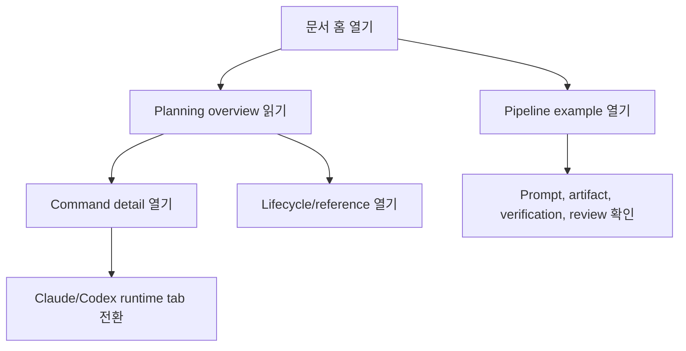

# Flow Spec: user-guide-website

```mermaid
flowchart TD
  A["문서 홈 열기"] --> B["Planning overview 읽기"]
  B --> C["Command detail 열기"]
  C --> D["Claude/Codex runtime tab 전환"]
  B --> E["Lifecycle/reference 열기"]
  A --> F["Pipeline example 열기"]
  F --> G["Prompt, artifact, verification, review 확인"]
```

## Traceability Flow

`IDEA-20260527-001 -> SCREENING-20260527-001 -> EPIC-20260527-001 -> REQ-UGW-* -> TASK-UGW-* -> TC-UGW-*`
