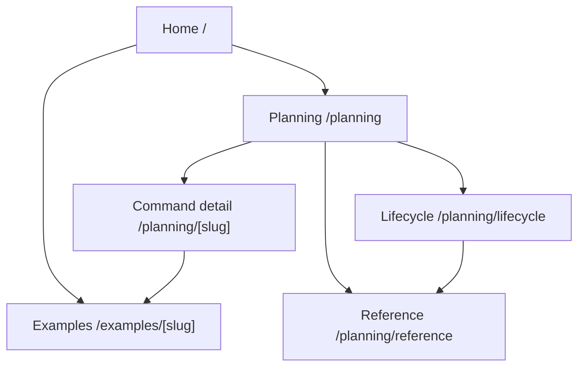

# Navigation Flow: user-guide-website

## 내비게이션 규칙

| 규칙 | 내용 |
| --- | --- |
| Home은 진입점이다 | 웹사이트가 무엇이고 무엇이 아닌지 설명한다. |
| Planning index는 command map이다 | 사용자를 각 command 상세 페이지로 연결한다. |
| Command page는 상세 문서다 | agents, skills, hooks, rules, artifacts, runtime tab을 설명한다. |
| Example page는 증거 기반이다 | `.plans`와 `docs/plans` 산출물을 연결한다. |
