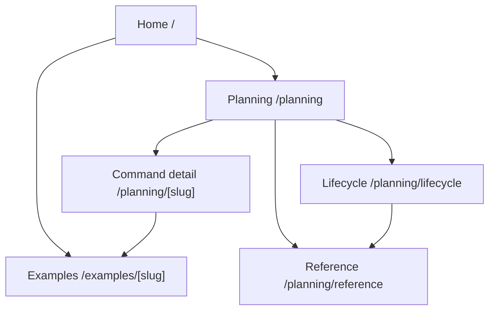

# Navigation Flow: user-guide-website

## Navigation Rules

| Rule | Detail |
| --- | --- |
| Home is the entry point | It must explain what the website is and what it is not |
| Planning index is the command map | It routes users into specific command pages |
| Command pages are detailed | They explain agents, skills, hooks, rules, artifacts, and runtime tabs |
| Examples are evidence-backed | They link to `.plans` and `docs/plans` artifacts |
