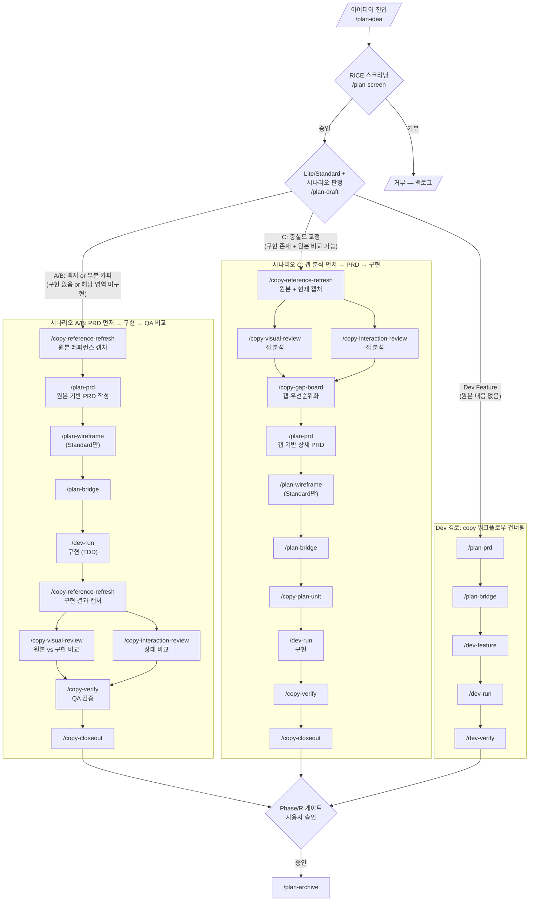
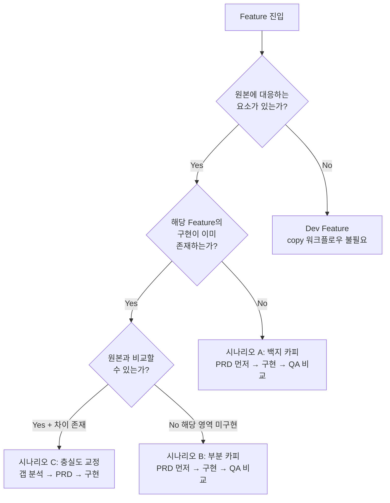
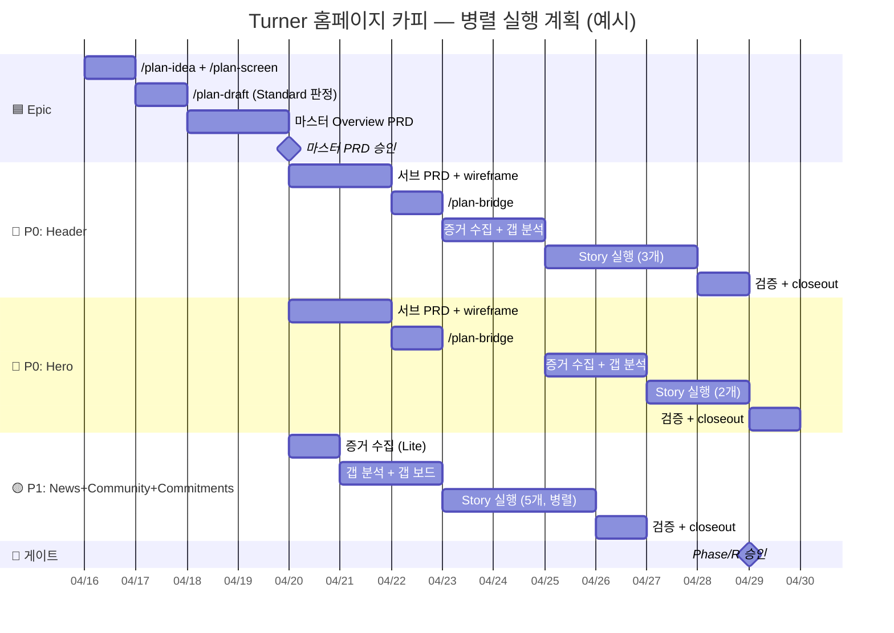
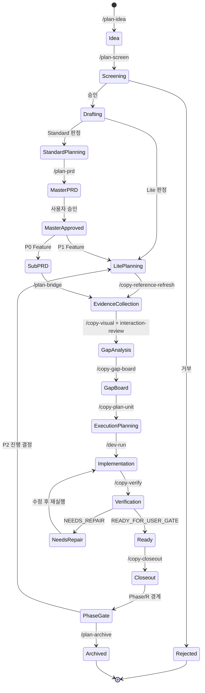

# 03. Workflow & Pipeline Design

> 파이프라인 설계의 핵심 문서. 시나리오 판정, 워크플로우 경로, 커맨드 활성화, 게이트, 병렬 실행 규칙, WBS 매핑을 정의한다.
>
> **원본 참조**: CAI-06, CAI-10, CAI-11, CAI-12, CAI-13 (archive/2026-04-16-original/)

---

## 1. 판정 시점: /plan-draft

`/plan-draft`는 파이프라인 전체의 분기점이다. 이 시점에서 3가지를 **동시에** 판정한다.

| 판정 항목 | 설명 | 값 |
|----------|------|-----|
| **시나리오** | 현재 구현 상태에 따른 파이프라인 분기 | A (백지 카피), B (부분 카피), C (충실도 교정), Dev |
| **Feature 유형** | 원본 대응 여부에 따른 워크플로우 경로 | `copy` (원본 대응 존재), `dev` (원본 대응 없음) |
| **규모** | 문서 깊이와 게이트 수준 결정 | Lite (경량), Standard (상세 PRD) |

### 1.1 시나리오 판정 기준

| 시나리오 | 조건 | 핵심 특징 |
|---------|------|----------|
| **A: 백지 카피** | 구현이 아예 없음 | 갭 분석 불가 (비교할 현재가 없음). PRD가 "원본의 무엇을 만들지"를 정의 |
| **B: 부분 카피** | 기존 프로젝트에 해당 영역 미구현 | A와 동일한 이유로 갭 분석 불가. PRD로 "무엇을 추가할지" 정의 |
| **C: 충실도 교정** | 구현 존재 + 원본과 차이 있음 | 현재 구현이 존재하므로 갭 측정 가능. 갭 데이터가 상세 PRD의 입력 |
| **Dev Feature** | 원본에 대응 요소 없음 | copy 워크플로우를 건너뛰고 dev 경로로 직행 |

### 1.2 Feature 유형 라우팅

| 유형 | 정의 | 워크플로우 경로 | 판정 기준 |
|------|------|--------------|----------|
| **Copy Feature** | 원본과의 시각적/인터랙션 차이를 닫는 작업 | plan -> **copy** -> dev | 원본 대응 요소 존재 + 시각적 차이 닫기 목표 |
| **Dev Feature** | 원본에 없는 새 기능 또는 비시각적 변경 | plan -> **dev** 직행 | 원본 대응 없음, 또는 시각적 차이와 무관 |

> Hybrid Feature(원본 스타일 참조 + 새 기능)는 Copy Feature의 경량 변형으로 처리한다. 레퍼런스 캡처만 수행하고 나머지는 dev 경로를 따른다.

### 1.3 Feature 유형 태깅 예시

`/plan-draft` 출력에 각 Feature의 유형, 우선순위, 시나리오, 경로를 태깅한다.

```
E-01: Homepage Copy (Standard Epic)
  F-HEADER:      type=copy  | P0 | 시나리오 C | 서브 PRD
  F-HERO:        type=copy  | P0 | 시나리오 A | 서브 PRD
  F-NEWS:        type=copy  | P1 | 시나리오 B | Lite
  F-ANALYTICS:   type=dev   | P1 | Dev 경로
  F-NEW-SECTION: type=copy  | P1 | 시나리오 A | Lite
```

### 1.4 Lite/Standard 판정

| 규모 | 조건 | 문서 수준 | 게이트 |
|------|------|----------|-------|
| **Lite** | Feature 수 < 3, P0 Feature 없음, 단순 갭 | 경량 PRD 또는 PRD 생략 | `/plan-draft` 확인만 |
| **Standard** | Feature 수 >= 3, 또는 P0 Feature 포함 | 마스터 PRD + 서브 PRD | 마스터 PRD 승인 + 서브 PRD 승인 |

---

## 2. 시나리오별 파이프라인 순서

| 시나리오 | 조건 | 파이프라인 순서 |
|---------|------|--------------|
| **A: 백지 카피** | 구현이 아예 없음 | 레퍼런스 캡처 -> PRD -> wireframe -> 구현 -> **QA에서 copy 비교** |
| **B: 부분 카피** | 기존 프로젝트에 해당 영역 미구현 | 레퍼런스 캡처 -> PRD -> wireframe -> 구현 -> **QA에서 copy 비교** |
| **C: 충실도 교정** | 구현 존재 + 원본과 차이 있음 | 범위 PRD -> **갭 분석** -> 상세 PRD -> wireframe -> 구현 -> QA |
| **Dev Feature** | 원본에 대응 요소 없음 | PRD -> 구현 (copy 워크플로우 건너뜀) |

### 시나리오별 copy 워크플로우 역할

- **A/B**: copy 워크플로우는 **검증 도구**. 구현 후 QA 시점에서 `/copy-visual-review`, `/copy-interaction-review`로 "제대로 카피했는지" 확인
- **C**: copy 워크플로우는 **기획 도구 + 검증 도구**. 기획 시 갭 분석으로 PRD 입력 데이터 생성, 구현 후 갭 닫힘 재검증

---

## 3. 워크플로우 5가지

### 3.1 시나리오 A/B -- Standard (PRD 먼저 -> 구현 -> QA 비교)

```text
/plan-idea -> /plan-screen -> /plan-draft [A/B, Standard 판정]
  -> /copy-reference-refresh (원본 레퍼런스 캡처)
    -> /plan-prd (마스터 Overview PRD, Feature 3+ 시)
      -> 마스터 승인
        -> [병렬] Feature별:
           /plan-prd (서브) -> /plan-wireframe -> /plan-bridge
             -> /dev-run (구현)
               -> /copy-reference-refresh (구현 결과 캡처)
                 -> /copy-visual-review + /copy-interaction-review (원본 vs 구현 비교)
                   -> /copy-verify -> /copy-closeout
```

> **QA 자동 트리거**: `/dev-run` 완료 후 routing metadata에 `Feature Type: copy`가 설정되어 있으면, `/copy-verify` 내부에서 자동으로 `/copy-visual-review` + `/copy-interaction-review`를 실행하여 원본 vs 구현을 비교한다. 별도 호출 불필요.

### 3.2 시나리오 A/B -- Lite (PRD 생략 -> 바로 구현)

```text
/plan-idea -> /plan-screen -> /plan-draft [A/B, Lite 판정]
  -> /copy-reference-refresh (원본 캡처)
    -> /dev-run (구현)
      -> /copy-visual-review + /copy-interaction-review (QA 비교)
        -> /copy-verify -> /copy-closeout
```

> **QA 자동 트리거**: `/dev-run` 완료 후 routing metadata에 `Feature Type: copy`가 설정되어 있으면, `/copy-verify` 내부에서 자동으로 `/copy-visual-review` + `/copy-interaction-review`를 실행하여 원본 vs 구현을 비교한다. 별도 호출 불필요.

### 3.3 시나리오 C -- Standard (갭 분석 -> 2단계 PRD -> 구현)

```text
/plan-idea -> /plan-screen -> /plan-draft [C, Standard 판정]
  -> /plan-prd (범위 PRD: "어디를 분석할지")
    -> 범위 PRD 승인
      -> /copy-reference-refresh (원본 + 현재 캡처)
        -> /copy-visual-review + /copy-interaction-review (갭 분석, 병렬)
          -> /copy-gap-board (갭 우선순위화)
            -> /plan-prd (상세 PRD: "어떻게 닫을지", 갭 데이터 포함)
              -> /plan-wireframe (갭 기반 상태 구조)
                -> /plan-bridge
                  -> [병렬] Story별:
                     /copy-plan-unit -> /dev-run -> /copy-verify
                       -> /copy-closeout
```

### 3.4 시나리오 C -- Lite (갭 분석 -> 바로 실행)

```text
/plan-idea -> /plan-screen -> /plan-draft [C, Lite 판정]
  -> /copy-reference-refresh (원본 + 현재 캡처)
    -> /copy-visual-review + /copy-interaction-review (갭 분석, 병렬)
      -> /copy-gap-board (갭 우선순위화)
        -> /copy-plan-unit (실행 단위 계획)
          -> /dev-run -> /copy-verify -> /copy-closeout
```

### 3.5 Dev Feature (copy 워크플로우 건너뜀)

```text
/plan-idea -> /plan-screen -> /plan-draft [Dev Feature 판정]
  -> /plan-prd -> /plan-bridge
    -> /dev-feature -> /dev-run -> /dev-verify
```

### 3.6 검증/closeout 공통

모든 경로의 종착점은 동일한 검증/closeout 흐름을 따른다.

```text
구현 완료 -> /copy-verify (QA) 또는 /dev-verify (Dev)
  -> closeout 작성 -> git status scope review -> 단위 commit
    -> Phase/R 종료 gate (모든 Feature 합류) -> 사용자 승인
      -> /plan-archive (완료 번들)
```

### 3.7 Blueprint Fast-Track과 copy 시나리오

외부 디자인 시스템이나 기존 기획 문서를 가져오는 Blueprint Fast-Track은 copy Feature에도 적용된다:

| 진입 시점 | Blueprint 내용 | copy 시나리오 | 처리 |
|----------|-------------|-------------|------|
| P3 `/plan-draft` | 외부 디자인 스펙 | A (백지 카피) | blueprint = 원본 참조, `/plan-draft`에서 Lite/Standard 재판정 |
| P3 `/plan-draft` | 기존 구현의 리디자인 스펙 | C (충실도 교정) | blueprint = 변경 목표, 갭 분석으로 현재 vs 목표 차이 측정 |

Blueprint는 source spec(읽기 전용)이며, approved PRD가 execution SSOT이다. copy 시나리오 판정은 blueprint 내용이 아닌 현재 구현 상태를 기준으로 한다.

### 3.8 시나리오 재진입: `/plan-improve` → 시나리오 C

Archive된 copy Feature의 원본이 변경되면(예: 리브랜딩, 원본 사이트 업데이트), `/plan-improve`를 통해 **시나리오 C(충실도 교정)**로 재진입한다:

```
/plan-improve (archive된 Feature 선택)
  → /plan-idea (개선 요청 등록, 원본 변경 근거 첨부)
    → /plan-screen (재스크리닝)
      → /plan-draft [시나리오 C 판정 — 기존 구현 존재 + 원본과 차이]
        → 시나리오 C 워크플로우 진입 (§3.3 또는 §3.4)
```

이 흐름으로 copy Feature의 라이프사이클이 완성된다:
- 최초 구현 (A/B) → archive → 원본 변경 → `/plan-improve` → 시나리오 C → 수정 → archive

### 3.9 시나리오 전환: A/B → C

시나리오 A/B로 시작했지만 QA에서 원본과의 예상치 못한 차이가 발견되면, **사용자 게이트를 거쳐** 시나리오 C로 전환할 수 있다:

```
시나리오 A/B 진행 중
  → /dev-run (구현 완료)
    → /copy-verify (QA) — 예상치 못한 갭 발견
      → 사용자 판정: "시나리오 C로 전환"
        → /copy-visual-review + /copy-interaction-review (갭 분석)
          → /copy-gap-board (갭 우선순위화)
            → /copy-plan-unit → /dev-run (수정) → /copy-verify (재검증)
```

전환 시 routing metadata의 `Scenario: A` → `Scenario: C`로 업데이트하고, stage manifest에 전환 이력을 기록한다.

---

## 4. 커맨드 활성화 매트릭스

시나리오별로 각 커맨드가 활성화되는 시점을 정의한다.

| 커맨드 | A: 백지 카피 | B: 부분 카피 | C: 충실도 교정 | Dev Feature |
|--------|:---:|:---:|:---:|:---:|
| `/plan-idea` | 사용 | 사용 | 사용 | 사용 |
| `/plan-screen` | 사용 | 사용 | 사용 | 사용 |
| `/plan-draft` | 사용 | 사용 | 사용 | 사용 |
| `/plan-prd` | 일반 PRD | 일반 PRD | 범위 PRD(1차) + 상세 PRD(2차) | 일반 PRD |
| `/plan-wireframe` | Standard만 | Standard만 | Standard만 | 미사용 |
| `/plan-bridge` | Standard만 | Standard만 | Standard만 | 사용 |
| `/plan-review` | 사용 | 사용 | 사용 | 사용 |
| `/plan-archive` | 사용 | 사용 | 사용 | 사용 |
| `/copy-reference-refresh` | 기획 시 (원본) | 기획 시 (원본) | 기획 시 (원본+현재) | 미사용 |
| `/copy-visual-review` | **QA 시점** | **QA 시점** | **기획 시** (갭 분석) | 미사용 |
| `/copy-interaction-review` | **QA 시점** | **QA 시점** | **기획 시** (갭 분석) | 미사용 |
| `/copy-gap-board` | **QA 시점** | **QA 시점** | **기획 시** (우선순위화) | 미사용 |
| `/copy-plan-unit` | 미사용 | 미사용 | 사용 | 미사용 |
| `/copy-verify` | QA | QA | QA | 미사용 |
| `/copy-closeout` | 사용 | 사용 | 사용 | 미사용 |
| `/dev-feature` | 미사용 | 미사용 | 미사용 | 사용 |
| `/dev-run` | 사용 | 사용 | 사용 | 사용 |
| `/dev-verify` | 사용 | 사용 | 사용 | 사용 |

---

## 5. 게이트 정의

파이프라인 전체에 걸쳐 자동 진행을 차단하는 게이트 목록.

| Gate | 위치 | 조건 | 승인 주체 |
|------|------|------|----------|
| **Idea Screening** | `/plan-screen` | RICE 스크리닝 통과 | 사용자 |
| **Scenario Determination** | `/plan-draft` | 시나리오(A/B/C/Dev) 판정 확인 | 사용자 확인 권장 |
| **Lite/Standard** | `/plan-draft` | Feature 수, P0 포함 여부로 규모 판정 | `/plan-draft` 출력 확인 |
| **Scope PRD** | `/plan-prd` (1차, C-Standard) | "어디를 분석할지" 범위 정의 승인 | 사용자 |
| **Master PRD** | `/plan-prd` (마스터) | 전체 Feature 목록, 공유 제약, 의존성 매트릭스 승인 | 사용자 |
| **PRD** | `/plan-prd` (서브/일반) | Feature별 상세 요구사항 승인 | 사용자 (PRD 승인 또는 revise) |
| **P0 Gap Board** | `/copy-gap-board` | P0 실행 후보 선정 | 사용자 확인 (P0 = 필수) |
| **PCC** | `/plan-review` | Planning Consistency Check -- 기획 산출물 간 충돌 없음 | PASS/WARN/FAIL 기록 |
| **Bridge** | `/plan-bridge` | 승인된 plan 산출물을 dev/copy 입력으로 전환 | bridge context 승인 |
| **QA Readiness** | `/copy-verify` | READY_FOR_USER_GATE 또는 READY_WITH_LOGGED_GAPS | QA 결과 보고서 |
| **Feature Closeout** | `/copy-closeout` | 완료 범위, 검증 결과, 남은 이슈, 다음 gate 명확 | closeout memo 확인 |
| **Phase/R** | Phase/R 경계 | 모든 병렬 작업 합류 + Feature closeout 완료 | 사용자 승인 (자동 진행 금지) |
| **시나리오 판정** | `/plan-draft` 시점 | 구현 존재 여부 + 원본 대응 여부 + 차이 여부 | 사용자 확인 권장 | A/B/C/Dev 결정 → 파이프라인 경로 확정 |
| **Feature 유형 판정** | `/plan-draft` 시점 | 원본 대응 + 시각적 차이 닫기 여부 | 자동 + 사용자 확인 | copy/dev 결정 → 도메인 라우팅 |
| **Archive** | `/plan-archive` | 완료된 보강 라운드를 archive로 묶음 | closeout 이후 승인 |

---

## 6. 병렬 실행 규칙

| 규칙 | 설명 |
|------|------|
| **Feature 간 병렬** | 마스터 PRD 승인 후, 의존성 없는 Feature는 동시 진행 가능 |
| **Story 간 병렬** | 같은 Feature 내에서도 파일 충돌 없으면 병렬 가능 |
| **Task 순차** | 같은 Story 내 Task는 TDD 사이클(RED -> GREEN -> IMPROVE) 순차 |
| **Phase/R 게이트** | Phase 또는 R 경계에서는 모든 병렬 작업 합류 후 사용자 승인 |
| **증거 분석 병렬** | `/copy-visual-review`와 `/copy-interaction-review`는 항상 병렬 가능 |

### 병렬 진입 조건

| 병렬 구간 | 조건 | 충돌 방지 |
|----------|------|----------|
| visual + interaction 분석 | 동일 Feature 내, 베이스라인 캡처 완료 후 | 분석 영역 분리 (시각 vs 인터랙션) |
| P0 Feature 간 | 마스터 PRD 승인 + 의존성 없음 | 의존성 매트릭스 확인 |
| P0 + P1 병렬 | 마스터 PRD 승인 | P0이 글로벌 CSS 변경 시 P1 대기 |
| Story 간 병렬 | 같은 Feature 내, 파일 충돌 없음 | 변경 파일 목록 사전 확인 |
| Lite Epic + Standard Epic | 서로 다른 Epic | Epic 간 파일 충돌 없음 확인 |

---

## 7. WBS 계층 매핑

커맨드 라이프사이클과 WBS 4계층의 연결.

| WBS 계층 | 코드 패턴 | 정의 | 규모 기준 | 생성 커맨드 | 승인 게이트 |
|----------|----------|------|----------|-----------|-----------|
| **Epic** (대) | `E-{NN}` | 프로젝트 수준 목표. 복수 Phase/R을 포괄 | 10+ 파일, 5+ 뷰포트, 전체 섹션 | `/plan-idea` -> `/plan-screen` | 스크리닝 승인 |
| **Feature** (중) | `F-{AREA}-{NN}` | 기능 영역 단위. 독립 PRD 또는 마스터 PRD 섹션 | 3~10 파일, 2~3 뷰포트 | `/plan-draft` -> `/plan-prd` | PRD 승인 |
| **Story** (소) | `S-{AREA}-{NN}` | 단일 갭 또는 개선 항목. Gap Row 1개 | 1~3 파일, 1~2 뷰포트 | `/copy-gap-board` -> `/copy-plan-unit` | P0 = 사용자 승인 |
| **Task** (마이크로) | `T-{AREA}-{NN}` | 원자적 구현 단위. 1 커밋 = 1 태스크 | 단일 파일, 단일 속성 변경 | `/dev-run` 내부 | 자동 (TDD 가드) |

### 계층 간 관계

```
Epic (대)
 |-- Feature (중) ---- 독립 PRD 또는 마스터 PRD 섹션
 |    |-- Story (소) -- Gap Row (VF-*/IF-*) 1개
 |    |    |-- Task (마이크로) -- 구현 1 커밋
 |    |    +-- Task (마이크로) -- 검증 1 커밋
 |    +-- Story (소)
 +-- Feature (중)
```

### 분류 판정 기준 (의사결정 트리)

```
아이디어 진입
  |
  +-- 영향 범위 >= 5 뷰포트 + 전체 섹션?
  |    YES -> Epic (대)
  |    NO  |
  +-- 영향 범위 >= 2 뷰포트 + 단일 영역?
  |    YES -> Feature (중)
  |    NO  |
  +-- 단일 Gap Row로 표현 가능?
  |    YES -> Story (소)
  |    NO  |
  +-- 단일 파일/속성 변경?
       YES -> Task (마이크로)
```

### 7.2 도메인별 WBS 경로

WBS는 전체 파이프라인에 적용된다. 도메인별로 각 계층의 생성 방식이 다르다.

| 계층 | Copy Feature 경로 | Dev Feature 경로 | 공통 |
|------|-----------------|-----------------|------|
| **Epic** | `/plan-idea` → `/plan-screen` | `/plan-idea` → `/plan-screen` | plan 도메인 공통 |
| **Feature** | `/plan-draft`(type=copy) → `/plan-prd` | `/plan-draft`(type=dev) → `/plan-prd` | plan 도메인 공통 |
| **Story** 생성 | `/copy-gap-board` (Gap Row = Story) | `/dev-feature` (task breakdown = Story) | **경로 분기** |
| **Story** ID | `S-{AREA}-{NN}` (VF-*/IF-* 기반) | `S-{AREA}-{NN}` (REQ-* 기반) | 동일 ID 체계 |
| **Task** 실행 | `/dev-run` (copy-plan-unit 후) | `/dev-run` (직접) | dev 도메인 공통 |
| **Task** ID | `T-{AREA}-{NN}` (1 커밋 = 1 Task) | `T-{AREA}-{NN}` (1 커밋 = 1 Task) | 동일 ID 체계 |

> **핵심 분기점**: Story 생성이 copy와 dev에서 다르다. Copy Feature의 Story는 갭 분석의 결과물이고, Dev Feature의 Story는 Feature 명세의 분해 결과이다.

### 7.3 Stage Manifest 확장

각 Feature의 `.plans/stage-manifest.json`에 copy 도메인 단계를 추가한다:

```json
{
  "feature": "F-HEADER-01",
  "scenario": "C",
  "featureType": "copy",
  "planStages": { "idea": "completed", "screen": "completed", "draft": "completed" },
  "copyStages": {
    "referenceRefresh": "completed",
    "visualReview": "completed",
    "interactionReview": "completed",
    "gapBoard": "completed",
    "planUnit": "in-progress",
    "verify": "pending",
    "closeout": "pending"
  },
  "devStages": { "feature": "pending", "run": "pending", "verify": "pending" }
}
```

이전 세션에서 중단된 경우, stage manifest를 읽어 마지막 완료 단계 다음부터 재개한다.

---

## 8. Standard 마스터+서브 PRD

Feature 수 >= 3 또는 P0 Feature가 포함된 Standard Epic에서 적용.

| 단계 | 커맨드 | 내용 | 병렬 |
|------|--------|------|------|
| 마스터 PRD | `/plan-prd` (1차) | 전체 Feature 목록, 공유 제약, 의존성 매트릭스, 우선순위 | 순차 |
| 마스터 승인 | 사용자 승인 | PRD 리뷰 + 승인 | 게이트 |
| 서브 PRD | `/plan-prd` (2차~) x N | Feature별 상세 요구사항 | **Feature 간 병렬** |
| wireframe | `/plan-wireframe` | 복잡한 Feature만 (선택) | Feature 내 순차 |
| bridge | `/plan-bridge` | Feature별 context 생성 | Feature 내 순차 |

### 시나리오 C 범위 PRD 개념

시나리오 C + Standard에서는 `/plan-prd`를 2회 호출한다.

| 단계 | PRD 유형 | 내용 | 갭 데이터 |
|------|---------|------|----------|
| 1차 | 범위 PRD | "어디를 분석할지": 대상 영역 목록, 뷰포트, 우선순위, 공유 제약 | 없음 (분석 전) |
| 갭 분석 | -- | `/copy-visual-review` + `/copy-interaction-review` | 생성됨 |
| 2차 | 상세 PRD | "어떻게 닫을지": 갭별 수용 기준(acceptance criteria), 구체적 조정 방향 | 포함 |

---

## 9. Mermaid 다이어그램

### 9.1 전체 파이프라인 흐름도 (A/B, C, Dev 분기)



### 9.2 시나리오 판정 의사결정 트리



### 9.3 병렬 실행 Gantt (간략 예시)



### 9.4 상태 전이 다이어그램



---

## 10. 시나리오 x 규모 매트릭스

6-cell 매트릭스로 시나리오와 규모의 모든 조합에 대한 파이프라인 경로를 정의한다.

| 시나리오 | 규모 | 파이프라인 경로 | plan 커맨드 사용 |
|---------|------|--------------|----------------|
| **A: 백지** | Lite | 레퍼런스 -> 구현 -> QA 비교 | `/plan-idea` -> `/plan-screen` -> `/plan-draft` |
| **A: 백지** | Standard | 레퍼런스 -> 마스터 PRD -> 서브 PRD -> 구현 -> QA 비교 | 전체 `/plan-*` 사용 |
| **B: 부분** | Lite | 레퍼런스 -> 구현 -> QA 비교 | `/plan-idea` -> `/plan-screen` -> `/plan-draft` |
| **B: 부분** | Standard | 레퍼런스 -> 마스터 PRD -> 서브 PRD -> 구현 -> QA 비교 | 전체 `/plan-*` 사용 |
| **C: 교정** | Lite | 갭 분석 -> 실행 단위 -> 구현 | `/plan-idea` -> `/plan-screen` -> `/plan-draft` |
| **C: 교정** | Standard | 범위 PRD -> 갭 분석 -> 상세 PRD -> 구현 | `/plan-prd` 2회 (범위+상세) |
