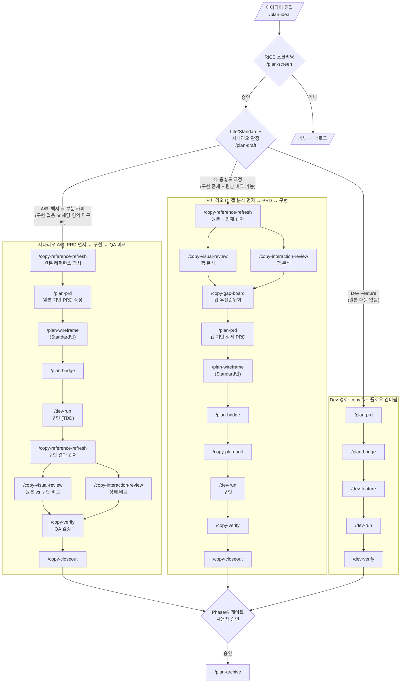
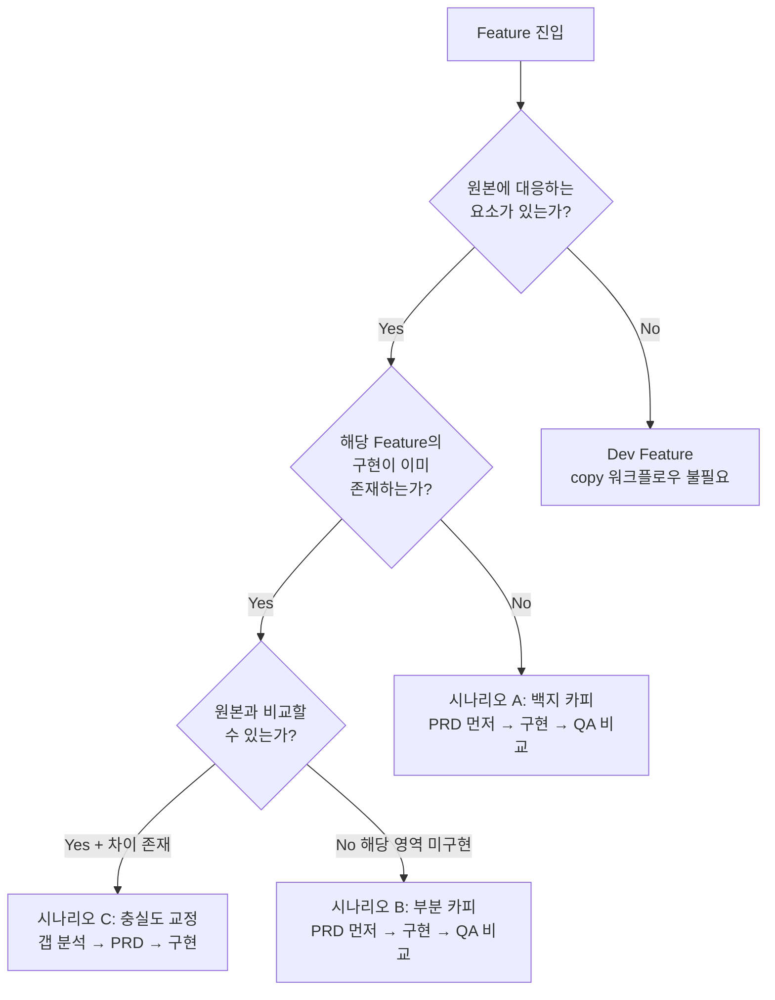
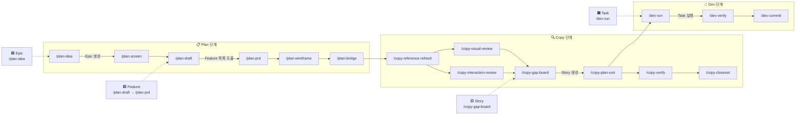
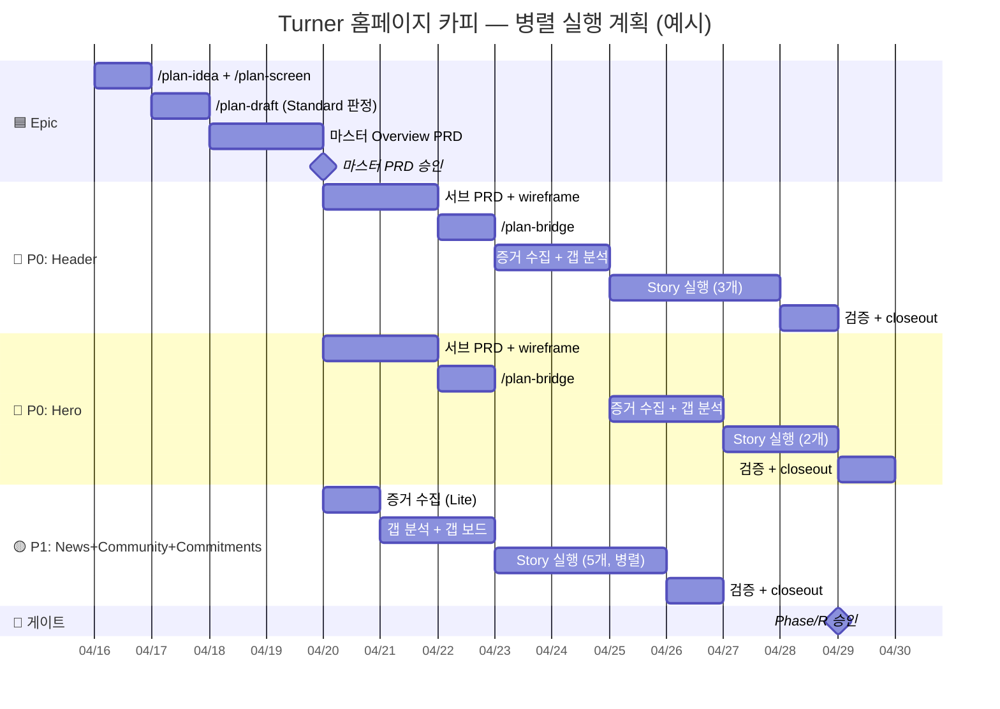
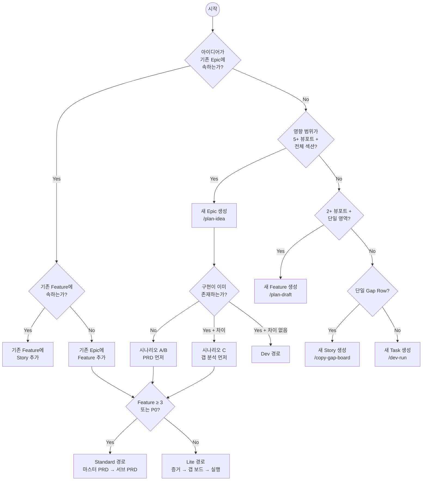
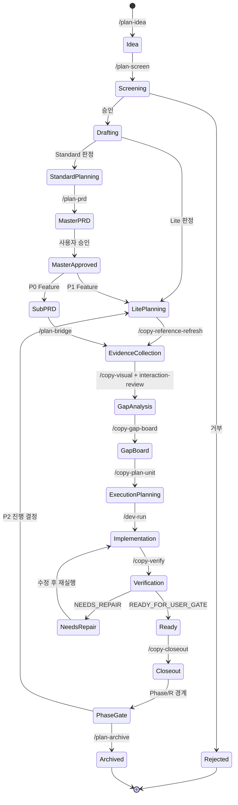

# 파이프라인 통합 순서도 (Pipeline Integration Diagram)

- 문서 ID: CAI-12
- 관련 문서: [11_work-breakdown-structure.md](./11_work-breakdown-structure.md) (WBS 분류 체계), [06_command-workflow-spec.md](./06_command-workflow-spec.md) (커맨드 워크플로우), [10_plan-workflow-integration-plan.md](./10_plan-workflow-integration-plan.md) (plan 통합)
- 목적: WBS가 기존 plan/copy/dev 파이프라인에 어떻게 합류하는지를 시각적으로 표현한다.

---

## 1. 전체 파이프라인 흐름도

> 권장안(C+D 혼합, Adaptive WBS)을 기준으로 작성.

---

## 1.5 시나리오 판정 다이어그램

> Feature가 어떤 시나리오에 해당하는지 판정하는 의사결정 흐름.

### 시나리오별 copy 커맨드 사용 시점

| 커맨드 | A: 백지 카피 | B: 부분 카피 | C: 충실도 교정 |
|--------|------------|------------|-------------|
| `/copy-reference-refresh` | 기획 시 (원본 캡처) | 기획 시 (원본 캡처) | 기획 시 (원본+현재) |
| `/copy-visual-review` | **QA 시점** | **QA 시점** | **기획 시** (갭 분석) |
| `/copy-interaction-review` | **QA 시점** | **QA 시점** | **기획 시** (갭 분석) |
| `/copy-gap-board` | **QA 시점** | **QA 시점** | **기획 시** (우선순위화) |
| `/copy-verify` | QA | QA | QA |

---

## 2. WBS 계층별 생성 시점 다이어그램

> 각 분류 계층이 파이프라인 어디에서 탄생하는지를 표시.

---

## 3. 병렬 실행 Swim Lane

> 어떤 작업이 동시에 진행 가능한지를 시간축으로 표현.

---

## 4. 진입 조건표

### 4.1 계층 생성 진입 조건

| 계층 | 생성 조건 | 진입 커맨드 | 필수 입력 | 게이트 |
|------|----------|-----------|----------|-------|
| **Epic** | 아이디어 존재 + 사용자 요청 | `/plan-idea` | 아이디어 설명 | 없음 (누구나 등록 가능) |
| **Feature** | Epic이 `/plan-screen` 통과 + Lite/Standard 판정 완료 | `/plan-draft` | 스크리닝 결과 | `/plan-screen` 승인 |
| **시나리오** | Feature 생성 시 `/plan-draft`에서 A/B/C 판정 | `/plan-draft` | 구현 존재 여부 + 원본 대응 여부 | 사용자 확인 권장 |
| **Story** | Feature의 갭 분석 완료 + 갭 보드 생성 | `/copy-gap-board` | visual/interaction gap board | P0 Story = 사용자 승인 |
| **Task** | Story의 실행 단위 계획 승인 | `/dev-run` | 실행 단위 계획서 | TDD 가드 (자동) |

### 4.2 단계 전환 진입 조건

| 전환 | 조건 | 검증 방법 |
|------|------|----------|
| Plan → Copy | `/plan-bridge` 완료 + bridge context 승인 | bridge 문서 존재 확인 |
| Copy 분석 → Copy 실행 | `/copy-gap-board` 완료 + P0 갭 사용자 승인 | gap board + 사용자 확인 |
| Copy → Dev | `/copy-plan-unit` 완료 + 실행 단위 계획 승인 | 실행 단위 계획서 존재 |
| Dev → Copy 검증 | `/dev-run` 완료 (구현 + 테스트 통과) | 테스트 결과 + 빌드 성공 |
| Copy 검증 → Closeout | `/copy-verify` 통과 (READY_FOR_USER_GATE) | QA 결과 보고서 |
| Feature Closeout → Phase 게이트 | 모든 Feature의 `/copy-closeout` 완료 | 전체 Feature closeout 확인 |
| Phase 게이트 → 다음 Phase | 사용자 승인 | 명시적 승인 |

### 4.3 병렬 진입 조건

| 병렬 구간 | 조건 | 충돌 방지 |
|----------|------|----------|
| visual + interaction 분석 | 동일 Feature 내, 베이스라인 캡처 완료 후 | 분석 영역 분리 (시각 vs 인터랙션) |
| P0 Feature 간 | 마스터 PRD 승인 + 의존성 없음 | 의존성 매트릭스 확인 |
| P0 + P1 병렬 | 마스터 PRD 승인 | P0이 글로벌 CSS 변경 시 P1 대기 |
| Story 간 병렬 | 같은 Feature 내, 파일 충돌 없음 | 변경 파일 목록 사전 확인 |
| Lite Epic + Standard Epic | 서로 다른 Epic | Epic 간 파일 충돌 없음 확인 |

---

## 5. 분기점 의사결정 다이어그램

---

## 6. 상태 전이 다이어그램

> Epic/Feature/Story의 생명주기 상태.

---

## 7. 기존 문서와의 관계

| 기존 문서 | 본 문서 참조 위치 |
|----------|---------------|
| CAI-06 (command workflow) | §4.2 단계 전환 진입 조건 — 6단계 라이프사이클 기반 |
| CAI-08 (adoption roadmap) | 인프라 도입(A0~A9) 완료 후 본 다이어그램의 런타임 흐름 적용 |
| CAI-10 (plan integration) | §1 전체 흐름도 — Lite/Standard 분기 기반 |
| CAI-11 (WBS) | §1~§5 — 모든 다이어그램이 CAI-11의 4계층 분류를 시각화 |
| CAI-02~05 (agent specs) | §4.1 — Gap Row(VF-*/IF-*) = Story 계층 |
| CAI-09 (readiness) | §4.2 — `.plans/` 생성 게이트 SSOT 참조 |

---

## 8. 자기 검증

| 항목 | 기준 | 확인 |
|------|------|------|
| Mermaid 다이어그램 포함 | 5개 (전체 흐름, 계층 생성, Gantt, 의사결정, 상태 전이) | [ ] |
| 진입 조건표 포함 | 3개 (계층 생성, 단계 전환, 병렬) | [ ] |
| 게이트 표시 | 모든 분기점에 게이트/조건 명시 | [ ] |
| 병렬 구간 구분 | swim lane(Gantt) + 서브그래프(flowchart) | [ ] |
| 대/중/소/마이크로 표시 | 계층별 생성 시점 다이어그램에 표시 | [ ] |
| 기존 문서 미수정 | 신규 문서만 추가 | [ ] |
