# Claude Code 에이전트 아키텍처 — 시각 설계 문서

> **대상 독자**: 기획자·PM, 신규 합류 개발자
> **원본 출처**: [별첨 91. 클로드 코드 소스 코드 분석서 (wikidocs.net/338204)](https://wikidocs.net/338204)
> **작성 기준**: 원본 24개 섹션(2026-04-01) + 필요 시 Jina Reader(`https://r.jina.ai/...`) 경유 재분석
> **목적**: 본 프로젝트(`claude-kit`)의 에이전트 기능을 개선하기 전, Claude Code 내부 동작을 "그림으로" 이해한다.

---

## 0. 세 줄 요약

1. Claude Code는 **"사용자 입력 → AI가 도구 선택 → 권한 확인 → 도구 실행 → 결과 피드백"** 루프를 핵심으로 돈다.
2. 이 루프를 **안전성 · 성능 · 확장성**이라는 세 원칙이 감싼다.
3. `claude-kit`의 서브에이전트·훅·스킬은 이 구조 안에서 각기 정해진 자리가 있다. 자리를 이해하면 개선 방향이 보인다.

---

## 1. 시스템 컨텍스트 (Who talks to whom)

> **비유**: 호텔 컨시어지를 상상하자. 손님(사용자)은 컨시어지(Claude Code)에게 요청만 한다. 컨시어지는 본사(Claude API)에 지침을 받고, 하우스키핑·레스토랑·택시회사(MCP 서버들)에 전화하고, 손님 방(로컬 파일)의 물건을 직접 옮긴다.

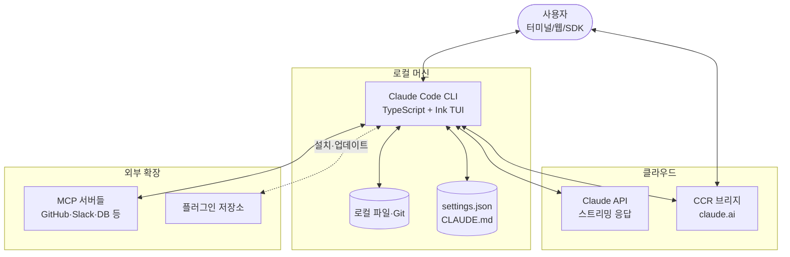

**📘 용어**
- **MCP(Model Context Protocol)**: Claude Code에 외부 도구를 꽂는 표준 규격. USB-C 포트에 비유할 수 있다.
- **CCR(Claude Remote Runtime)**: claude.ai 웹에서 보낸 작업을 로컬에서 실행시키는 중계 서버.

**🔧 claude-kit 적용 위치**
- 본 프로젝트의 `.claude/settings.json`과 `CLAUDE.md`가 위 다이어그램의 `Settings` 노드에 해당한다. [원본 §4.2]

---

## 2. 4-Tier 확장 계층 — Tool / Skill / Plugin / Command

> **비유**: 주방을 떠올리자. **칼(Tool)** 은 재료를 자르는 단일 동작이다. **레시피(Skill)** 는 여러 칼질·불 조절을 순서대로 묶은 절차다. **밀키트(Plugin)** 는 레시피 + 재료 + 도구를 한 박스로 판다. **주문 버튼(Command)** 은 손님이 주방에 요청을 넣는 단축키다.

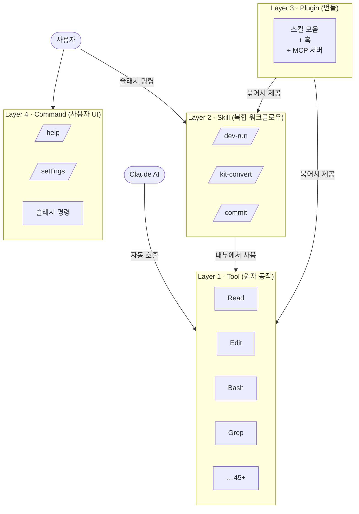

**📘 핵심 규칙**
- Tool은 AI가 자동으로 고르고, Skill은 사용자가 `/이름`으로 호출한다.
- Skill은 Tool을 **조합**하지, Tool을 **대체**하지 않는다.
- 계층을 섞어 쓰면 캐시 무효화·권한 꼬임이 발생한다.

**🔧 claude-kit 적용 위치**
- `.claude/skills/kit-validation/SKILL.md` 류가 Layer 2.
- `.claude/hooks/dev-tdd-guard.js`는 Plugin 층의 훅 역할이되, 본 프로젝트에서는 단독으로 배치됨. [원본 §15]

---

## 3. 쿼리 루프 — 한 턴에 무슨 일이 벌어지나

> **비유**: 건축가와 견습생의 작업을 떠올리자. 손님이 "집 좀 고쳐줘"라고 하면, 건축가(AI)는 혼자 모든 걸 하지 않는다. 견습생(Claude Code)에게 "저 문 치수 재 와", "벽지 뜯어 와"를 시키고, 결과를 보고 다음 지시를 내린다. 이 "지시 → 결과 → 다음 지시"가 끝날 때까지 반복된다.

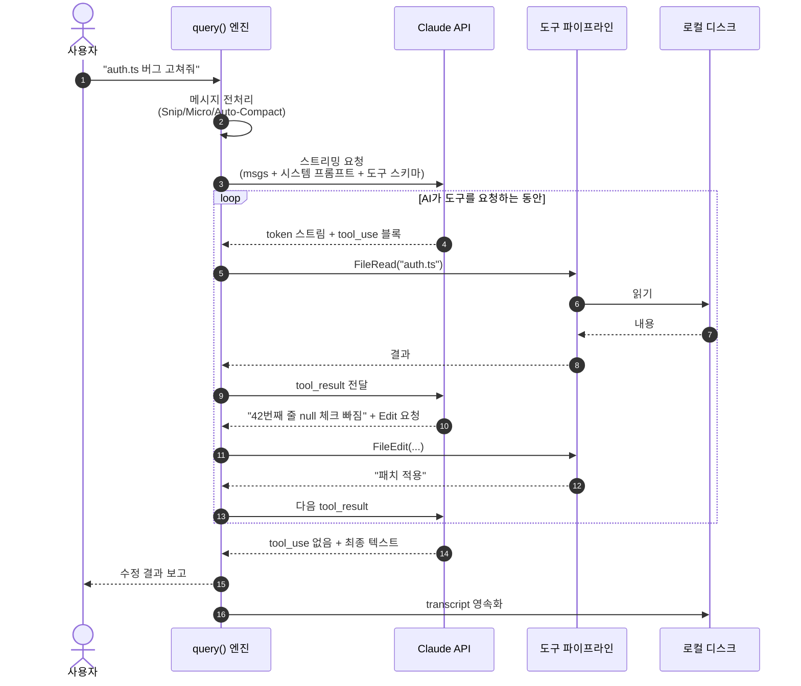

**📘 핵심 규칙**
- AI 응답은 **스트리밍**으로 도착 → 도구 실행도 동시에 시작 가능(스트리밍 실행기).
- `tool_use`가 없어질 때까지 루프는 끝나지 않는다.
- 매 턴 시작 전에 **메시지를 디스크에 저장**한다 → 크래시 발생해도 복구 가능.

**🔧 claude-kit 적용 위치**
- 본 프로젝트의 어떤 커스텀 에이전트도 이 루프 안에서 한 개의 `tool_use`로 치환된다. 즉, 에이전트는 "무거운 도구"일 뿐이다. [원본 §5]

---

## 4. 10단계 도구 실행 파이프라인

> **비유**: 공항 보안검색대를 떠올리자. 탑승권 확인 → 신분증 확인 → 가방 X-ray → 금속 탐지 → 샘플 검사… 단계가 많아 보이지만, 각 단계는 다른 관점에서 "이 사람을 비행기에 태워도 되는가"를 검사한다. 하나라도 걸리면 통과 불가.

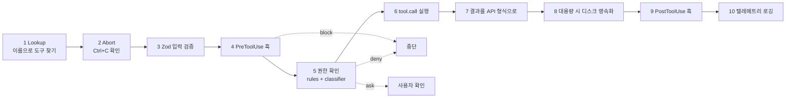

**📘 왜 이렇게 단계가 많은가**
- AI가 "rm -rf /" 같은 위험한 명령을 요청할 수 있다.
- 중간 어느 단계에서든 차단할 수 있어야 한다 → fail-closed 설계.
- 각 단계는 서로 다른 **관점**에서 "이거 실행해도 되나?"를 묻는다.

**📘 핵심 규칙**
- 입력 검증(3단계)은 **반드시 Zod 스키마**로 한다.
- 권한 확인(5단계)이 실패하면 사용자에게 묻거나 차단한다. 절대 자동 통과 없음.

**🔧 claude-kit 적용 위치**
- `.claude/hooks/dev-tdd-guard.js` → 4단계(PreToolUse)에 꽂혀 있다.
- `.claude/hooks/dev-db-guard.js` → 4단계에서 위험한 DB 명령을 차단한다.
- `.claude/hooks/edit-tracker.js` → 9단계(PostToolUse)에 해당. [원본 §8.1]

---

## 5. 권한 결정 스윔레인 — 누가 "허용/거부"를 정하나

> **비유**: 회사 출장 결재를 떠올리자. 본인이 올린 신청서는 먼저 팀장이 본다(규칙 일치). 규칙에 맞으면 자동 승인, 위반이면 자동 거부. 애매하면 본부장(AI 분류기)에게 올라가고, 본부장도 애매하면 본인에게 물어본다("원래 이게 맞아요?").

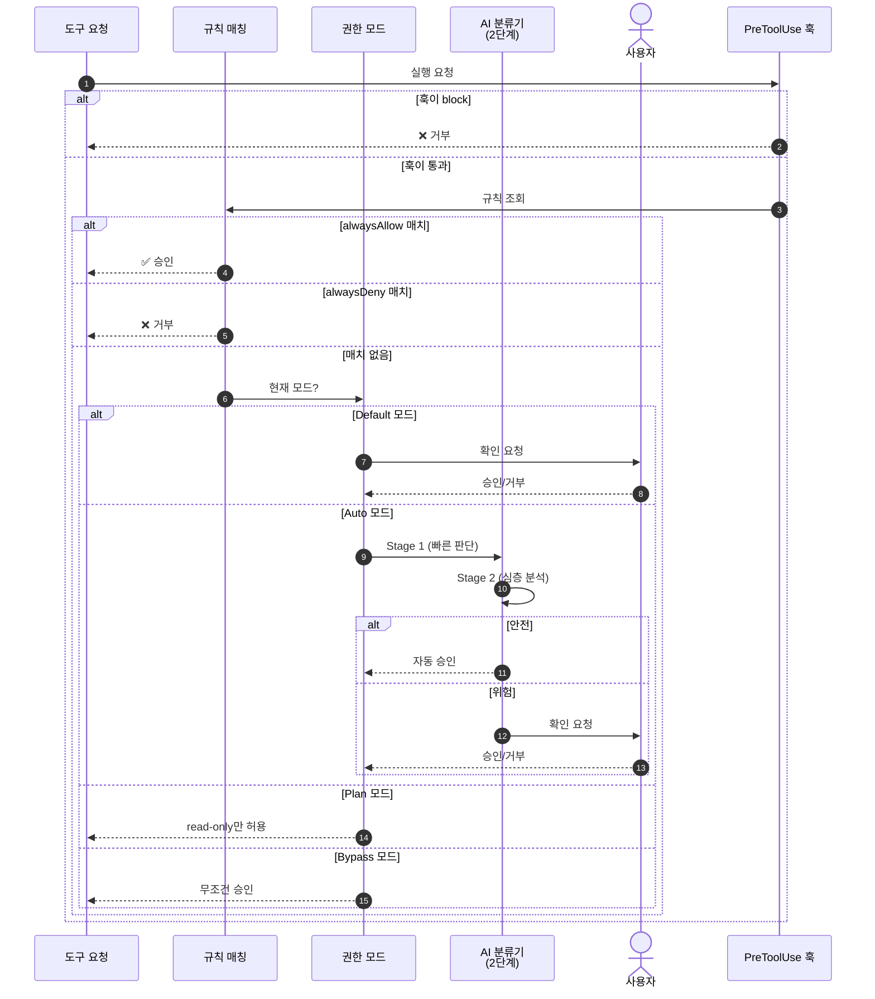

**📘 규칙 우선순위** (위가 높음)

| 순위 | 출처 | 파일 경로 |
|------|------|-----------|
| 1 | Local 프로젝트 | `.claude/settings.local.json` |
| 2 | 공유 프로젝트 | `.claude/settings.json` |
| 3 | 사용자 글로벌 | `~/.claude/settings.json` |
| 4 | CLI 플래그 | 읽기 전용 |
| 5 | 기업 정책 | 읽기 전용 |

**📘 4가지 권한 모드 비교**

| 모드 | 읽기 | 쓰기 | 용도 |
|------|------|------|------|
| **Default** | 자동 | 질문 | 일반 개발 |
| **Auto** | 자동 | AI 분류기 | CI / 장시간 작업 |
| **Plan** | 자동 | ❌ 금지 | 설계·계획 단계 |
| **Bypass** | 자동 | 자동 | 개발 샌드박스 전용 |

**🔧 claude-kit 적용 위치**
- `/dev-plan` 커맨드가 Plan 모드와 결합되면 HARD-GATE(핵심 원칙 #9)가 자동으로 강제된다.
- `/dev-run` 루프는 Default 또는 Auto 모드에서 동작한다. [원본 §13]

---

## 6. Coordinator 협업 — 리더 1 + 워커 N

> **비유**: 요리 대회를 떠올리자. 주방장(리더)은 직접 요리하지 않고 지시만 내린다. 3명의 부주방장(워커)이 각자 에피타이저·메인·디저트를 병렬로 준비한다. 주방장은 모든 접시를 **직접 맛보고**(종합) 최종 플레이팅을 결정한다. 위임했다고 맛을 안 보면 큰일 난다.

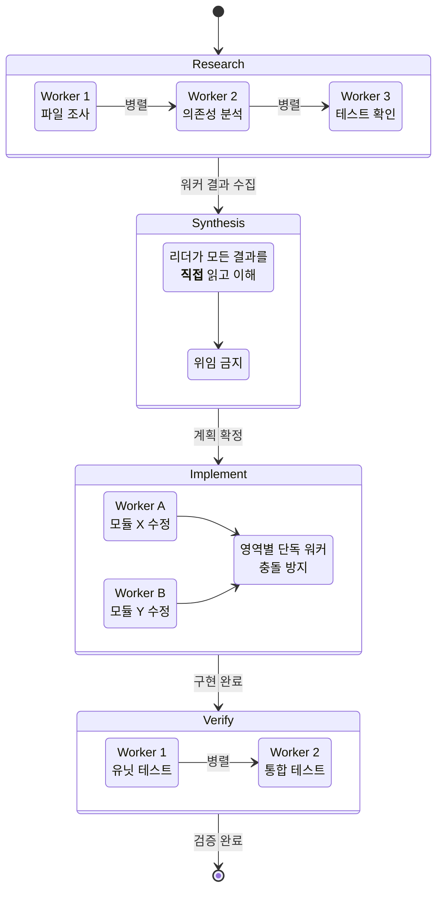

**📘 황금 규칙 3가지**
1. **리더는 코드를 직접 수정하지 않는다.** 오직 `AgentTool`·`SendMessage`·`TaskStop`만 사용.
2. **Synthesis 단계에서 위임 금지.** 리더가 워커 결과를 읽지 않고 다음으로 넘어가면 전체 흐름이 틀어진다.
3. **Implement 단계는 영역당 워커 1명.** 같은 파일에 두 워커가 붙으면 충돌.

**📘 서브에이전트 격리 수준 5단계** (위로 갈수록 안전·느림)

| 모드 | 설명 | 언제 쓰나 |
|------|------|-----------|
| In-process | 같은 프로세스에서 즉시 실행 | 빠른 조회 |
| Background | 비동기, 결과 대기 | 장시간 분석 |
| tmux teammate | 별도 터미널 패널 | 팀 협업 시나리오 |
| **Git worktree** | 격리된 브랜치 | 안전한 실험 |
| Remote | 클라우드 실행 | 병렬 대량 처리 |

**🔧 claude-kit 적용 위치**
- 현재 `dev-architect`, `dev-code-reviewer`, `dev-security-reviewer`, `dev-doc-updater`, `dev-verify-agent`는 모두 **Research/Verify** 단계의 워커 후보.
- 리더 역할을 별도로 분리하면 Coordinator 패턴이 완성된다. [원본 §19]

---

## 7. 훅 타임라인 — "언제 내 규칙이 끼어드나"

> **비유**: 공항 게이트에서 탑승 직전·후에 벌어지는 일들을 떠올리자. 탑승권 스캔(PreToolUse), 좌석 확인(PostToolUse), 이륙 방송(SessionStart), 착륙 방송(Stop) 같은 **정해진 타이밍**에만 특별한 안내가 나온다.

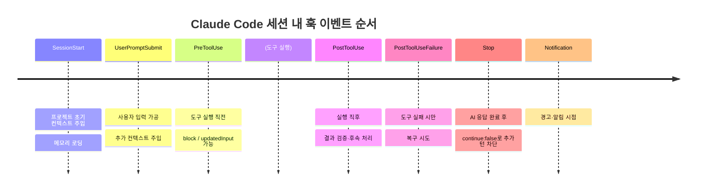

**📘 훅 응답 제어 필드**

| 필드 | 효과 |
|------|------|
| `continue: false` | 현재 작업 중단 |
| `decision: block` | 도구 실행 거부 |
| `updatedInput` | 도구 입력 수정 후 진행 |
| `additionalContext` | 추가 컨텍스트를 AI에 주입 |

**🔧 claude-kit 적용 위치**

| 훅 파일 | 이벤트 | 효과 |
|---------|--------|------|
| `dev-tdd-guard.js` | PreToolUse | 테스트 없는 구현 차단 |
| `dev-db-guard.js` | PreToolUse | 위험한 DB 명령 차단 |
| `dev-feature-scope-guard.js` | PreToolUse | Feature Package 범위 경고 |
| `copy-evidence-reminder.js` | PreToolUse | evidence 갱신 유도 |
| `edit-tracker.js` | PostToolUse | 편집 통계 집계 |
| `session-wrap-suggest.js` | Stop | 세션 정리 제안 |
| `output-secret-filter.js` | PostToolUse | 시크릿 유출 방지 |

[원본 §14]

---

## 8. 도구 동시성 — "왜 어떤 건 병렬, 어떤 건 순차인가"

> **비유**: 도서관을 떠올리자. 여러 사람이 동시에 같은 책을 **읽는 것**은 안전하다(이해에 영향 없음). 하지만 여러 사람이 동시에 같은 책에 **밑줄을 긋는 것**은 위험하다(서로 겹쳐서 엉망). Claude Code도 같은 원리로 도구를 배치한다.

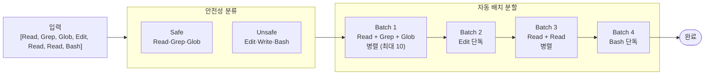

**📘 핵심 규칙**
- 연속된 **Safe 도구**는 하나의 배치로 묶여 **최대 10개 병렬** 실행.
- **Unsafe 도구**를 만나면 새 배치를 시작하고, **그 도구만 단독 실행**.
- 도구 스스로 `isReadOnly()`, `isConcurrencySafe()` 메타데이터를 제공한다.

**📘 대용량 결과 처리**
- 도구 결과가 `maxResultSizeChars`를 초과하면 **디스크 파일로 영속화**하고 AI에는 참조 ID만 넘긴다.
- 덕분에 컨텍스트 윈도우가 낭비되지 않는다.

**🔧 claude-kit 적용 위치**
- 커스텀 서브에이전트(`dev-architect`, `kit-sync-agent` 등)를 작성할 때, **읽기 전용이면 여러 개를 단일 메시지에 묶어** 병렬로 띄우자 → 체감 속도 향상.
- 쓰기 작업은 반드시 순차로 처리하도록 프롬프트에 명시. [원본 §8.2]

---

## 9. 메시지 압축 & 에러 복구 — "대화가 길어지면 뭐가 작동하나"

> **비유**: 화이트보드 회의를 떠올리자. 보드가 꽉 차면 (a) 오래된 낙서를 지우거나, (b) 핵심만 요약해서 다시 적거나, (c) 그래도 안 되면 "잠깐, 다시 정리해봅시다"가 필요하다. Claude Code는 이 세 가지를 자동으로 한다.

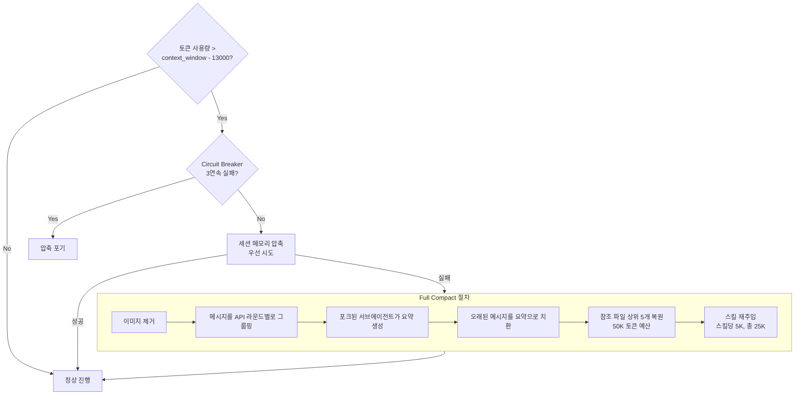

**📘 에러 복구 전략**

| 에러 | 1차 대응 | 2차 대응 |
|------|---------|---------|
| `413 Prompt Too Long` | Collapse drain | Reactive compact |
| Max output tokens | 8K→64K 확대 | 최대 3회 이어쓰기 |
| `429 rate limit` | `retry-after < 500ms`면 즉시 재시도 | Fast mode 해제 + Standard 모델 전환 |
| `529 overloaded` | 3연속 시 fallback 모델 | 비포그라운드 작업은 즉시 포기 |
| `401 auth fail` | OAuth 강제 갱신 | 클라이언트 재생성 |
| `ECONNRESET` | keep-alive 해제 | 재연결 |

**🔧 claude-kit 적용 위치**
- 장시간 `/dev-run` 루프에서 auto-compact가 작동한 뒤엔 프로젝트 파일을 다시 참조해야 할 수 있다 → 중요한 결정은 마크다운으로 기록해두자. [원본 §12.2]

---

## 10. 메모리 시스템 — "이 사용자를 어떻게 기억하나"

> **비유**: 단골 손님을 기억하는 카페 바리스타를 떠올리자. "이 손님은 우유 알레르기가 있다"(user), "지난주에 아메리카노가 너무 진하다고 했다"(feedback), "다음 주에 딸 생일 케이크 주문할 예정"(project), "원두 도매상은 ○○네가 싸다"(reference)의 네 종류 정보를 각기 다르게 기억한다.

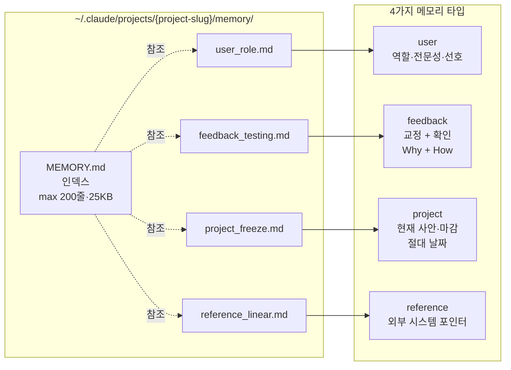

**📘 저장하지 말아야 하는 것**
- ❌ 코드 패턴·아키텍처 (코드 자체가 SSoT)
- ❌ Git 히스토리 (`git log`로 충분)
- ❌ 디버깅 레시피 (커밋 메시지로 충분)
- ❌ 이미 `CLAUDE.md`에 있는 내용

**🔧 claude-kit 적용 위치**
- 프로젝트별 에이전트 메모리는 `~/.claude/agent-memory/{agent-name}/`에 타입별 구조로 저장한다(전역 룰 `agents-v2.md`). [원본 §20]

---

## 11. 8가지 반복 설계 패턴 — "어디서나 나타나는 리듬"

> **비유**: 잘 지은 건물을 보면 출입구·비상구·창문 같은 요소가 어느 층이든 같은 위치에 있다. Claude Code의 코드도 마찬가지로, 아래 8가지 패턴이 반복해서 등장한다.

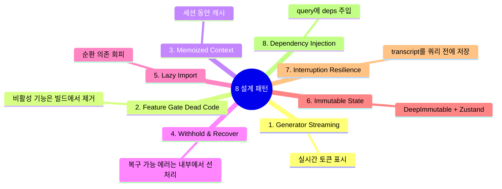

**🔧 claude-kit 적용 위치**
- `.claude/hooks/*`는 설정에 따라 비활성화될 수 있다 → 패턴 2(Feature Gate)의 응용.
- `state.json` 계열(워크플로우 상태)은 반드시 **불변 업데이트**로 작성해야 한다 → 패턴 6. [원본 §23]

---

## 12. 종합: claude-kit 개선 로드맵

아래는 위 8개 다이어그램을 본 프로젝트에 역으로 매핑한 요약표다. 한눈에 "어느 부분을 어떻게 고칠지" 결정할 때 쓴다.

```mermaid
flowchart TB
    subgraph Current["현재 claude-kit"]
        C1[서브에이전트 6종<br/>dev-*]
        C2[훅 8종<br/>dev-*, copy-*]
        C3[스킬 다수<br/>kit-*, dev-*]
    end

    subgraph Gaps["개선 여지"]
        G1[리더-워커 구조 미정립<br/>Coordinator 패턴 도입]
        G2[에이전트 격리 수준 미지정<br/>worktree 옵션 활용]
        G3[Safe/Unsafe 메타데이터 부재<br/>자동 병렬화 제한]
        G4[Plan 모드와 결합 미흡<br/>HARD-GATE 강화 여지]
        G5[메모리 타입 체계 부분 적용]
    end

    subgraph Actions["구체 액션"]
        A1[리더 에이전트 신설<br/>dev-orchestrator.md]
        A2[Agent 호출 시<br/>isolation: worktree]
        A3[에이전트 frontmatter에<br/>concurrency_safe 명시]
        A4[/dev-plan 시점 Plan 모드 자동 전환]
        A5[agent-memory/ 타입별 파일 분리]
    end

    C1 --> G1 --> A1
    C1 --> G2 --> A2
    C1 --> G3 --> A3
    C3 --> G4 --> A4
    C2 --> G5 --> A5
```

### 우선순위별 추천

| 우선순위 | 액션 | 기대 효과 |
|---------|------|-----------|
| 🔴 P0 | A1 리더 에이전트 신설 | Coordinator 패턴 완성 → 병렬 개발 안정화 |
| 🟡 P1 | A4 Plan 모드 자동 전환 | HARD-GATE(설계 없이 코딩 금지) 강제 |
| 🟡 P1 | A3 concurrency 메타데이터 | 읽기 전용 에이전트 병렬 실행 속도 향상 |
| 🟢 P2 | A2 worktree 격리 | 위험 실험의 안전성 확보 |
| 🟢 P2 | A5 메모리 타입화 | 세션 간 학습 품질 향상 |

---

## 부록 A. 용어집 (빠른 참조)

| 용어 | 한 줄 정의 |
|------|-----------|
| **Tool** | AI가 자동 호출하는 원자 동작 (Read, Edit, Bash 등 45+) |
| **Skill** | 사용자가 `/name`으로 호출하는 복합 워크플로우 템플릿 |
| **Plugin** | 스킬·훅·MCP 서버의 번들 |
| **Hook** | 특정 이벤트에 자동 실행되는 사용자 정의 동작 |
| **MCP** | 외부 도구를 Claude Code에 꽂는 표준 프로토콜 |
| **Agent(Tool)** | 서브에이전트를 고용하는 특수 도구 |
| **Coordinator** | 리더 1 + 워커 N 멀티에이전트 모드 |
| **Kairos** | 상시 대기하는 프로액티브 어시스턴트 모드 |
| **Bridge** | 로컬 터미널 ↔ claude.ai 웹을 잇는 서브시스템 |
| **CCR** | Claude Remote Runtime. 원격 세션 백엔드 |
| **Zod** | TypeScript 런타임 스키마 검증 라이브러리 |
| **Ink** | React 기반 터미널 UI 프레임워크 |
| **Auto-Compact** | 대화가 길 때 자동으로 요약·축약하는 메커니즘 |

## 부록 B. 본 문서의 범위

- ✅ 포함: 루프·도구·권한·훅·메모리·Coordinator·확장 계층의 시각 설명
- ❌ 제외: 원본 §4.1(main.tsx 시작 시퀀스), §11.1(AppState 내부 필드 상세), §16.1~16.3(Ink TUI 내부), §17~18(Bridge·Remote 구체 구현), §21~22(타입 시스템·유틸)
  - → 에이전트 기능 개선 목적엔 불필요하므로 제외. 필요 시 원본 참조.

## 부록 C. 다시 분석할 때

원본은 Cloudflare 챌린지로 curl 직접 접근이 차단된다. 다음 경로가 동작한다.

```bash
curl -s -L --max-time 60 \
  "https://r.jina.ai/https://wikidocs.net/338204" \
  > ./wikidocs-338204.md
```

---

**🔧 본 문서 작성 기준**: 원본 분석서 24개 섹션 중 에이전트 개선 관련 12개 섹션(§2, §5, §6, §7, §8, §13, §14, §15, §19, §20, §23, §24)을 선별·재구성. 새로 그린 다이어그램은 전부 Mermaid 문법으로 작성되어 GitHub·VS Code Preview·Obsidian 등에서 바로 렌더된다.
