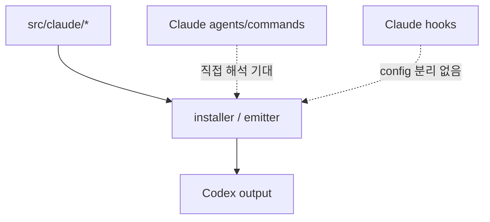
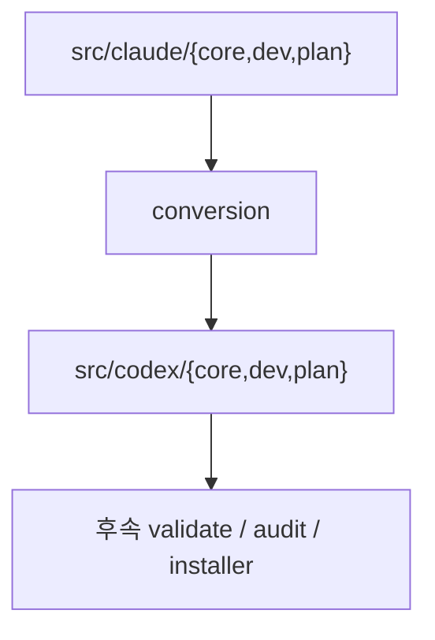
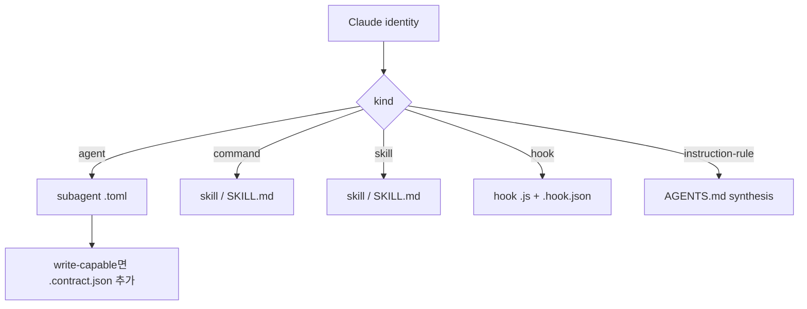

# Conversion Diagrams

> legacy 흐름과 conversion-first 흐름을 비교하는 다이어그램 문서

## 1. legacy 흐름

## 2. conversion-first 흐름

## 3. kind별 흐름

## 다이어그램이 강조하는 점

- 중심은 `src/claude -> conversion -> src/codex`다.
- installer는 후속 단계다.
- `kit-create`는 이 흐름의 중심이 아니다.
