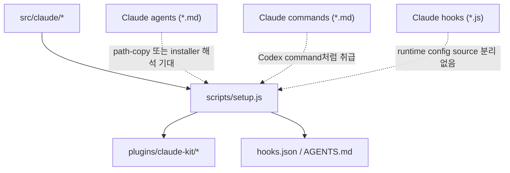
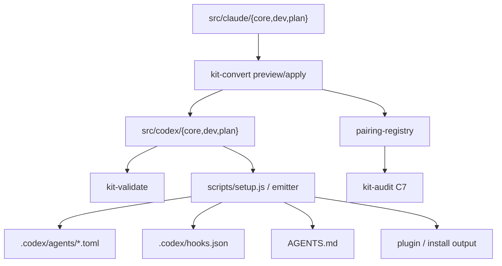
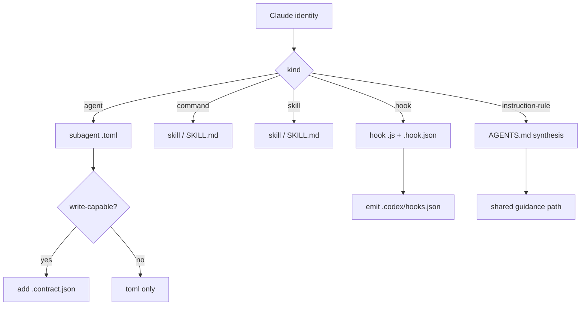
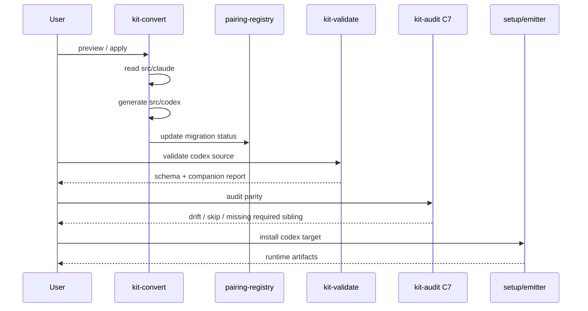

# Pipeline Diagrams

> legacy 파이프라인과 migration-first 파이프라인을 비교 다이어그램으로 설명하는 문서

## 목적

이 문서는 아래를 시각적으로 설명한다.

- 기존 구조에서 Claude 자산이 어떻게 Codex로 흘렀는가
- 새 구조에서 conversion tooling이 어디에 들어가는가
- `src/claude -> src/codex -> installer/runtime` 흐름이 어떻게 달라지는가

## 1. 기존 파이프라인

기존 구조는 Claude source 중심이고, installer가 Codex 대응을 많이 떠안는다.

## 2. 새 migration-first 파이프라인

새 구조는 기존 Claude source를 먼저 분석하고, conversion tooling이 `src/codex` authoring source를 생성한다.

## 3. 기능별 변환 흐름

## 4. migration 시퀀스

## 5. 무엇이 개선되는가

- installer가 Claude 자산을 직접 해석하는 부담이 줄어든다.
- `src/codex`가 빈 폴더가 아니라 실제 conversion output이 된다.
- hook과 write-capable subagent의 companion pair를 source 단계에서 검증할 수 있다.
- `kit-validate`와 `kit-audit C7`의 책임이 분리된다.
- create-time보다 migration-first 목표가 먼저 고정된다.
