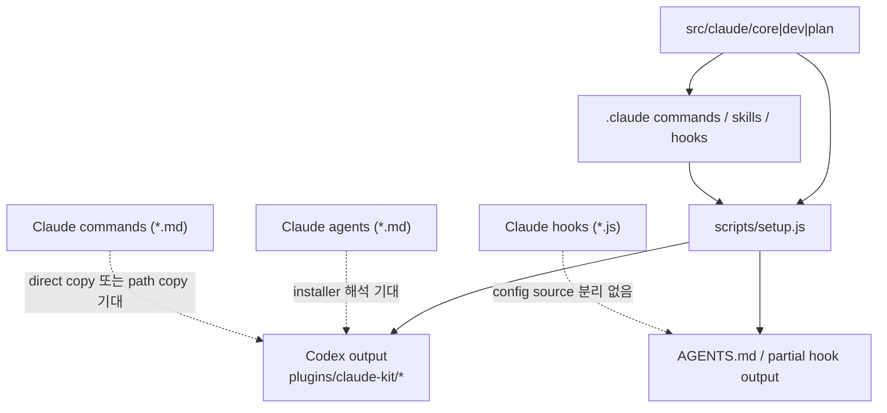
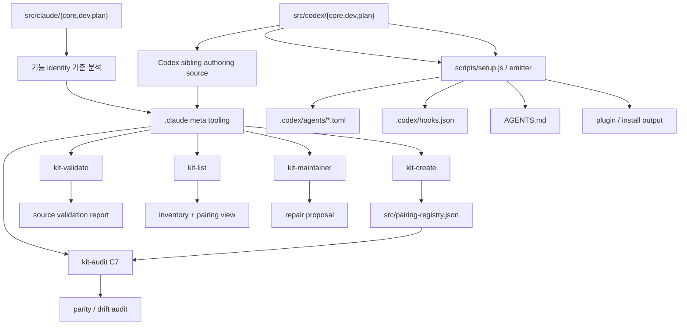
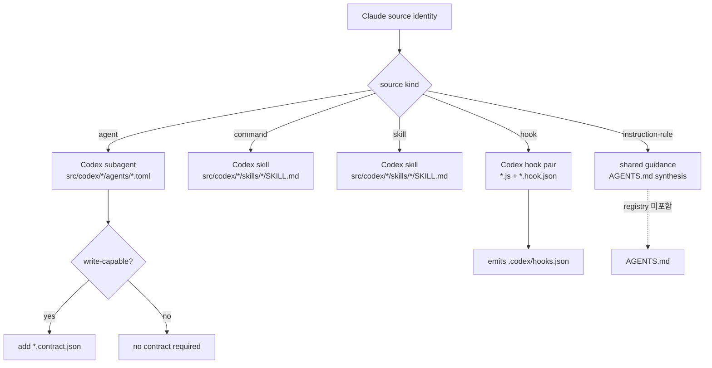
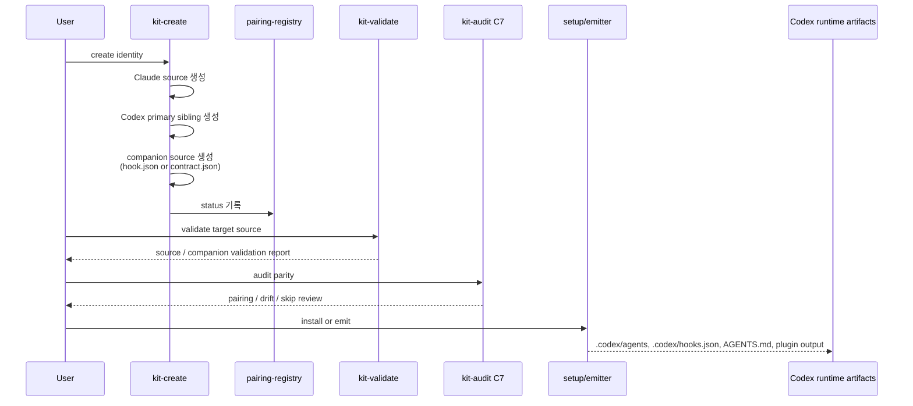
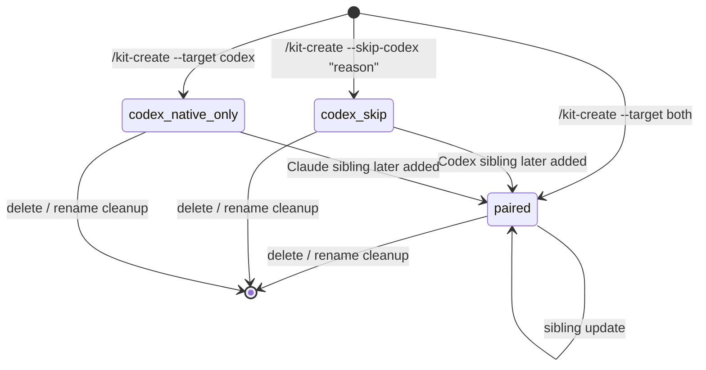
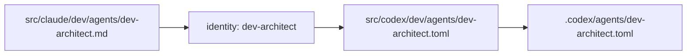
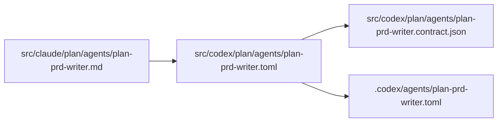
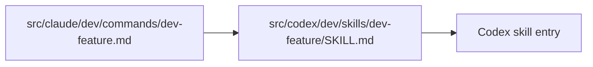
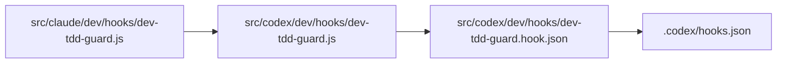
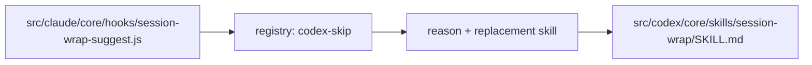

# Pipeline Diagrams

> Claude 기능이 Codex 기능으로 어떻게 이어지는지, 기존 파이프라인과 새 파이프라인을 비교 다이어그램으로 설명하는 문서

## 목적

이 문서는 아래 질문에 답한다.

- 기존 Claude 중심 파이프라인은 어디에서 흔들렸는가
- 새 `src/claude + src/codex` 구조에서는 어떤 책임이 어디로 이동했는가
- `agent`, `command`, `skill`, `hook`, `instruction-rule`이 Codex에서 무엇이 되는가
- `.claude` 메타 툴과 `pairing-registry`가 어디에서 개입하는가

## 범례

- `파랑`: authoring source
- `초록`: meta tooling
- `주황`: validation / audit / pairing
- `회색`: installer / runtime artifact
- `점선`: shared guidance 또는 explicit skip

## 1. 기존 파이프라인

기존 모델은 Claude source를 중심에 두고, installer나 emitter가 Codex 대응을 해석하는 쪽에 무게를 두었다.

### 기존 모델의 한계

- `src/claude`가 사실상 Codex source처럼 취급되었다.
- `agent`와 `command`는 Claude 문법 기반 자산인데도 Codex 대응을 installer가 떠안았다.
- hook은 실행 코드와 runtime config를 별도 source로 관리하지 않았다.
- parity와 validation 책임이 installer 쪽으로 밀려 있었다.

## 2. 새 파이프라인

새 모델은 authoring, validation, parity, emit 책임을 분리한다.

### 새 모델의 핵심 변화

- Codex는 더 이상 `src/claude`를 직접 runtime source로 보지 않는다.
- Codex sibling은 `src/codex`에 미리 authoring한다.
- `.claude` 메타 툴은 생성과 검증, parity 추적을 담당한다.
- installer는 authoring과 parity 판단이 끝난 source를 emit하는 역할에 집중한다.

## 3. 기존 vs 새 모델 비교

| 축 | 기존 파이프라인 | 새 파이프라인 |
|----|-----------------|---------------|
| source of truth | `src/claude` 중심 | `src/claude` + `src/codex` sibling authoring |
| Codex agent 대응 | installer가 해석 | `src/codex/*/agents/*.toml`로 명시 authoring |
| Codex command 대응 | path-copy 또는 direct-copy 사고 | `src/codex/*/skills/*/SKILL.md` |
| hook 대응 | JS 중심 | `*.js` + `*.hook.json` pair |
| write safety | prompt/문서에 암묵적 | `*.contract.json`으로 boundary 명시 |
| parity 판단 | installer/사람이 수동 판단 | `pairing-registry` + `kit-audit C7` |
| validation | source와 parity 경계가 모호 | `kit-validate`는 source, `kit-audit`는 parity |
| rule 처리 | 혼동 가능 | `instruction-rule -> AGENTS.md`, registry 비대상 |

## 4. 기능별 변환 경로

Claude 기능 종류별로 Codex target surface가 어떻게 갈리는지 보여준다.

## 5. 메타 툴 개입 순서

같은 identity가 생성되고 검증되고 설치되는 순서를 보여준다.

## 6. pairing-registry 상태 전이

## 7. pilot 예시

### 7.1 `dev-architect`

### 7.2 `plan-prd-writer`

### 7.3 `dev-feature`

### 7.4 `dev-tdd-guard`

### 7.5 `session-wrap-suggest`

## 8. 무엇이 개선되는가

- installer가 Claude 자산을 억지로 해석하지 않는다.
- Codex 공식 surface에 맞는 source가 `src/codex`에 분리된다.
- hook은 코드와 config가 분리되어 validation 가능성이 높아진다.
- write-capable subagent는 contract로 안전 경계를 문서화할 수 있다.
- `kit-validate`와 `kit-audit C7`의 책임이 나뉘어 결과가 덜 흔들린다.
- skip도 `codex-skip`으로 남아 누락이 아니라 의도된 생략으로 추적된다.

## 9. 후속 반영 포인트

- 이 문서가 확정되면 [00-overview.md](./00-overview.md)에서 읽는 순서에 추가한다.
- 구현이 진행되면 [14-conversion-workflow-and-roadmap.md](./14-conversion-workflow-and-roadmap.md)에서 Wave A~E와 연결한다.
- 실제 구현 후에는 `docs/guide/09-architecture.md`, `docs/meta-tooling/*`에 축약 버전을 반영한다.
