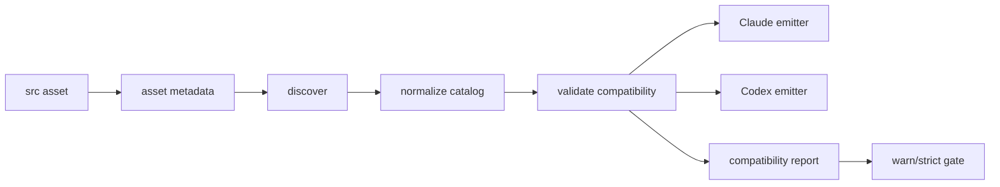

# Codex Compatibility Overview

> `claude-kit`에 새 자산이 추가될 때마다 Codex 호환이 우연히 따라오길 기대하지 않고, 생성 시점과 설치 시점 모두에서 Codex 처리 방식을 강제하기 위한 설계 제안서.

---

## 1. 왜 이 문서가 필요한가

현재 `claude-kit`는 이미 Claude와 Codex를 함께 지원하지만, Codex 쪽 자산 설치 규칙은 아직 완전한 SSOT로 수렴하지 않았다.

- `scripts/setup.js` 안에 Codex 매핑 규칙이 하드코딩되어 있다.
- hook 호환 여부가 `scripts/codex-hook-compat.js`에 별도 리스트로 관리된다.
- rules는 별도 자산으로 복사되지 않고 `AGENTS.md` 템플릿 요약에 의존한다.
- 새 자산을 `src/`에 추가해도 “Codex에서 어떻게 처리할지”를 선언하지 않으면 드리프트가 생긴다.

문제의 핵심은 "Codex를 지원한다"가 아니라 "새 자산이 들어올 때 Codex 처리 정책을 반드시 선언하게 만들고, 설치기가 그 선언을 집행해야 한다"는 점이다.

---

## 2. 현재 위험

| 위험 | 지금 생기는 방식 | 결과 |
|------|------------------|------|
| 하드코딩 드리프트 | setup.js, hook filter, template가 각자 규칙을 가짐 | 새 자산 추가 시 누락 가능 |
| 타깃별 설명 불일치 | README, architecture, 설치기 로직이 따로 변함 | 사용자와 구현 사이 계약이 어긋남 |
| 부분 지원의 비가시성 | skip 이유가 일부만 남음 | 왜 Codex에서 안 되는지 추적이 어려움 |
| 검증 부재 | repo 차원 parity 체크가 없음 | 메타데이터 누락을 PR 시점에 못 잡음 |

---

## 3. 제안 목표

- 모든 installable asset이 Claude/Codex 처리 방식을 명시적으로 가진다.
- 설치기는 같은 catalog를 기준으로 Claude emitter와 Codex emitter를 실행한다.
- Codex 미지원 자산은 조용히 사라지지 않고 reason과 함께 report된다.
- repo CI 또는 로컬 검증에서 metadata 누락과 선언-구현 불일치를 실패 처리할 수 있다.

---

## 4. 용어

| 용어 | 뜻 |
|------|----|
| Asset | `src/` 아래 설치 대상 파일 또는 디렉터리. agent, command, skill, hook, rule을 포함 |
| Metadata SSOT | 자산 옆에 두는 선언 파일. 타깃 지원 범위와 설치 방식을 설명 |
| Catalog | 설치기가 발견한 자산과 metadata를 normalize한 중간 표현 |
| Emitter | catalog를 읽어 실제 Claude/Codex 출력물을 만드는 타깃별 설치기 |
| Compatibility Gate | 설치 후 또는 CI에서 Codex 지원 누락을 검사하는 검증 단계 |

---

## 5. 옵션 요약

| 옵션 | 핵심 아이디어 | 장점 | 한계 |
|------|---------------|------|------|
| Option A | 자산 옆 sidecar metadata 추가 | 도입 비용이 낮고 authoring 책임이 명확 | emitter 구조가 그대로면 로직 분산이 남음 |
| Option B | normalized catalog + target-specific emitter | 구조적으로 가장 안정적이고 설명 가능 | 설치기 리팩터링 비용이 큼 |
| Option C | install report + warn/strict gate | 운영 안전성과 회귀 방지에 강함 | SSOT가 없으면 경고 체계만 복잡해짐 |

권장 방향은 세 옵션을 결합한 하이브리드다.

- Option A를 authoring 포맷으로 사용한다.
- Option B를 설치기의 본체 구조로 사용한다.
- Option C를 repo 품질 게이트와 설치 리포트로 사용한다.

---

## 6. 최종 권장안

핵심 원칙은 아래와 같다.

1. 새 자산은 metadata 없이 설치 대상이 될 수 없다.
2. 설치기는 파일 경로를 직접 해석하지 않고 catalog를 기준으로 동작한다.
3. Codex 미지원은 허용할 수 있지만, 반드시 이유가 선언되고 report에 남아야 한다.
4. `warn`은 소비자 설치를 깨지 않고, `strict`는 claude-kit 저장소 품질 게이트로 동작한다.

---

## 7. 문서 읽는 순서

1. [01-current-gap-analysis.md](./01-current-gap-analysis.md)
2. [02-option-a-sidecar-manifest.md](./02-option-a-sidecar-manifest.md)
3. [03-option-b-target-adapter-registry.md](./03-option-b-target-adapter-registry.md)
4. [04-option-c-install-gates-and-reporting.md](./04-option-c-install-gates-and-reporting.md)
5. [05-recommended-hybrid-model.md](./05-recommended-hybrid-model.md)
6. [06-rollout-plan.md](./06-rollout-plan.md)
7. [07-authoring-checklist.md](./07-authoring-checklist.md)

---

## 8. 결론

`claude-kit`의 Codex 지원은 이미 “사용 가능” 단계에 들어와 있다. 다음 단계는 “새 기능이 들어와도 자동으로 설명되고 검증되는 구조”로 올리는 것이다. 이를 위해서는 자산별 metadata SSOT, catalog 기반 emitter, compatibility gate를 함께 도입하는 것이 가장 안정적이다.
