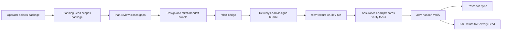

# Recommended Operating Model

## 1. 추천안

이번 연구의 추천안은 `Option B: Hybrid Claude Team`이다.

이 추천은 아래 균형을 노린다.

- 기존 planning/dev/verify backbone을 유지한다.
- `ai-worker` 문서 구조에 맞는 팀 역할을 만든다.
- handoff bundle과 ownership을 표준화한다.
- 병렬 포인트를 활용하되 control tower를 지금 당장 만들지는 않는다.

## 2. 운영 원칙

### 원칙 1. backbone은 바꾸지 않는다

핵심 실행 흐름은 유지한다.

```text
/plan-* -> /plan-bridge -> /dev-feature or /dev-run -> /dev-handoff-verify
```

이번 추천안은 이 흐름을 뒤집지 않는다.
변화는 "명령"보다 "팀 역할과 handoff 규칙"에서 일어난다.

### 원칙 2. `ai-worker`는 package 단위로 진입하되 ticket bundle로 실행한다

운영자가 phase 전체를 한 번에 태우지 않는다.
기본 단위는 package다.

다만 실제 execution은 package 내부 ticket를 bundle로 묶어 진행한다.
예를 들어 `P1-02`는 아래처럼 볼 수 있다.

- planning 계약 단위: `P1-02`
- delivery 실행 단위: `S2-T01 ~ S2-T06` 묶음
- verification 단위: lifecycle acceptance pack

### 원칙 3. 검증은 독립 stage로 남긴다

`/dev-handoff-verify`는 단순 마무리 단계가 아니라
package 완결 여부를 판정하는 공식 gate다.

따라서 추천안에서도 verification은 delivery 안에 흡수하지 않고
`Assurance Lead`가 별도 stage로 가진다.

## 3. Stage별 팀 구성

| Stage | 팀 구성 | 주요 산출물 | 종료 조건 |
| --- | --- | --- | --- |
| Planning stage | `Planning Lead` + `plan-prd-writer` + `plan-reviewer` | package scope, done signal, 제외 범위 | package가 개발 가능한 계약이 된다 |
| Design/Handoff stage | `Planning Lead` + `plan-wireframe-designer` + `plan-stitch-integrator` | design 보강, acceptance 초안, bridge-ready bundle | `/plan-bridge` 가능한 상태가 된다 |
| Delivery stage | `Delivery Lead` + `dev-architect` + implementation executor | 코드, 테스트, 산출물 | package contract를 만족하는 구현이 생긴다 |
| Verification stage | `Assurance Lead` + `dev-verify-agent` + 필요 시 reviewer 계열 | verify report, defects, residual risk | 통과, 재작업, 보류 중 하나로 판정된다 |
| Doc sync/closure | 필요 시 `dev-doc-updater` | backlog/gap report sync | 다음 package 진입에 필요한 문서가 갱신된다 |

## 4. 권장 운영 시퀀스



### 실제 운영 순서

1. 운영자는 이번 라운드 package 하나 또는 package 묶음 하나를 고른다.
2. `Planning Lead`가 source docs를 읽고 package contract를 확정한다.
3. `plan-reviewer`가 누락과 모순을 잡는다.
4. `plan-stitch-integrator`가 handoff bundle을 만든다.
5. `/plan-bridge`로 delivery 진입 문서를 고정한다.
6. `Delivery Lead`가 ownership과 구현 순서를 정한다.
7. 구현 executor가 `/dev-feature` 또는 `/dev-run`으로 작업한다.
8. `Assurance Lead`가 verify focus를 정리해 `/dev-handoff-verify`를 실행한다.
9. 결과를 바탕으로 `dev-doc-updater` 또는 수동 sync로 backlog/gap report를 갱신한다.

## 5. 권장 handoff bundle 형식

추천안은 아래 bundle을 최소 세트로 본다.

| bundle 항목 | 왜 필요한가 |
| --- | --- |
| source docs | package와 ticket의 근거 문서 추적 |
| selected scope | 이번 라운드에 실제로 하는 범위 명시 |
| out-of-scope | package 전체와 이번 bundle의 차이 명시 |
| done signal | 완료 판정 기준 통일 |
| blocking inputs | 선행 ticket, 의존 패키지, 승인 필요 항목 명시 |
| verification focus | verify가 특히 봐야 할 위험과 acceptance 항목 |
| evidence expectation | 테스트, 산출물, 로그 등 증빙 기대치 |

이 세트가 고정되어야
`/plan-bridge`와 `/dev-handoff-verify`가 사람마다 다른 품질로 흔들리지 않는다.

## 6. `ai-worker`에 바로 적용하는 시작점

처음 적용할 package 후보는 아래 기준으로 고른다.

### 1차 추천 후보

- `P0-01 Sidecar Execution Baseline`
- `P0-02 Workspace Persistence Baseline`
- `P1-02 Run Lifecycle Engine`

### 이유

- `P0-01`, `P0-02`는 linear baseline이라 팀 운영 규칙을 시험하기 쉽다.
- `P1-02`는 구조 중심 package라 `Delivery Lead + dev-architect` 조합의 가치를 확인하기 좋다.
- 이후 `P1-01`/`P1-03` 병렬화로 확장하기 좋은 발판이 된다.

## 7. 실패 시 fallback

### Option A로 내리는 경우

아래 상황이면 임시로 Option A 운영으로 내릴 수 있다.

- package가 아주 작다
- 팀 역할을 유지할 시간보다 바로 구현하는 편이 빠르다
- additive asset이 아직 준비되지 않았다

이때도 `/dev-handoff-verify`와 최소 scope contract는 유지한다.

### Option C 요소를 부분 도입하는 경우

아래 상황이면 Option C 요소만 일부 차용한다.

- 동시에 여러 package를 굴리기 시작했다
- blocked package가 자주 생긴다
- 운영자가 현재 상태를 계속 수동 집계하느라 지친다

이때는 `status-report-hook`이나 `blocker-triage` 같은 자산을
부분 도입해서 관제 시야만 먼저 늘린다.

## 8. 1차 성공 기준

추천 운영 모델이 성공적이라고 보려면,
실제 구현 전이라도 아래를 문서 기준으로 판단할 수 있어야 한다.

1. `ai-worker` package 하나를 planning -> delivery -> verification 흐름으로 명확히 설명할 수 있다.
2. 누가 lead이고 누가 verify를 거는지 애매하지 않다.
3. package와 ticket bundle의 handoff 세트가 일관된다.
4. verify 실패 시 어디 문서를 갱신해야 하는지 바로 알 수 있다.

이 기준을 만족하면
다음 단계에서 skill/command/hook/rule을 구현할 가치가 충분하다.
