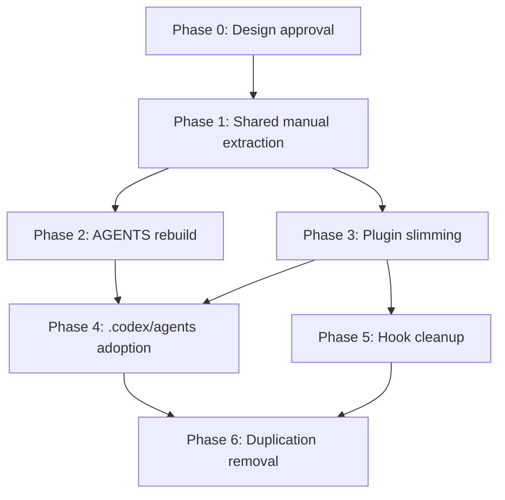

# 04 Migration Plan

> 목적: 현재 구조에서 목표 구조로 옮기기 위한 단계와 완료 조건을 정의한다.

## 1. 전환 원칙

이번 전환은 일괄 교체보다 `병행 전환 + 검증 후 제거`가 적합하다.

- 현재 Codex runtime 자산이 넓다.
- 공식 Codex surface와 현재 구현 사이 차이가 있다.
- hook, agent, skill을 한 번에 뒤집으면 regression 범위가 커진다.

## 2. Phase plan

### Phase 0. 설계 승인

산출물:

- 본 문서 패키지 승인
- official Codex documentation snapshot
- `src/shared/manuals/` canonical path 결정
- `src/codex` duplication A/B/C rubric

완료 조건:

- `manual-only` 대신 `manual-first hybrid` 채택
- 공식 문서 확인 URL 세트 고정
- duplication 분류 기준 승인

### Phase 1. Shared manual 추출

산출물:

- `src/shared/manuals/`
- workflow/pipeline/hook 차이 문서
- shared manifests 초안
- `src/codex` A/B/C 분류표
- meta asset 처리 방향 초안

실행 항목:

- `src/claude`와 `src/codex`에서 설명 중복 추출
- `설명 차이`와 `실제 runtime 차이` 분리
- `pairing-registry`, `exception-registry`, `codex-portability` 처리 방향 정의

완료 조건:

- 동일 개념 설명이 둘 이상의 runtime 전용 파일에 중복되지 않는다
- A/B/C 분류표가 유지보수 기준으로 사용 가능하다

### Phase 2. `AGENTS.md` 재구성

산출물:

- 새 `AGENTS.md.template`
- shared manual 링크 구조
- legacy-to-new 용어 매핑 표

실행 항목:

- 현재 규칙 요약 이관
- pipeline 안내 추가
- Claude/Codex 차이와 discovery 방식 설명 추가

완료 조건:

- Codex 사용자가 `AGENTS.md`만 읽고도 어떤 skill/agent를 먼저 써야 하는지 판단 가능하다

### Phase 3. Codex plugin 축소

산출물:

- skill 중심 plugin 구조
- 불필요한 `commands/agents` 복제 축소안
- legacy alias 처리 정책

실행 항목:

- 공식 surface와 맞지 않는 자산 목록 작성
- skill로 대체 가능한 command 설명은 router skill로 이동
- `/dev-*`, `/plan-*`, `/copy-*` legacy naming을 alias 또는 router intent로 흡수

완료 조건:

- Codex plugin이 주로 `skills` 중심 구조를 가진다
- 기존 사용자 언어가 alias/router를 통해 이해 가능하다

### Phase 4. `.codex/agents` 도입

산출물:

- project-scoped `.codex/agents/*.toml`

실행 항목:

- `src/codex` 자산 중 runtime 차이가 분명한 항목만 custom agent로 매핑
- 나머지는 skill 또는 manual route로 대체

완료 조건:

- Codex custom agent 경로가 공식 문서 구조와 맞는다

### Phase 5. Hook 정리

산출물:

- Codex-compatible hook 목록
- 유지/삭제/보류 분류표

실행 항목:

- shell guardrail로 유효한 hook 유지
- 문서 설명으로 충분한 항목은 manual로 이동
- false confidence를 주는 hook 설명 제거

완료 조건:

- Codex hook 목록이 실제 보장 가능한 동작만 나타낸다

### Phase 6. 중복 제거

산출물:

- 제거 가능한 `src/codex` duplication 정리 PR

실행 항목:

- shared manual 참조로 충분한 파일 제거
- 실제 runtime 차이가 있는 파일만 유지

완료 조건:

- `src/codex`가 `차이 집합`이지 `복제 집합`이 아니다

## 3. Dependency flow

## 4. 파일/영역별 책임 분리

| 영역 | 역할 | 변경 방향 | 제거 후보 |
|---|---|---|---|
| `src/claude` | Claude native runtime | shared manual 참조로 정리 | 설명 중복 파일 |
| `src/codex` | Codex runtime 차이 자산 | skill/custom agent 중심으로 축소 | 단순 duplication 문서 |
| `src/shared` | 공통 설명과 manifests | 신규 도입 | 없음 |
| `src/templates` | generator 입력 템플릿 | `AGENTS.md`, plugin 구조 반영 | legacy 가정 템플릿 |
| `scripts/setup.js` | emitter 중심부 | shared manifest 기반으로 재구성 | legacy branching 로직 |

## 5. 추천 구현 순서

1. official snapshot과 duplication rubric 고정
2. `src/shared/manuals/` 도입
3. `AGENTS.md.template` 개편
4. Codex router skill 도입
5. `.codex/agents` generator 도입
6. plugin 축소
7. 중복 파일 제거

## 6. 보수적 전환 규칙

- 한 Phase에서 바꾸는 surface 수를 최소화한다.
- hooks와 agents를 같은 PR에서 동시에 크게 뒤집지 않는다.
- 제거 작업은 항상 대체 경로가 검증된 뒤에 한다.
- `AGENTS.md`와 skill router가 먼저 안정화된 뒤 plugin 축소로 들어간다.
