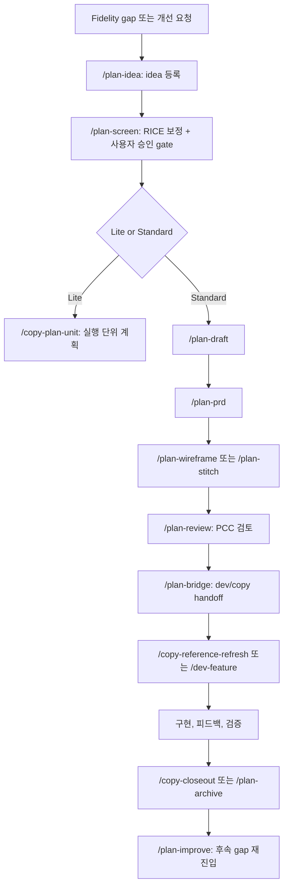

> [REVIEW 반영] claude-kit 아키텍처 리뷰 피드백 반영. 소스 경로 수정.

# Claude Plan Workflow 통합 반영 계획

- 문서 ID: CAI-10
- 작성일: 2026-04-15
- 문서 상태: plan 기능 분석 및 CAI 반영 계획 완료
- 선행 문서: [README.md](./README.md), [01_package-map.md](./01_package-map.md), [06_command-workflow-spec.md](./06_command-workflow-spec.md), [08_adoption-roadmap.md](./08_adoption-roadmap.md), [09_readiness-checklist.md](./09_readiness-checklist.md)
- 관련 상위 문서: [18_claude-agent-integration-proposal.md](../../18_claude-agent-integration-proposal.md)
- 관련 Claude Kit 문서: [CLAUDE-KIT-QUICKSTART.md](../../CLAUDE-KIT-QUICKSTART.md)
- 목적: 새로 확인된 Claude Kit `plan` 기능을 Turner Construction 홈페이지 정밀 카피 파이프라인에 어떻게 반영할지 분석하고, 기존 CAI 문서 패키지의 수정 범위와 실행 단위를 정의한다.

## 1. 문서 목적

기존 `docs/claude-agent-integration/` 문서 패키지는 `core`, `dev`, 그리고 프로젝트 전용으로 설계한 `/copy-*` 중심 workflow를 기준으로 작성되었다. 그러나 현재 Claude Kit 설치 상태에는 `plan` 도메인이 추가되어 있으며, `/plan-idea`부터 `/plan-bridge`까지 기획 산출물을 개발 진입 전 단계로 연결하는 공식 흐름이 존재한다.

이 문서의 목적은 `plan` 기능을 일반 기획 자동화가 아니라 Turner Construction 홈페이지 정밀 카피 작업의 `기준선 수집`, `fidelity gap 분석`, `실행 단위 계획`, `사용자 승인 gate`, `QA readiness`, `release closeout`에 연결하는 것이다.

| 항목 | 기존 CAI 한계 | plan 반영 기대 효과 |
| --- | --- | --- |
| 기획 진입점 | `/copy-*`와 agent spec이 dev 보조 중심으로 설계됨 | fidelity 개선 아이디어를 `/plan-idea`와 `/plan-screen`으로 선별 |
| 실행 전 승인 | 실행 단위 gate는 문서 규칙으로만 존재 | `/plan-screen`, PRD, bridge 단계에서 명시적 사용자 gate 강화 |
| 문서 산출물 | CAI 문서와 P 문서 중심 | `.plans/` 기반 PRD, wireframe, bridge context 추가 가능 |
| 품질 검증 | copy QA와 evidence 중심 | Planning Consistency Check(PCC)로 기획 산출물 간 충돌 점검 |
| dev 연결 | `/copy-plan-unit` 이후 구현 보조를 별도 설계 | `/plan-bridge`를 통해 `/dev-feature` 진입 context 생성 가능 |

## 2. 새로 추가된 plan 기능 분석

### 2.1 설치 상태 근거

| 확인 항목 | 현재 상태 | 근거 |
| --- | --- | --- |
| Claude Kit 버전 | `2.1.0` | [CLAUDE-KIT-QUICKSTART.md](../../CLAUDE-KIT-QUICKSTART.md) |
| 활성 도메인 | `core`, `dev`, `plan` | [CLAUDE-KIT-QUICKSTART.md](../../CLAUDE-KIT-QUICKSTART.md) |
| 활성 타겟 | `claude` | [CLAUDE-KIT-QUICKSTART.md](../../CLAUDE-KIT-QUICKSTART.md) |
| plan command | 10개 존재 | [../../.claude/commands](../../.claude/commands) (claude-kit 소스: src/claude/plan/commands/) |
| plan agent | 6개 존재 | [../../.claude/agents](../../.claude/agents) (claude-kit 소스: src/claude/plan/agents/) |
| plan skill | 8개 존재 | [../../.claude/skills](../../.claude/skills) (claude-kit 소스: src/claude/plan/skills/) |
| plan hook | `plan-doc-guard.js` 존재 | [../../.claude/hooks/plan-doc-guard.js](../../.claude/hooks/plan-doc-guard.js) (claude-kit 소스: src/claude/plan/hooks/) |
| `.plans/` 산출물 | 아직 없음 | 현재 workspace 확인 기준 |

### 2.2 새로 확인된 command 목록

| Command | 파일 | 역할 | Turner 카피 프로젝트 해석 |
| --- | --- | --- | --- |
| `/plan-idea` | [plan-idea.md](../../.claude/commands/plan-idea.md) (소스: src/claude/plan/commands/) | 아이디어 수집 | fidelity gap 또는 보강 요청을 표준 idea로 등록 |
| `/plan-screen` | [plan-screen.md](../../.claude/commands/plan-screen.md) (소스: src/claude/plan/commands/) | RICE 스크리닝과 승인 gate | gap의 영향도, evidence, 구현 비용을 기준으로 우선순위 판정 |
| `/plan-draft` | [plan-draft.md](../../.claude/commands/plan-draft.md) (소스: src/claude/plan/commands/) | 1차 기능 기획과 Lite/Standard 판정 | 작은 gap은 Lite, header/mega menu급 보강은 Standard로 분류 |
| `/plan-prd` | [plan-prd.md](../../.claude/commands/plan-prd.md) (소스: src/claude/plan/commands/) | PRD 작성 | 큰 fidelity 보강을 요구사항과 acceptance로 고정 |
| `/plan-wireframe` | [plan-wireframe.md](../../.claude/commands/plan-wireframe.md) (소스: src/claude/plan/commands/) | ASCII/Mermaid wireframe | 메뉴 open, sticky, responsive state 구조를 텍스트 구조로 명확화 |
| `/plan-stitch` | [plan-stitch.md](../../.claude/commands/plan-stitch.md) (소스: src/claude/plan/commands/) | PRD와 디자인 산출물 통합 | reference screenshot, state evidence, wireframe을 구현 context로 정렬 |
| `/plan-bridge` | [plan-bridge.md](../../.claude/commands/plan-bridge.md) (소스: src/claude/plan/commands/) | planning에서 dev로 handoff | 승인된 fidelity 보강을 `/dev-feature` 또는 `/copy-*` 실행 context로 전환 |
| `/plan-review` | [plan-review.md](../../.claude/commands/plan-review.md) (소스: src/claude/plan/commands/) | 기획 문서 품질 검토 | PRD, wireframe, bridge가 원본 fidelity 목표와 충돌하지 않는지 점검 |
| `/plan-archive` | [plan-archive.md](../../.claude/commands/plan-archive.md) (소스: src/claude/plan/commands/) | 완료 기능 archive | 완료된 보강 라운드의 근거와 산출물 묶음화 |
| `/plan-improve` | [plan-improve.md](../../.claude/commands/plan-improve.md) (소스: src/claude/plan/commands/) | archive 기반 개선 재진입 | 완료 후 발견된 fidelity gap을 새 보강 흐름으로 되돌림 |

### 2.3 새로 확인된 agent 목록

| Agent | 파일 | 역할 | CAI 반영 방향 |
| --- | --- | --- | --- |
| `plan-idea-collector` | [plan-idea-collector.md](../../.claude/agents/plan-idea-collector.md) (소스: src/claude/plan/agents/) | idea 구조화, 중복 검토 | fidelity gap intake agent로 활용 |
| `plan-idea-screener` | [plan-idea-screener.md](../../.claude/agents/plan-idea-screener.md) (소스: src/claude/plan/agents/) | RICE 기반 screening | visual/interaction gap 우선순위 판정에 사용 |
| `plan-prd-writer` | [plan-prd-writer.md](../../.claude/agents/plan-prd-writer.md) (소스: src/claude/plan/agents/) | PRD 작성 | 큰 보강 항목의 acceptance와 제외 범위 고정 |
| `plan-wireframe-designer` | [plan-wireframe-designer.md](../../.claude/agents/plan-wireframe-designer.md) (소스: src/claude/plan/agents/) | wireframe 작성 | 상태별 layout과 responsive 전환 구조 문서화 |
| `plan-stitch-integrator` | [plan-stitch-integrator.md](../../.claude/agents/plan-stitch-integrator.md) (소스: src/claude/plan/agents/) | PRD, wireframe, design context 통합 | reference evidence와 구현 context 연결 |
| `plan-reviewer` | [plan-reviewer.md](../../.claude/agents/plan-reviewer.md) (소스: src/claude/plan/agents/) | planning consistency review | 사용자 gate 전 self-review 품질 향상 |

### 2.4 새로 확인된 skill 목록

| Skill | 경로 | 역할 | 프로젝트 적용 포인트 |
| --- | --- | --- | --- |
| `plan-pipeline` | [plan-pipeline](../../.claude/skills/plan-pipeline) (소스: src/claude/plan/skills/) | P1~P7 전체 흐름 | CAI에 plan pre-stage 추가 |
| `plan-idea-management` | [plan-idea-management](../../.claude/skills/plan-idea-management) (소스: src/claude/plan/skills/) | idea inbox, backlog, 상태 관리 | fidelity gap intake 표준화 |
| `plan-screening-workflow` | [plan-screening-workflow](../../.claude/skills/plan-screening-workflow) (소스: src/claude/plan/skills/) | screening과 승인 | 사용자 승인 gate 강화 |
| `plan-prd-authoring` | [plan-prd-authoring](../../.claude/skills/plan-prd-authoring) (소스: src/claude/plan/skills/) | PRD 섹션 작성 | 보강 범위, 제외 범위, acceptance 고정 |
| `plan-wireframe-design` | [plan-wireframe-design](../../.claude/skills/plan-wireframe-design) (소스: src/claude/plan/skills/) | wireframe 작성 | menu, sticky, responsive state 구조화 |
| `plan-stitch-workflow` | [plan-stitch-workflow](../../.claude/skills/plan-stitch-workflow) (소스: src/claude/plan/skills/) | design/context 통합 | evidence, spec, bridge 연결 |
| `plan-review-criteria` | [plan-review-criteria](../../.claude/skills/plan-review-criteria) (소스: src/claude/plan/skills/) | PCC 검토 기준 | 문서 충돌과 누락 점검 |
| `plan-archive-workflow` | [plan-archive-workflow](../../.claude/skills/plan-archive-workflow) (소스: src/claude/plan/skills/) | 완료 bundle archive | release closeout, improvement 재진입 |

### 2.5 rules, hooks, settings 변화

| 항목 | 현재 확인 내용 | 해석 | 주의점 |
| --- | --- | --- | --- |
| `.claude/rules/` | plan 전용 rule 파일은 확인되지 않음 | plan 정책은 현재 command/agent/skill/hook 중심으로 제공됨 | copy 전용 rule을 추가할 때 plan rule이 이미 있다고 가정하면 안 됨 |
| `plan-doc-guard.js` | [../../.claude/hooks/plan-doc-guard.js](../../.claude/hooks/plan-doc-guard.js) 추가 | `.plans/` 문서의 필수 섹션과 planning 중 code edit 차단 의도를 가짐 | 실제 차단 범위는 도입 전 별도 검증 필요 |
| `.claude/settings.json` | `PreToolUse`의 `Edit|Write`에 `plan-doc-guard.js` 연결 | plan 문서 품질 guard가 활성화된 상태 | copy 전용 hook과 충돌 여부 점검 필요 |
| `.plans/` | 아직 생성되지 않음 | plan command 실행 전 산출물 root와 운영 규칙 승인이 필요. copy 도메인 훅 추가 시 `plan-doc-guard.js`와의 충돌 여부를 사전 검증해야 한다 (동일 `PreToolUse` `Edit|Write` 이벤트에서 plan-doc-guard와 copy 훅이 동시 발동될 수 있음) | 무심코 plan command를 실행하면 새 planning tree가 생길 수 있음 |
| `profile.json` | 현재 workspace 기준 `domains`에 `plan` 포함 | plan 도메인 설치 근거 | 본 문서 작업에서는 수정/커밋 대상 아님 |

### 2.6 기존 dev workflow와의 차이

| 구분 | plan workflow | dev workflow | copy workflow 후보 |
| --- | --- | --- | --- |
| 주요 목적 | 무엇을 할지 선별하고 요구사항으로 잠금 | 승인된 요구사항을 구현 package로 전환 | 원본 대비 fidelity gap을 수집, 분석, 검증 |
| 시작점 | idea, screening, PRD | PRD 또는 feature package | reference evidence, visual/interaction gap |
| 대표 산출물 | `.plans/ideas`, `.plans/prd`, `.plans/wireframes`, bridge context | `.plans/features/active`, package, dev notes | gap board, state map, evidence manifest, QA report |
| 핵심 gate | `/plan-screen`, PRD review, bridge handoff | feature overview review, DVC, commit | P0/P1 fidelity gap 사용자 확인 |
| Turner 프로젝트 역할 | dev 전에 fidelity 보강 범위와 우선순위 고정 | 실제 구현 수행 | 원본 카피 품질을 판단하는 프로젝트 특화 layer |

## 3. plan 기능의 역할 요약

| 역할 | 확인된 command/agent | 산출물 | Turner 카피 프로젝트 적용 방식 |
| --- | --- | --- | --- |
| idea 수집 | `/plan-idea`, `plan-idea-collector` | `.plans/ideas/00-inbox/IDEA-*` | “Our Company hover panel fidelity 부족” 같은 gap을 idea로 등록 |
| screening | `/plan-screen`, `plan-idea-screener` | `.plans/ideas/10-screening/SCREENING-*` | gap을 체감 영향, evidence 신뢰도, 구현 비용으로 선별 |
| draft 작성 | `/plan-draft` | feature first-pass | 작은 gap은 Lite 실행 단위, 큰 gap은 Standard PRD 대상으로 판정 |
| PRD 작성 | `/plan-prd`, `plan-prd-writer` | `.plans/prd/00-draft` 또는 `10-approved` | header, mega menu, responsive overhaul처럼 큰 보강의 기준 문서 생성 |
| wireframe | `/plan-wireframe`, `plan-wireframe-designer` | `.plans/wireframes/{slug}/` | menu open, sticky, mobile nav 구조를 ASCII/Mermaid로 정리 |
| stitch | `/plan-stitch`, `plan-stitch-integrator` | `.plans/stitch/{slug}/` | PRD, wireframe, screenshot evidence, P3/P5 기준을 연결 |
| bridge | `/plan-bridge` | bridge context 파일 | 승인된 plan 산출물을 `/dev-feature` 또는 `/copy-plan-unit` 입력으로 넘김 |
| review | `/plan-review`, `plan-reviewer` | PASS/WARN/FAIL 검토 | 계획 산출물이 원본 fidelity 목표와 충돌하지 않는지 확인 |
| archive | `/plan-archive` | `.plans/archive/{slug}/ARCHIVE-*` | 완료된 보강 라운드의 기준선, gap, 구현, 검증 묶음화 |
| improve | `/plan-improve` | improvement 문서 | release 이후 발견된 gap을 재진입 흐름으로 연결 |

## 4. Turner 홈페이지 카피 프로젝트와의 매핑

| 프로젝트 단계 | 기존 기준 문서/흐름 | plan 기능 연결 | 기대 효과 |
| --- | --- | --- | --- |
| reference baseline 수집 전 planning | P2, CAI-04 | `/plan-idea`로 capture 보강 요청 등록, `/plan-screen`으로 필요성 판단 | capture 범위가 커지기 전에 근거와 우선순위 확보 |
| visual fidelity gap 분석 전 planning | P10, CAI-02 | `/plan-draft`로 gap board 후보를 실행 가능 범위로 축소 | 추상적 “디테일 개선”을 특정 section/state 단위로 고정 |
| interaction fidelity gap 분석 전 planning | P10, P11, CAI-03 | `/plan-prd`, `/plan-wireframe`으로 hover/open/sticky state 명세화 | header/menu처럼 상태가 많은 영역의 누락 감소 |
| 실행 단위 계획서 작성 | 기존 6단계 lifecycle | `/plan-bridge` 산출물을 실행 단위 입력으로 사용 | 계획, 구현, 검증의 context drift 감소 |
| 사용자 승인 gate | 대그룹/Phase/R gate | `/plan-screen`, PRD, bridge에서 사용자 확인 지점 추가 | 자동화가 원본 fidelity 판단을 임의로 확정하지 못하게 함 |
| QA readiness | P5, P15, CAI-05, CAI-09 | `/plan-review`와 PCC를 QA readiness 전단에 배치 | QA가 검증할 범위와 evidence 요구사항을 먼저 고정 |
| release closeout | P8, P17, closeout 문서 | `/plan-archive`, `/plan-improve` | 완료 bundle과 후속 improvement routing 표준화 |
| Claude Agent adoption roadmap | CAI-08 | plan pre-stage를 A0 또는 별도 CAI-10 gate로 추가 | `.claude` 수정 전 문서/운영 결정 정리 |

### 4.1 fidelity 작업용 RICE 해석 보정

`/plan-screen`의 RICE를 그대로 사업 기능 우선순위로만 쓰면 홈페이지 카피 프로젝트에는 맞지 않는다. 이 프로젝트에서는 아래처럼 해석을 보정해야 한다.

| RICE 요소 | 일반 해석 | Turner 카피 프로젝트 해석 |
| --- | --- | --- |
| Reach | 영향을 받는 사용자 수 | 영향을 받는 viewport, section, state, 반복 노출 빈도 |
| Impact | 사업/사용자 가치 | 원본 대비 체감 차이 감소 효과 |
| Confidence | 근거 신뢰도 | reference/current screenshot, video, timing evidence 보유 수준 |
| Effort | 구현 비용 | CSS/JS 변경 규모, capture 재수집, QA 반복 비용 |

## 5. 기존 CAI 문서별 반영 필요 사항

| 문서 | 수정 필요 | 추가해야 할 내용 | 유지해야 할 내용 | 충돌 가능성 | 우선순위 |
| --- | --- | --- | --- | --- | --- |
| [README.md](./README.md) | 필요 | CAI-10 링크, plan 반영 상태, 읽기 순서에 plan pre-stage 추가 | 기존 P18 상위 제안서와 00~09 상태판 | 기존 “1차 문서 패키지 완료” 표현과 plan 추가 상태가 충돌 가능 | 높음 |
| [00_docs-split-plan.md](./00_docs-split-plan.md) | 필요 | P18 상세 문서 패키지에 CAI-10이 추가된 이유 | 루트 문서 추가 대신 하위 폴더 유지 원칙 | 문서 분리 계획이 00~09로 고정된 듯 보일 수 있음 | 중간 |
| [01_package-map.md](./01_package-map.md) | 필요 | `.plans/`를 planning SSOT 후보로 추가, CAI와 P 문서 관계 업데이트 | P0~P18, CAI 00~09 추적성 | `.plans/`와 기존 P 문서의 권한 경계 모호화 | 높음 |
| [02_copy-fidelity-agent-spec.md](./02_copy-fidelity-agent-spec.md) | 부분 필요 | visual gap이 `/plan-idea` 또는 `/plan-screen`으로 승격되는 기준 | visual gap schema와 P0/P1 priority | copy agent가 plan 우선순위를 대신 판단하는 오해 | 중간 |
| [03_interaction-fidelity-agent-spec.md](./03_interaction-fidelity-agent-spec.md) | 부분 필요 | complex state는 `/plan-prd`와 `/plan-wireframe` 대상이라는 기준 | state map, timing sheet, 사용자 gate | wireframe이 실제 reference evidence를 대체하는 오해 | 중간 |
| [04_reference-baseline-agent-spec.md](./04_reference-baseline-agent-spec.md) | 부분 필요 | capture 범위 확장 요청을 `/plan-idea`로 올리는 기준 | manifest, missing evidence report | capture 자동 확장이 gate 없이 진행될 위험 | 중간 |
| [05_qa-review-agent-spec.md](./05_qa-review-agent-spec.md) | 부분 필요 | QA readiness 전에 `/plan-review` 결과를 참조하는 규칙 | QA result schema, evidence quality 기준 | PCC와 QA review의 책임 중복 | 중간 |
| [06_command-workflow-spec.md](./06_command-workflow-spec.md) | 필요 | `/plan-* -> /copy-* -> /dev-*` 흐름, `/plan-bridge` input/output contract | 기존 `/copy-*` lifecycle와 6단계 실행 규칙 | `/copy-plan-unit`과 `/plan-draft` 역할 중복 | 높음 |
| [07_hooks-and-rules-plan.md](./07_hooks-and-rules-plan.md) | 필요 | `plan-doc-guard.js` 현황, copy hook과 plan hook 충돌 검증 | blocking/reminder 정책 | planning 중 code edit 차단 의도와 실제 hook 동작 범위의 차이 | 높음 |
| [08_adoption-roadmap.md](./08_adoption-roadmap.md) | 필요 | A0 plan workflow alignment 또는 별도 P0 도입 단계 | 분석/검증 agent 우선, orchestrator 후순위 | roadmap이 dev/copy 중심으로만 보이는 문제 | 높음 |
| [09_readiness-checklist.md](./09_readiness-checklist.md) | 필요 | plan domain readiness, `.plans/` 생성 gate, plan command dry run 기준 | 로컬 git, dirty file 보호, readiness 상태 | `.plans/` 미존재 상태를 READY로 오판 | 높음 |

## 6. 새 문서 추가 필요성 검토

| 항목 | 판단 |
| --- | --- |
| 새 문서 필요 여부 | 필요 |
| 권장 파일명 | `docs/claude-agent-integration/10_plan-workflow-integration-plan.md` |
| 이유 | 기존 00~09 문서에 바로 흩어 넣으면 plan 기능의 역할, 경계, 위험이 분산되어 이해하기 어려움 |
| 담당 내용 | plan 기능 분석, CAI 영향도, 반영 실행 단위, 검증 계획 |
| 중복 회피 방식 | 06은 command 상세, 08은 도입 순서, 09는 readiness로 유지하고, CAI-10은 plan 반영 전 의사결정 문서로 한정 |

## 7. plan 기능을 포함한 새 문서 패키지 구조 제안

### 7.1 구조 유지안

| 구성 | 설명 | 장점 | 단점 |
| --- | --- | --- | --- |
| 00~09 유지, 각 문서에 plan 내용을 조금씩 추가 | 새 문서 없이 기존 문서 수정 | 파일 수 증가 없음 | plan 도입 판단 근거가 흩어짐 |

### 7.2 새 문서 1개 추가안

| 구성 | 설명 | 장점 | 단점 |
| --- | --- | --- | --- |
| 00~09 유지, CAI-10 추가 | 본 문서가 plan 반영 기준점 역할 | 영향도와 실행 계획을 한 곳에서 확인 가능 | README/package map 동기화 필요 |

### 7.3 plan 관련 문서 다중 분리안

| 구성 | 설명 | 장점 | 단점 |
| --- | --- | --- | --- |
| `10_plan-overview`, `11_plan-command-map`, `12_plan-readiness` 등으로 분리 | plan만 별도 하위 패키지처럼 관리 | 대규모 도입 시 상세화 쉬움 | 현재 단계에서는 문서 복잡도 증가 |

### 7.4 추천안

현재는 `새 문서 1개 추가안`을 추천한다. 이유는 plan 기능이 이미 설치되어 있지만 `.plans/` 산출물은 아직 없고, 실제 `.claude` 수정도 이 단계의 목적이 아니기 때문이다. 먼저 CAI-10으로 판단 기준을 고정한 뒤, 사용자 승인 후 README, package map, command workflow, roadmap, readiness checklist를 갱신하는 순서가 안전하다.

## 8. plan 기능 반영 후 기대되는 운영 흐름

| 흐름 단계 | 기존 계층형 구조 연결 | 사용자 gate |
| --- | --- | --- |
| idea/screening | 대그룹 또는 Phase 진입 전 후보 정리 | `/plan-screen` 결과 승인 |
| draft/PRD | 소그룹 또는 실행 단위 묶음의 요구사항 고정 | PRD 승인 또는 revise |
| wireframe/stitch | 상태형 UI와 responsive 구조의 실행 전 설계 | header/menu/sticky 같은 P0 state는 사용자 확인 |
| bridge | 실행 단위 plan과 dev/copy command 입력 생성 | bridge context 승인 |
| dev/copy 실행 | `대그룹 > 중그룹 > 소그룹 > 실행 단위` 유지 | 대그룹/Phase/R 종료 gate 유지 |
| archive/improve | 완료 bundle과 후속 개선 연결 | archive 또는 improve 재진입 승인 |

## 9. 실행 단위 계획

| 실행 단위 | 목적 | 입력 | 산출물 | 완료 기준 | 검증 방법 | 권장 커밋 메시지 |
| --- | --- | --- | --- | --- | --- | --- |
| PLAN-CAI-01 | plan 기능 분석 문서 작성 | `CLAUDE-KIT-QUICKSTART.md`, `.claude/commands`, `.claude/agents`, `.claude/skills`, `.claude/hooks`, CAI 00~09 | `10_plan-workflow-integration-plan.md` | command/agent/skill/hook 영향과 CAI 반영 계획이 문서화됨 | 파일 존재, 링크 존재, 미정 표현 검색, self-review | `docs: plan workflow 통합 반영 계획 정리` |
| PLAN-CAI-02 | README와 package map 갱신 | CAI-10, README, 01 | README 상태판, 01 package map | CAI-10이 문서 패키지와 SSOT 관계에 포함됨 | 링크 확인, 읽기 순서 확인 | `docs: CAI plan 문서 맵 갱신` |
| PLAN-CAI-03 | command workflow 문서 갱신 | CAI-06, plan command 목록 | `/plan-* -> /copy-* -> /dev-*` workflow | `/copy-plan-unit`, `/plan-draft`, `/plan-bridge` 책임 경계가 명확함 | command 중복/충돌 self-review | `docs: plan command workflow 연결 기준 정리` |
| PLAN-CAI-04 | adoption roadmap와 readiness checklist 갱신 | CAI-08, CAI-09, settings/hook 현황 | plan readiness 항목, A0 또는 pre-stage roadmap | `.plans/` 생성 gate와 plan hook 검증 항목이 포함됨 | readiness 상태표 점검 | `docs: plan readiness와 도입 순서 반영` |
| PLAN-CAI-05 | plan integration 운영 문서화 확정 | PLAN-CAI-02~04 결과 | CAI-10 보정 또는 별도 운영 부록 | plan/dev/copy 경계와 사용자 gate가 최종 정리됨 | 문서 간 중복/충돌 검토 | `docs: plan integration 운영 기준 확정` |

현재 반영 상태는 아래와 같다.

| 실행 단위 | 반영 상태 |
| --- | --- |
| PLAN-CAI-01 | 완료. CAI-10 문서 작성 및 커밋 완료 |
| PLAN-CAI-02 | 완료. README와 01 package map에 CAI-10과 `.plans/` gate 반영 |
| PLAN-CAI-03 | 완료. 06 command workflow에 `/plan-* -> /copy-* -> /dev-*` 경계 반영 |
| PLAN-CAI-04 | 완료. 07/08/09에 plan hook, A0 alignment, plan readiness 반영 |
| PLAN-CAI-05 | 완료. 02~05에 plan 승격/검토 연결 지점 반영 |

## 10. 검증 계획

| 검증 항목 | 방법 | 완료 기준 |
| --- | --- | --- |
| plan 관련 파일 존재 확인 | `.claude/commands/plan-*.md` (소스: src/claude/plan/commands/), `.claude/agents/plan-*.md` (소스: src/claude/plan/agents/), `.claude/skills/plan-*` (소스: src/claude/plan/skills/), `plan-doc-guard.js` 확인 | 본 문서에 적은 목록과 실제 파일이 일치 |
| 기존 CAI 문서 링크 확인 | README, 00~09, CAI-10 링크 대상 확인 | 모든 상대 링크가 존재 |
| plan/dev/copy workflow 충돌 검증 | `/plan-draft`, `/copy-plan-unit`, `/plan-bridge`, `/dev-feature` 역할 대조 | 각 command의 책임이 중복 없이 설명됨 |
| 사용자 gate 유지 여부 확인 | `/plan-screen`, PRD, bridge, Phase/R gate 위치 확인 | 자동 진행 금지 지점이 명시됨 |
| 문서 간 중복/충돌 확인 | README, 01, 06, 08, 09에 반영할 범위만 분리 | CAI-10은 분석/계획, 기존 문서는 운영 기준으로 역할 분리 |
| 실제 `.claude` 구현 변경 여부 확인 | git diff와 status 확인 | 본 실행 단위에서는 `.claude` 파일 변경 없음 |
| `.plans/` 도입 상태 확인 | `.plans/` 존재 여부 확인 | 현재는 미생성 상태로 기록하고, 생성은 별도 승인 대상으로 남김 |

## 11. 리스크와 대응

| 리스크 | Severity 근거 | Confidence | 대응 |
| --- | --- | --- | --- |
| plan 기능을 과도하게 도입해 문서가 복잡해짐 | Impact 2 / Reach 2 / Recovery 1 / Total 5, high | likely | CAI-10 1개 추가안으로 시작하고 다중 분리는 보류 |
| 기존 copy-specific workflow와 plan workflow가 중복됨 | Impact 2 / Reach 2 / Recovery 1 / Total 5, high | likely | plan은 pre-stage, copy는 fidelity evidence/gap 분석, dev는 구현으로 경계 고정 |
| plan 산출물이 실제 fidelity 작업과 분리됨 | Impact 3 / Reach 2 / Recovery 1 / Total 6, high | likely | 모든 plan 산출물은 reference evidence, P3/P5, gap board 중 하나와 연결하도록 규칙화 |
| 사용자 승인 gate가 약해짐 | Impact 3 / Reach 2 / Recovery 1 / Total 6, high | likely | `/plan-screen`의 자동 승인 옵션은 기본 금지로 해석하고 P0/P1 fidelity gap은 user-review 유지 |
| dev workflow 진입 전 plan 문서가 너무 무거워짐 | Impact 2 / Reach 2 / Recovery 1 / Total 5, high | likely | Lite/Standard 판정으로 작은 gap은 간단한 실행 단위로 처리 |
| `plan-doc-guard.js`와 copy hook 후보가 충돌함 | Impact 2 / Reach 1 / Recovery 1 / Total 4, medium | tentative | 실제 hook 동작 검증을 CAI-09 readiness에 추가 |
| `.plans/` 미생성 상태에서 command 실행으로 구조가 갑자기 생김 | Impact 2 / Reach 2 / Recovery 1 / Total 5, high | likely | `.plans/` 생성은 별도 사용자 승인 후 수행 |

## 12. 최종 추천안

| 판단 항목 | 추천 |
| --- | --- |
| plan 기능 반영 수준 | 먼저 문서 반영 중심으로 진행하고, 실제 `.plans/` 생성과 `.claude` 수정은 별도 승인 후 진행 |
| 기존 문서 수정 vs 새 문서 추가 | CAI-10을 추가하고 README/00~09에 plan 연결 지점을 반영 완료 |
| 가장 먼저 반영할 3개 항목 | README 상태판, 06 command workflow, 09 readiness checklist |
| 실제 `.claude` 구현 수정 필요 여부 | 현재 즉시 수정 불필요. plan 기능은 이미 설치되어 있고, 이 단계는 반영 계획 수립이 목적 |
| `.plans/` 생성 필요 여부 | 즉시 생성하지 않음. 첫 plan command 실행 또는 plan adoption 승인 시 생성 |

### 12.1 가장 먼저 수정해야 할 문서 3개

| 순위 | 문서 | 이유 |
| --- | --- | --- |
| 1 | [06_command-workflow-spec.md](./06_command-workflow-spec.md) | `/plan-*`, `/copy-*`, `/dev-*`의 책임 경계를 먼저 고정해야 실제 운영 충돌을 줄일 수 있음 |
| 2 | [09_readiness-checklist.md](./09_readiness-checklist.md) | `.plans/` 생성, plan hook 검증, 사용자 gate를 readiness에 넣어야 성급한 도입을 막을 수 있음 |
| 3 | [README.md](./README.md) | CAI-10을 문서 패키지 상태판과 읽기 순서에 반영해야 인수인계가 쉬워짐 |

### 12.2 새 문서 추가 필요 여부

새 문서는 필요하다. 권장 산출물은 현재 문서인 `docs/claude-agent-integration/10_plan-workflow-integration-plan.md`이며, 이 문서는 기존 CAI 문서를 바로 수정하기 전의 영향도 분석과 실행 단위 계획을 담당한다.

### 12.3 실제 `.claude` 파일 수정 필요 여부

현재는 실제 `.claude` 파일 수정이 필요하지 않다. plan command, agent, skill, hook은 이미 설치되어 있으며, 추가 수정은 CAI 문서 반영과 readiness 검증 이후 별도 실행 단위로 다루는 것이 안전하다.

### 12.4 사용자 승인 gate가 필요한 지점

| Gate | 승인 필요 이유 |
| --- | --- |
| CAI 문서 추가 수정 또는 실제 `.claude` 수정 착수 | 문서 패키지의 운영 구조 또는 agent 동작이 바뀌기 때문 |
| `.plans/` 생성 또는 첫 `/plan-*` 실행 | 새 planning 산출물 tree가 생기기 때문. 생성 조건은 [CAI-09 `.plans/` 생성 게이트](./09_readiness-checklist.md#plans-생성-게이트-ssot)를 따른다 |
| `/plan-screen` 결과 승인 | fidelity gap을 실제 보강 대상으로 확정하는 지점이기 때문 |
| PRD 또는 wireframe 승인 | 원본과 동일하게 느껴지는 기준을 자동화가 대신 판단하면 안 되기 때문 |
| `/plan-bridge` 이후 dev/copy 진입 | 계획 산출물이 실제 구현 범위로 바뀌는 지점이기 때문 |
| 대그룹, Phase, R 단위 종료 | 기존 프로젝트의 사용자 확인 gate를 유지해야 하기 때문 |
