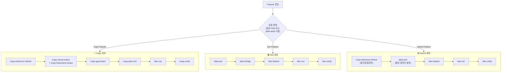

# 파이프라인 순서 분석 및 워크플로우 적용 범위

- 문서 ID: CAI-13
- 관련 문서: [11_work-breakdown-structure.md](./11_work-breakdown-structure.md), [12_pipeline-integration-diagram.md](./12_pipeline-integration-diagram.md), [06_command-workflow-spec.md](./06_command-workflow-spec.md)
- 목적: 두 가지 설계 질문에 대한 분석, 대안, 권장안을 정리한다.

---

## 질문 1: PRD/wireframe과 copy 분석의 순서

### 1.1 현재 구조 분석

**현재 순서** (CAI-11 Standard 경로):

```
/plan-idea → /plan-screen → /plan-draft → /plan-prd → /plan-wireframe
  → /plan-bridge → /copy-reference-refresh → /copy-visual-review
    → /copy-interaction-review → /copy-gap-board → /dev-run
```

즉: **PRD를 먼저 쓰고, copy 분석은 나중에.**

**장점**:
- plan 도메인의 기존 파이프라인(`/plan-idea` → `/plan-prd`)을 그대로 재사용
- PRD가 "목표 상태"를 정의하고, copy 분석이 "현재 상태와의 차이"를 측정하는 역할 분리

**단점 — 핵심 문제**:
- **추측 기반 PRD**: copy 프로젝트에서 PRD의 "요구사항"은 "원본과 현재의 차이"인데, 갭 분석 없이 작성하면 추측이 된다
- **재작성 불가피**: PRD 작성 → copy 분석 → "이 갭은 PRD에 없었다" → PRD 수정 → 재승인. 이중 작업이 발생한다
- **wireframe도 동일**: 갭 데이터 없이 그린 wireframe은 실제 차이를 반영하지 못한다

### 1.2 대안 제안

#### 대안 A: Copy 분석 먼저 (역전)

```
/plan-idea → /plan-screen → /copy-reference-refresh
  → /copy-visual-review + /copy-interaction-review → /copy-gap-board
    → /plan-draft (갭 데이터 기반) → /plan-prd (갭 데이터 포함)
      → /plan-wireframe (실제 차이 반영) → /plan-bridge → /dev-run
```

| 장점 | 단점 |
|------|------|
| PRD가 실측 갭 데이터를 기반으로 작성됨 | plan 도메인의 기존 순서를 깨뜨림 |
| wireframe이 실제 차이를 정확히 반영 | copy 분석 전에 "무엇을 분석할지"의 범위가 불명확 |
| 재작성 불필요 — 한 번에 완성된 기획 | 스크리닝 단계에서 갭 규모를 모르므로 RICE 판정이 부정확 |
| CAI 철학(capture-first, evidence-first)에 부합 | 갭 분석 자체에도 범위 정의가 필요 (닭과 달걀) |

#### 대안 B: 2-패스 반복 (Iteration)

```
패스 1 — 탐색적 분석:
  /plan-idea → /plan-screen
    → /copy-reference-refresh (경량) → /copy-visual-review (훑어보기)
      → 대략적 갭 목록 생성

패스 2 — 정밀 기획:
  갭 목록 기반 → /plan-draft → /plan-prd (갭 데이터 첨부)
    → /plan-wireframe → /plan-bridge
      → /copy-gap-board (정밀) → /dev-run
```

| 장점 | 단점 |
|------|------|
| 탐색적 분석으로 범위를 먼저 파악 | copy 분석을 2번 실행 (경량 + 정밀) |
| PRD가 실데이터 기반이면서도 plan 순서 유지 | 패스 1 결과를 패스 2에 연결하는 인터페이스 필요 |
| RICE 스크리닝이 탐색적 갭 데이터로 더 정확 | 총 작업량 증가 |
| 기존 커맨드를 수정 없이 재사용 가능 | "경량 분석"의 기준이 모호할 수 있음 |

#### 대안 C: 하이브리드 — 범위 정의 PRD + 갭 기반 상세 PRD

```
Phase 1 — 범위 PRD (Scope PRD):
  /plan-idea → /plan-screen → /plan-draft
    → /plan-prd (범위 PRD: "어디를 분석할 것인지"만 정의)
      - 대상 영역 목록 (Header, Hero, Sections 등)
      - 뷰포트 범위 (1440, 1024, 768, 390)
      - 분석 우선순위 (P0/P1/P2 예상)
      - 공유 제약 (글로벌 CSS, 브레이크포인트)
    → 범위 PRD 승인

Phase 2 — 갭 분석:
  범위 PRD 기반 → /copy-reference-refresh → /copy-visual-review
    → /copy-interaction-review → /copy-gap-board

Phase 3 — 상세 PRD (Detail PRD):
  갭 데이터 기반 → /plan-prd (상세 PRD: "어떻게 닫을 것인지" 정의)
    - 각 갭의 수용 기준 (acceptance criteria)
    - wireframe은 여기서 작성 (/plan-wireframe)
    - /plan-bridge → /dev-run
```

| 장점 | 단점 |
|------|------|
| **닭과 달걀 문제 해결**: 범위 PRD가 분석 방향을, 갭 데이터가 상세 PRD를 결정 | PRD가 2단계 (범위 + 상세)로 나뉨 — 문서 관리 비용 |
| plan 도메인의 순서를 유지하면서도 갭 데이터 반영 | `/plan-prd`를 2번 실행하는 것이 자연스러운지 |
| wireframe이 갭 데이터를 반영한 시점에 작성됨 | 범위 PRD의 깊이를 어디까지 할지 판단 필요 |
| RICE 스크리닝은 범위 PRD 단계에서 수행 가능 | 소규모 Feature에는 과도할 수 있음 |

### 1.3 비교 요약

| 기준 | 현재 순서 | A: 역전 | B: 2-패스 | C: 범위+상세 PRD |
|------|:---:|:---:|:---:|:---:|
| PRD 정확도 | 낮음 (추측) | 높음 | 높음 | 높음 |
| 재작성 위험 | 높음 | 낮음 | 낮음 | 낮음 |
| plan 순서 유지 | 유지 | 깨짐 | 유지 | 유지 |
| 범위 정의 명확성 | 높음 | 낮음 | 중간 | 높음 |
| 작업량 | 기본 | 기본 | 1.5배 | 1.3배 |
| CAI 철학 정합 | 중간 | 높음 | 높음 | 높음 |
| Lite Feature 적합 | 해당 없음 | 해당 없음 | 해당 없음 | 해당 없음 |

### 1.4 권장안: 대안 C (범위+상세 PRD) — Lite에는 대안 A 적용

**근거**:

1. **닭과 달걀 문제의 정면 해결**: "무엇을 분석할지"(범위 PRD)와 "무엇을 고칠지"(상세 PRD)는 다른 질문이다. 범위 PRD는 갭 데이터 없이도 작성 가능하다(대상 영역, 뷰포트, 우선순위 예상). 상세 PRD는 갭 데이터가 있어야 정확하다.

2. **plan 파이프라인 호환**: `/plan-prd`를 2번 사용하지만, 첫 번째는 "범위 PRD"(얇고 빠르게), 두 번째는 "상세 PRD"(갭 데이터 포함)로 용도가 다르다. 기존 커맨드를 수정할 필요 없다.

3. **Lite Feature 예외**: 작은 갭(Feature 3개 미만, P0 없음)은 범위 PRD 없이 **대안 A**(바로 copy 분석 → 실행)로 진행. CAI-11의 Adaptive WBS(C+D 혼합)와 일관.

**제안 흐름**:

```
Standard Feature (P0):
  /plan-idea → /plan-screen
    → /plan-prd [범위] ← "어디를, 어떤 뷰포트로, 어떤 우선순위로 분석할지"
      → [승인]
        → /copy-reference-refresh → /copy-visual-review + /copy-interaction-review
          → /copy-gap-board
            → /plan-prd [상세] ← "갭 X를 이 acceptance criteria로 닫는다"
              → /plan-wireframe ← "갭 데이터 기반 상태 구조"
                → /plan-bridge → /dev-run

Lite Feature (P1/P2):
  /plan-idea → /plan-screen
    → /copy-reference-refresh → /copy-gap-board
      → /copy-plan-unit → /dev-run
  (범위 PRD/상세 PRD 모두 건너뜀)
```

### 1.5 반대 의견 (자기 검증)

| 반대 | 응답 |
|------|------|
| "PRD를 2번 쓰면 오버엔지니어링이다" | 범위 PRD는 **영역 목록 + 뷰포트 + 우선순위** 3가지만 담는 얇은 문서다. 30분 이내에 작성 가능하며, 이후 갭 분석의 방향을 잡아준다. |
| "대안 A(역전)가 더 단순하다" | copy 분석의 범위가 정의되지 않은 상태에서 "모든 것을 분석"하면 불필요한 작업이 발생한다. 범위 PRD가 분석 효율을 높인다. |
| "기존 plan 파이프라인을 깨지 않겠다고 했는데 PRD 2번은 변경 아닌가" | `/plan-prd` 커맨드 자체를 수정하는 것이 아니라 2번 호출할 뿐이다. 커맨드 인터페이스는 동일. |

---

## 질문 2: Copy 워크플로우 적용 범위

### 2.1 현재 구조 분석

**현재 상태**: CAI-11/12의 파이프라인은 모든 Feature가 copy 경로(`/copy-reference-refresh` → `/copy-visual-review` → ...)를 거치는 것으로 묘사되어 있다.

**문제**: 실제로는 copy 워크플로우가 필요 없는 Feature가 존재한다:
- 새 기능 추가 (원본에 없는 것)
- API/백엔드 변경 (시각적 차이 없음)
- 인프라/빌드 설정 변경
- 접근성(a11y) 개선 (원본 비교 불필요)
- 성능 최적화 (시각적 변화 없음)

이런 Feature에 copy 워크플로우를 강제하면 불필요한 증거 수집/갭 분석이 발생한다.

### 2.2 Feature 유형 분류

| 유형 | 정의 | 예시 | 적용 워크플로우 |
|------|------|------|---------------|
| **Copy Feature** | 원본과의 시각적/인터랙션 차이를 닫는 작업 | Header hover, Hero CTA, Section spacing | copy 경로 (plan → **copy** → dev) |
| **Dev Feature** | 원본에 없는 새 기능이나 비시각적 변경 | API 통합, 새 페이지, 성능 최적화 | dev 경로 (plan → **dev** 직행) |
| **Hybrid Feature** | 새 기능이지만 원본의 시각적 패턴을 따라야 하는 것 | 원본 스타일로 새 컴포넌트 추가 | copy 분석(참조용) → dev 경로 |

### 2.3 분기 조건 의사결정 트리

```
Feature 진입
  │
  ├── 원본(Turner live)에 대응하는 요소가 있는가?
  │    │
  │    ├── YES + 시각적/인터랙션 차이를 닫아야 하는가?
  │    │    │
  │    │    ├── YES → 🔴 Copy Feature
  │    │    │         → copy 경로: /copy-reference-refresh → gap 분석 → /dev-run
  │    │    │
  │    │    └── NO (구조만 참조, 차이 닫기 아님)
  │    │         → 🟡 Hybrid Feature
  │    │           → copy 분석은 참조용만 + dev 경로: /dev-feature → /dev-run
  │    │
  │    └── NO (원본에 없는 요소)
  │         → 🟢 Dev Feature
  │           → dev 직행: /plan-prd → /plan-bridge → /dev-feature → /dev-run
  │
  └── 판정 불가
       → 범위 PRD에서 유형 지정 + 사용자 확인
```

### 2.4 판정 기준표

| 판정 기준 | Copy Feature | Dev Feature | Hybrid Feature |
|----------|:---:|:---:|:---:|
| 원본 대응 요소 존재 | 필수 | 없음 | 선택 |
| 시각적 차이 닫기 목표 | 예 | 아니오 | 부분적 |
| 스크린샷 비교 필요 | 예 | 아니오 | 참조용 |
| 갭 보드 생성 | 예 | 아니오 | 아니오 |
| `/copy-*` 커맨드 사용 | 전체 | 없음 | `/copy-reference-refresh`만 |
| `/dev-feature` 사용 | 아니오 | 예 | 예 |
| QA: 배리언트 가드 | 예 | 해당 없음 | 해당 없음 |
| QA: 스크린샷 diff | 예 | 아니오 | 참조 비교 |

### 2.5 워크플로우별 경로



### 2.6 판정 시점

| 시점 | 방법 | 권장 |
|------|------|------|
| `/plan-draft` | Lite/Standard 판정 시 Feature 유형도 함께 판정 | **권장** — 가장 이른 시점에 경로 결정 |
| 범위 PRD | PRD 작성 시 각 Feature에 `type: copy / dev / hybrid` 태그 | Standard Feature에 권장 |
| `/copy-gap-board` | 갭 분석 후 "갭이 없으면 dev 경로로 전환" | 사후 판정 — 이미 분석 비용 발생 |

### 2.7 권장안

**`/plan-draft` 시점에 Feature 유형을 태깅한다.**

```
/plan-draft 출력:
  E-01: Turner 홈페이지 카피 (Standard Epic)
    F-HEADER:      type=copy     | P0 | 서브 PRD + copy 경로
    F-HERO:        type=copy     | P0 | 서브 PRD + copy 경로
    F-NEWS:        type=copy     | P1 | Lite + copy 경로
    F-ANALYTICS:   type=dev      | P1 | dev 경로 직행
    F-A11Y:        type=dev      | P2 | dev 경로 직행
    F-NEW-SECTION: type=hybrid   | P1 | 참조 캡처 + dev 경로
```

### 2.8 반대 의견 (자기 검증)

| 반대 | 응답 |
|------|------|
| "모든 Feature에 copy를 적용하면 일관성이 높다" | 일관성은 유지하되, 불필요한 갭 분석/증거 수집 비용이 Feature 수에 비례하여 증가한다. 유형 태깅으로 필요한 곳에만 적용하는 것이 효율적이다. |
| "유형 판정이 틀리면 나중에 전환 비용이 크다" | `/plan-draft` 시점의 판정은 확정이 아니라 초기 분류다. 갭 분석 후 "copy → dev" 또는 "dev → copy" 전환이 가능하다. 전환 비용은 갭 분석 1회 정도. |
| "Hybrid가 필요한가? copy와 dev 2가지면 충분하다" | 타당한 반론이다. Hybrid를 제거하고 "copy 분석은 참조용으로만 실행" 옵션을 copy Feature의 경량 변형으로 통합할 수 있다. 실제 적용 시 Hybrid가 빈번하지 않으면 제거해도 무방하다. |

---

## 종합 권장안

### CAI-11/12 수정 제안

| 문서 | 수정 내용 |
|------|----------|
| **CAI-11** §5 권장안 | Standard 경로에 "범위 PRD → copy 분석 → 상세 PRD" 순서 반영. Feature 유형(copy/dev/hybrid) 태깅 추가 |
| **CAI-12** §1 전체 흐름도 | Feature 유형 분기 노드 추가. Dev 경로(copy 건너뜀) 추가 |
| **CAI-12** §4 진입 조건표 | Feature 유형별 진입 조건 행 추가 |
| **CAI-12** §5 의사결정 트리 | Feature 유형 판정 분기 추가 |

### 수정이 불필요한 문서

| 문서 | 이유 |
|------|------|
| CAI-00~10 | 기존 agent/command/hook 스펙은 Feature 유형과 무관하게 동작. copy agent는 copy Feature에서만 호출되므로 스펙 자체는 변경 불필요 |

---

## 자기 검증

| 항목 | 기준 | 확인 |
|------|------|------|
| 질문 1: 현재 구조 장단점 | 명시적으로 기술 | [ ] |
| 질문 1: 대안 3개 이상 | A/B/C 3개 | [ ] |
| 질문 1: 권장안 + 근거 | 대안 C + Lite 예외 | [ ] |
| 질문 1: 반대 의견 포함 | 3개 반대 + 응답 | [ ] |
| 질문 2: 분기 조건 정의 | 의사결정 트리 + 판정 기준표 | [ ] |
| 질문 2: Feature 유형 3개 | copy/dev/hybrid + 정의 + 예시 | [ ] |
| 질문 2: 워크플로우 경로 | Mermaid + 경로별 커맨드 | [ ] |
| 질문 2: 반대 의견 포함 | 3개 반대 + 응답 | [ ] |
| CAI-11/12 수정 제안 | 구체적 섹션 + 내용 명시 | [ ] |
