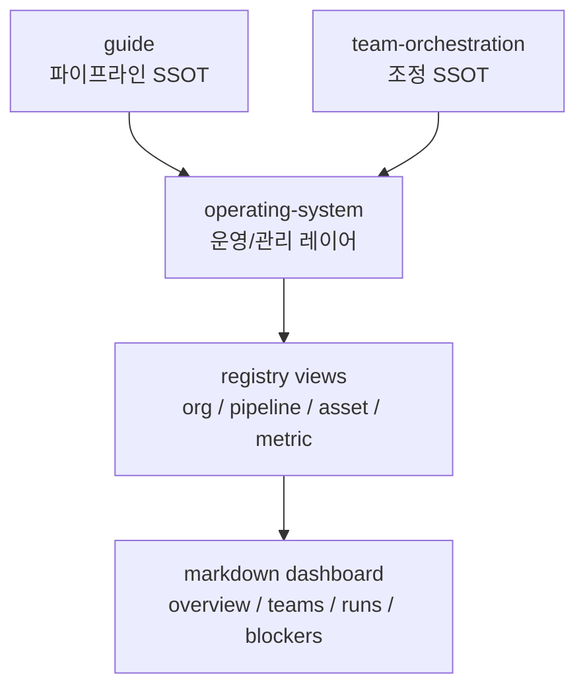

# AI Company OS 개요

> `operating-system` 문서 축은 `guide`와 `team-orchestration` 위에 놓이는 **운영/관리 레이어**다. 실행 엔진을 새로 정의하는 문서가 아니라, 현재 `Claude Kit`를 소규모 내부팀이 운영 가능한 회사 시스템으로 읽고 관리하기 위한 관점과 데이터 계약을 정리한다.

---

## 왜 필요한가

`guide`는 end-to-end 파이프라인을 설명하고, `team-orchestration`은 병렬 실행 조정을 설명한다. 그러나 실제 운영자는 그 두 축만으로는 다음 질문에 답하기 어렵다.

- 지금 어떤 팀과 역할이 어떤 자산을 책임지는가
- 어느 파이프라인 단계가 막혀 있고 누구의 결정이 필요한가
- 어떤 agent/command/skill/hook/doc이 서로 연결되어 있는가
- 문서와 레지스트리가 실제 운영 상태를 얼마나 잘 반영하는가

`operating-system`은 이 질문을 **조직 축 + 파이프라인 축 + 자산 축 + 지표 축**으로 한 번에 묶는다.

---

## 문서 경계

| 문서 축 | 역할 | 유지 원칙 |
|--------|------|----------|
| `guide/` | 아이디어부터 개발까지의 정규 SSOT | 단계 의미와 산출물 규칙은 여기서 고정 |
| `team-orchestration/` | feature 병렬 조정과 state/gate SSOT | DAG, stage-manifest, orchestration 계약은 여기서 고정 |
| `operating-system/` | 운영자 관점의 조직/대시보드/관리 모델 | 기존 SSOT를 감싸는 read model만 정의 |

`operating-system`은 새 실행 상태 파일을 도입하지 않는다. 운영 view는 기존 `feature registry`, `dependency graph`, `stage-manifest`에서 파생된다.

---

## 대상 독자

| 독자 | 보고 싶은 것 | 먼저 읽을 문서 |
|------|-------------|---------------|
| 오너/운영자 | blocker, 승인 대기, KPI | `00`, `01`, `05`, `06` |
| 기획 리드 | plan stage와 handoff 구조 | `02`, `03`, `05` |
| 개발 리드 | delivery stage, verification, asset ownership | `02`, `03`, `04` |
| 품질/거버넌스 리드 | registry coverage, freshness, review chain | `03`, `04`, `06`, `07` |

---

## 운영 질문

이 문서 세트는 아래 질문에 답하도록 설계한다.

1. 어떤 팀과 역할이 현재 `Claude Kit`의 planning, delivery, assurance 책임을 나눠 갖는가
2. 각 stage와 gate는 어느 역할의 의사결정권 아래 있는가
3. 현재 repo의 agent/command/skill/hook/doc 자산은 누구 소유이며 어디서 소비되는가
4. 어떤 시각화 뷰를 보면 run-state, blocker, dependency, asset gap을 가장 빨리 파악할 수 있는가
5. 주간 운영 리뷰에서 어떤 지표를 보고 어떤 순서로 의사결정을 내려야 하는가

---

## 레이어 맵

---

## 핵심 산출물

### 문서

- [01-company-map.md](./01-company-map.md)
- [02-pipeline-map.md](./02-pipeline-map.md)
- [03-data-contracts.md](./03-data-contracts.md)
- [04-visualization-spec.md](./04-visualization-spec.md)
- [05-dashboard-ia.md](./05-dashboard-ia.md)
- [06-operating-rhythm.md](./06-operating-rhythm.md)
- [07-rollout-roadmap.md](./07-rollout-roadmap.md)

### 레지스트리

- [`org-registry.yaml`](../../.plans/operating-system/org-registry.yaml)
- [`pipeline-registry.yaml`](../../.plans/operating-system/pipeline-registry.yaml)
- [`asset-registry.yaml`](../../.plans/operating-system/asset-registry.yaml)
- [`metric-catalog.yaml`](../../.plans/operating-system/metric-catalog.yaml)

---

## 운영 원칙

- 조직 모델과 파이프라인 모델을 둘 다 1급 개념으로 취급한다.
- inventory는 문서에 수기 숫자로 적지 않고 registry에서 계산한다.
- `RunSnapshot`은 파생 view이며 새 SSOT가 아니다.
- canonical docs만 asset inventory 대상이며 `revision/`, `archive/` 문서는 제외한다.

---

## 관련 문서

- [guide/00-overview.md](../guide/00-overview.md)
- [guide/09-architecture.md](../guide/09-architecture.md)
- [team-orchestration/00-overview.md](../team-orchestration/00-overview.md)
- [team-orchestration/04-state-gates-lifecycle.md](../team-orchestration/04-state-gates-lifecycle.md)
