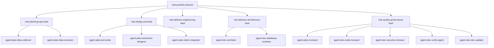

# Company Map

> 이 문서는 `Team > Role > Agent` 구조를 정의한다. 조직도는 사람을, agent catalog는 자동화 자산을 나타내며 둘은 1:1이 아니라 **책임 관계**로 연결된다.

---

## 조직 모델

---

## 팀 맵

| Team | Mission | Owned Pipelines | KPI Focus |
|------|---------|----------------|-----------|
| `team-executive-office` | 사람 승인, 우선순위, 예외 처리 | `pipe-operating-review` | blocker, approval wait, registry coverage |
| `team-planning-studio` | idea를 PRD와 handoff 산출물로 정규화 | `pipe-planning-lifecycle` | handoff latency, plan review pass, doc freshness |
| `team-delivery-studio` | 승인된 PRD를 feature package와 구현 흐름으로 전개 | `pipe-delivery-lifecycle` | active runs, verify pass, handoff latency |
| `team-assurance-desk` | review, verification, security, freshness 유지 | `pipe-orchestration-control` | verify pass, orphan asset, doc freshness |

팀 상세 정의는 [`org-registry.yaml`](../../.plans/operating-system/org-registry.yaml)에 있다.

---

## 역할 맵

| Role | 핵심 책임 | Owned Agents | 주요 결정권 |
|------|----------|-------------|------------|
| `role-portfolio-director` | 승인, 우선순위, 예외 | 없음 | `gate-p2-approval`, `gate-phase-b-human-review`, exception policy |
| `role-planning-ops-lead` | intake, screening, archive/improve, bridge readiness | `agent-plan-idea-collector`, `agent-plan-idea-screener` | idea normalization, screening threshold |
| `role-design-prd-lead` | PRD, wireframe, stitch completeness | `agent-plan-prd-writer`, `agent-plan-wireframe-designer`, `agent-plan-stitch-integrator` | PRD 구조, design fidelity |
| `role-delivery-engineering-lead` | feature package, implementation loop, commit readiness | 없음 | implementation scope, TDD loop |
| `role-delivery-architecture-lead` | architecture, DB safety, shared module policy | `agent-dev-architect`, `agent-dev-database-reviewer` | domain boundary, DB safety |
| `role-quality-governance-lead` | review, verification, security, docs freshness | `agent-plan-reviewer`, `agent-dev-code-reviewer`, `agent-dev-security-reviewer`, `agent-dev-verify-agent`, `agent-dev-doc-updater` | review severity, verification policy |

---

## Handoff 규칙

- 승인권은 `role-portfolio-director`에 있고, 산출물 품질 판단은 해당 도메인 role과 `role-quality-governance-lead`가 함께 닫는다.
- planning에서 delivery로 넘어가는 공식 handoff는 `stage-plan-p7-bridge -> stage-delivery-a-feature-package` 한 경로만 허용한다.
- quality/governance 역할은 모든 팀의 산출물을 읽을 수 있지만, source SSOT를 대체하지는 않는다.
- 역할 간 handoff는 문서가 아니라 ID로 추적한다. `roleId`, `stageId`, `gateId`, `assetId`가 모두 registry에서 해석되어야 한다.

---

## 운영상 해석

- 사람이 적은 조직일수록 여러 role을 한 사람이 겸임할 수 있다.
- 하지만 문서와 레지스트리에서는 role을 분리해 둬야 blocker와 책임 공백이 보인다.
- agent는 "팀원"이라기보다 특정 role이 호출하는 자동화 능력이다. ownership은 사용 빈도가 아니라 책임 기준으로 정한다.

---

## 관련 문서

- [00-overview.md](./00-overview.md)
- [02-pipeline-map.md](./02-pipeline-map.md)
- [team-orchestration/02-operating-model.md](../team-orchestration/02-operating-model.md)
- [guide/09-architecture.md](../guide/09-architecture.md)
