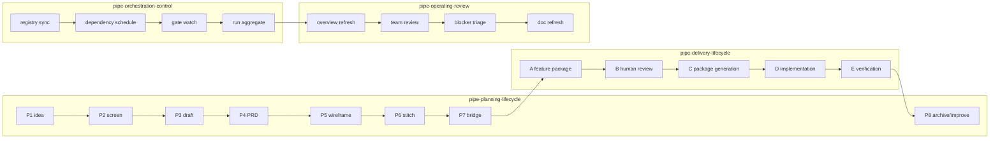

# Pipeline Map

> `operating-system`의 핵심은 조직도만 만드는 것이 아니라, 각 역할이 어느 파이프라인 stage와 gate를 책임지는지 한 화면에서 읽을 수 있게 하는 것이다.

---

## 하이브리드 모델

`Claude Kit`의 운영 모델은 두 축을 동시에 가진다.

- 조직 축: `Team -> Role -> Agent`
- 실행 축: `Pipeline -> Stage -> Gate -> Artifact`

운영자는 두 축의 교차점에서 일한다. 예를 들어 `role-design-prd-lead`는 `pipe-planning-lifecycle`의 `P4~P6`을, `role-quality-governance-lead`는 plan review와 delivery verify gate를 함께 본다.

---

## 파이프라인 전경

---

## 파이프라인별 역할

| Pipeline | 주 소유 역할 | 주요 Gate | 주 산출물 |
|---------|-------------|----------|----------|
| `pipe-planning-lifecycle` | `role-planning-ops-lead` | `gate-p2-approval`, `gate-p4-review-pass`, `gate-p5-review-pass` | idea, screening, PRD, wireframe, stitch, bridge |
| `pipe-delivery-lifecycle` | `role-delivery-engineering-lead` | `gate-phase-b-human-review`, `gate-phase-e-dvc` | feature package, implementation evidence, verify report |
| `pipe-orchestration-control` | `role-quality-governance-lead` | `gate-dependency-ready`, `gate-stage-manifest-synced` | ready queue, run snapshot, blocker board |
| `pipe-operating-review` | `role-portfolio-director` | `gate-registry-coverage-check`, `gate-doc-freshness-check` | KPI digest, escalations, refresh actions |

---

## Stage ownership 규칙

### Planning

- `P1~P3`는 `role-planning-ops-lead`가 운영한다.
- `P4~P6`는 `role-design-prd-lead`가 설계 완성도를 책임진다.
- `P7`은 planning에서 delivery로 넘어가는 공식 handoff다.
- `P8`은 delivery 완료 후 planning-ops가 archive/improve loop를 닫는 선택 단계다.

### Delivery

- `A, D`는 `role-delivery-engineering-lead`의 작업 공간이다.
- `B`는 사람 승인 gate이므로 `role-portfolio-director`의 결정이 필요하다.
- `E`는 `role-quality-governance-lead`가 통과 여부를 닫는다.
- `role-delivery-architecture-lead`는 stage owner가 아니라 delivery 전반의 구조 결정을 지원한다.

### Orchestration / Operating

- orchestration stages는 새 SSOT를 만들지 않고 read model만 만든다.
- operating review는 execution을 대체하지 않고, priority와 blockers를 정리하는 리듬이다.

---

## Artifact 흐름

| From | To | Artifact | 원칙 |
|------|----|----------|------|
| `P2` | `P3` | approved idea | 명시적 승인 없이는 이동하지 않음 |
| `P4` | `P5` | approved PRD | review gate가 닫혀야 이동 |
| `P6` | `P7` | stitch package | design completeness만 전달 |
| `P7` | `A` | bridge context, execution path | planning에서 delivery로 가는 유일한 공식 handoff |
| `D` | `E` | implementation evidence | build, test, diff evidence 포함 |
| orchestration | operating review | run snapshot, blocker board | 파생 view만 전달 |

---

## 관련 문서

- [01-company-map.md](./01-company-map.md)
- [03-data-contracts.md](./03-data-contracts.md)
- [team-orchestration/03-scheduler-and-dependencies.md](../team-orchestration/03-scheduler-and-dependencies.md)
- [guide/01-planning-pipeline.md](../guide/01-planning-pipeline.md)
