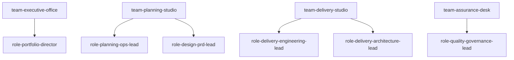
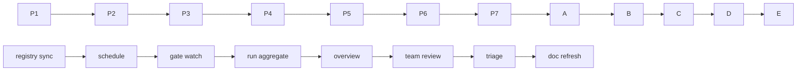
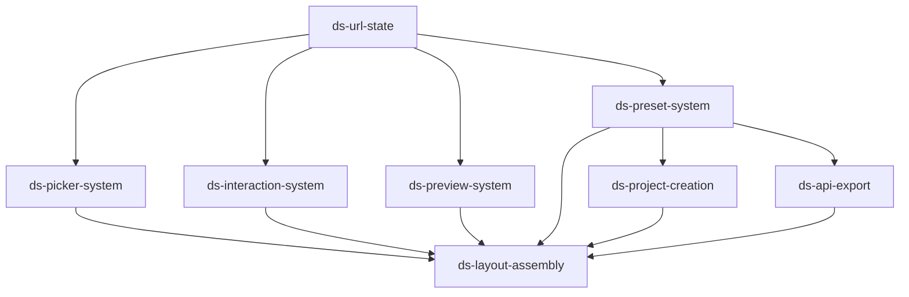

# Visualization Spec

> 이 문서는 `operating-system`이 기본으로 제공해야 하는 시각화 뷰를 정의한다. 뷰는 모두 registry 또는 `RunSnapshot`에서 재생성 가능해야 하며, 수기 보정 없이 유지되는 것이 목표다.

---

## 공통 규칙

- 모든 뷰는 ID를 기준으로 생성한다.
- 수기 합계, 임시 상태, 설명용 숫자는 뷰의 본문에 고정하지 않는다.
- `guide`와 `team-orchestration`의 SSOT를 복제하지 말고 요약만 보여준다.
- 파일럿 투영은 기존 [ds-customizer pilot](../team-orchestration/06-ds-customizer-pilot.md)을 기본 예시로 사용한다.

---

## View 1. 조직도

### 목적

- 누가 어떤 역할을 맡는지 보여준다.
- 사람 역할과 agent ownership의 경계를 분명히 한다.

### 데이터 소스

- `OrgRegistry`
- `AssetRegistry`의 `artifactType == agent`

### 표준 표현

---

## View 2. 파이프라인 맵

### 목적

- 운영자가 어느 stage가 어느 pipeline에 속하는지 빠르게 파악하게 한다.
- stage와 gate의 위치를 함께 본다.

### 데이터 소스

- `PipelineRegistry`

### 표준 표현

---

## View 3. Dependency DAG

### 목적

- 현재 pilot 또는 프로젝트에서 feature 간 hard dependency를 보여준다.
- blocked feature의 원인을 한 번에 읽는다.

### 데이터 소스

- dependency graph
- `RunSnapshot`

### 표준 표현

표시 규칙:

- `blocked`는 노드 색으로, `awaiting-approval`는 테두리 패턴으로, `active`는 강조 색으로 표현한다.
- foundation feature는 별도 색으로 표시한다.

---

## View 4. 역할-자산 매트릭스

### 목적

- asset ownership 공백과 중복 소유를 드러낸다.
- “이 문서/agent/command를 누가 관리하나?”를 즉답하게 만든다.

### 데이터 소스

- `AssetRegistry`
- `OrgRegistry`

### 표준 표현

| Role | Agents | Commands | Skills | Hooks | Docs |
|------|--------|----------|--------|------|------|
| `role-portfolio-director` | - | - | - | - | company overview, roadmap, glossary류 |
| `role-planning-ops-lead` | idea/screen agents | intake/bridge/archive commands | planning workflow skills | - | planning lifecycle docs |
| `role-design-prd-lead` | PRD/design agents | PRD/wireframe/stitch commands | design skills | - | design docs |
| `role-delivery-engineering-lead` | - | implementation commands | dev workflow skills | - | dev workflow docs |
| `role-delivery-architecture-lead` | architecture/database agents | - | architecture skills | - | architecture docs |
| `role-quality-governance-lead` | review/verify/doc agents | review/verify/sync commands | verification/security skills | all hooks | review/orchestration docs |

---

## View 5. Run-State 보드

### 목적

- 지금 무엇이 진행 중인지, 무엇이 막혔는지, 다음 승인 대상이 무엇인지 보여준다.

### 데이터 소스

- `RunSnapshot`

### 표준 표현

| Feature | Team | Role | Stage | Gate | Status | Blocker |
|---------|------|------|-------|------|--------|---------|
| `ds-url-state` | `team-delivery-studio` | `role-delivery-engineering-lead` | `stage-delivery-e-verification` | `gate-phase-e-dvc` | `active` | - |
| `ds-picker-system` | `team-delivery-studio` | `role-delivery-engineering-lead` | `stage-delivery-b-human-review` | `gate-phase-b-human-review` | `awaiting-approval` | user decision |
| `ds-layout-assembly` | `team-delivery-studio` | `role-delivery-engineering-lead` | `stage-delivery-a-feature-package` | `gate-dependency-ready` | `blocked` | `ds-picker-system` |

---

## 렌더링 우선순위

1. `Overview`에는 Run-State 보드 요약과 blocker count를 먼저 둔다.
2. `Teams`에는 조직도와 역할-자산 매트릭스를 둔다.
3. `Pipelines`에는 파이프라인 맵과 gate 상태를 둔다.
4. `Runs`에는 dependency DAG와 run-state 보드를 둔다.

---

## 관련 문서

- [03-data-contracts.md](./03-data-contracts.md)
- [05-dashboard-ia.md](./05-dashboard-ia.md)
- [team-orchestration/06-ds-customizer-pilot.md](../team-orchestration/06-ds-customizer-pilot.md)
