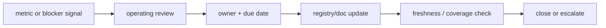

# Operating Rhythm

> 운영 레이어가 문서로만 끝나지 않으려면, 언제 무엇을 보고 어떤 액션을 닫는지 cadence가 있어야 한다. 이 문서는 소규모 내부팀 기준의 기본 리듬을 정의한다.

---

## 기본 리듬

| 리듬 | 주기 | 오너 | 입력 | 산출물 |
|------|------|------|------|--------|
| 비동기 health check | 매일 | `role-quality-governance-lead` | run-state board, blocker board | stale alert, quick fix |
| 운영 리뷰 | 주 1회 | `role-portfolio-director` | Overview, Metrics, Blockers | 우선순위, 승인 일정, escalation |
| planning sync | 주 1회 | `role-planning-ops-lead` | planning pipeline 상태, archive/improve backlog | draft/prd/design 정리 |
| delivery sync | 주 1회 | `role-delivery-engineering-lead` | active runs, verify 결과 | implementation focus, refactor window |
| doc refresh | 주 1회 또는 변경 후 | `role-quality-governance-lead` | changed registries, stale docs | refreshed docs, freshness exceptions |

---

## 운영 리뷰 순서

1. `Overview`에서 active runs, blocked count, approval wait를 확인한다.
2. `Blockers`에서 사람 승인 대기와 dependency blockers를 먼저 닫는다.
3. `Pipelines`에서 가장 오래 열린 gate를 확인한다.
4. `Assets`에서 orphan asset이나 stale doc 예외가 있는지 확인한다.
5. `Metrics`에서 지난 주 대비 악화된 지표만 액션 아이템으로 남긴다.

---

## 승인 대기 관리

- `gate-p2-approval`과 `gate-phase-b-human-review`는 사람 판단이 필요하므로 운영 리뷰 전에 대기 시간을 확인한다.
- 승인 대기 항목은 feature 가치보다 **대기 시간**을 먼저 본다.
- 같은 reviewer가 여러 gate를 막고 있으면 `Overview`와 `Blockers` 두 곳에 동시에 노출한다.

---

## Blocker triage 규칙

- dependency blocker는 원인 feature 하나만 명시한다.
- 사람 승인 blocker는 결정자와 SLA를 함께 적는다.
- stale-state blocker는 `stage-manifest`, registry, dashboard 중 어디가 어긋났는지 분리해서 기록한다.
- block가 풀리면 run-state 보드에서 먼저 상태를 바꾸고, 운영 리뷰 메모는 그 다음 갱신한다.

---

## 문서 갱신 cadence

- registry ID가 바뀌면 해당 canonical docs를 같은 주기에 함께 갱신한다.
- asset owner가 바뀌면 `AssetRegistry`와 `01-company-map.md`를 함께 갱신한다.
- pipeline stage/gate가 바뀌면 `PipelineRegistry`, `02-pipeline-map.md`, `04-visualization-spec.md`를 함께 갱신한다.
- dashboard section이 바뀌면 `05-dashboard-ia.md`와 `MetricCatalog`를 같이 본다.

---

## 개선 백로그 흐름

---

## 관련 문서

- [05-dashboard-ia.md](./05-dashboard-ia.md)
- [07-rollout-roadmap.md](./07-rollout-roadmap.md)
- [metric-catalog.yaml](../../.plans/operating-system/metric-catalog.yaml)
