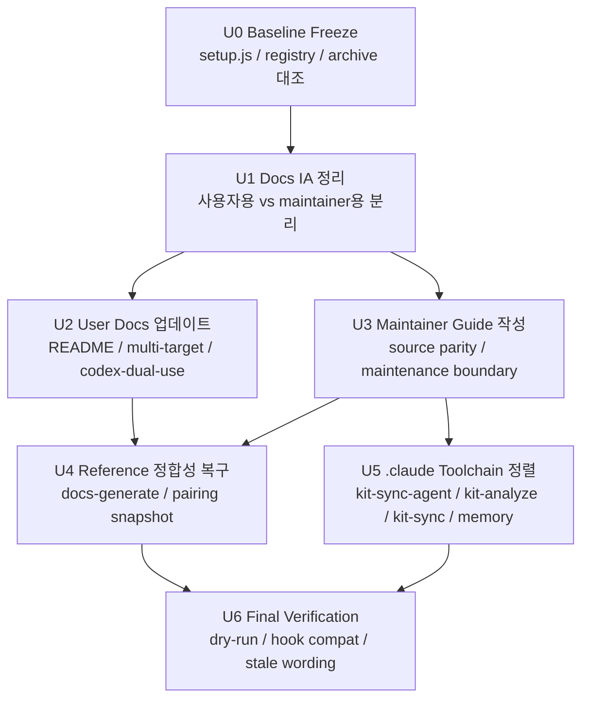

# Codex Sync 문서 정리 실행형 로드맵

> **상태**: 실행 준비 문서
> **작성일**: 2026-04-24
> **상위 계획**: [README.md](README.md)
> **목적**: 사람이 빠르게 전체 순서를 파악하고, AI가 그대로 실행 가능한 단위로 작업을 쪼갠 로드맵

## 0. 이 문서를 어떻게 쓰는가

이 문서는 두 용도로 쓴다.

1. 사람이 볼 때:
   codex sync 문서 정리 작업의 전체 흐름, 선후관계, 검증 포인트를 한눈에 본다.
2. AI가 볼 때:
   각 실행 단위의 입력, 수정 대상, 금지사항, 검증, 종료 조건을 그대로 따라 작업한다.

핵심 원칙은 간단하다.

- 현재 truth는 archive 문서가 아니라 [`scripts/setup.js`](../../../scripts/setup.js), [`src/pairing-registry.json`](../../../src/pairing-registry.json), [`src/exception-registry.json`](../../../src/exception-registry.json), `.claude` maintenance toolchain이다.
- generated output은 primary edit target이 아니다.
- `kit-sync`는 소비자 프로젝트 runtime 기능이 아니라 이 저장소의 maintenance pipeline이다.
- `src/codex/kit/**`와 `src/claude/kit/**`는 만들지 않는다.

## 1. 한눈에 보는 로드맵

| Phase | 이름 | 목표 | 결과물 | 병렬 가능 여부 |
|---|---|---|---|---|
| U0 | Baseline Freeze | 실제 동작과 문서 차이를 고정 | source-of-truth 점검 메모 | 아니오 |
| U1 | Docs IA 정리 | 사용자용/maintainer용 문서 흐름 확정 | 수정 대상 목록, 링크 구조 | 아니오 |
| U2 | User Docs 업데이트 | 사용자 문서에서 Codex dual-use와 sync 진입점 정리 | `docs/README.md`, `04-multi-target.md`, `06-codex-dual-use.md` | 부분 가능 |
| U3 | Maintainer Guide 작성 | source parity와 maintenance boundary를 한 문서로 정리 | 신규 maintainer 가이드 | U2와 병렬 가능 |
| U4 | Reference 정합성 복구 | generator와 registry 스냅샷을 현재 상태에 맞춤 | `30-reference` 최신화, 필요 시 generator 수정 | U2/U3 이후 |
| U5 | `.claude` Toolchain 정렬 | `kit-sync-agent`와 `kit-*` 설명을 archive 방향과 맞춤 | `.claude` 문서/메모 업데이트 | U3 이후 |
| U6 | Final Verification | 문서와 실제 emitter 동작이 모순 없는지 확인 | 검증 결과, 잔여 이슈 목록 | 아니오 |

## 2. 시각적 흐름



## 3. AI 실행 공통 규칙

모든 실행 단위에서 아래 규칙을 공통으로 적용한다.

| 규칙 | 설명 |
|---|---|
| 실제 구현 우선 | docs보다 `setup.js`, registry, `.claude` prompt를 우선 확인한다 |
| generated output 비직접수정 | `plugins/claude-kit/**`, generated `AGENTS.md`, `.agents/plugins/marketplace.json`, generated `hooks.json`은 원칙적으로 직접 수정하지 않는다 |
| maintenance boundary 유지 | `kit-sync-agent`, `.claude/commands/kit-*`, `.claude/skills/kit-*`는 product asset이 아니라 maintenance toolchain으로 다룬다 |
| `kit` domain 생성 금지 | `src/codex/kit/**`, `src/claude/kit/**`를 만들거나 유도하지 않는다 |
| 검증 우선 closeout | 각 실행 단위마다 최소 1회 self-review와 검증을 수행한다 |
| 충돌 시 중지 | docs 설명과 실제 emitter가 충돌하면 문서를 고치기 전에 source-of-truth를 재확인한다 |

## 4. 실행 단위 상세

## U0. Baseline Freeze

### 목표

현재 codex sync 관련 truth를 고정한다. 이후 모든 문서 수정은 이 기준 위에서만 진행한다.

### 입력

- [README.md](README.md)
- [`../../archive/repo-local-codex-kit-sync/`](../../archive/repo-local-codex-kit-sync/)
- [`../../../scripts/setup.js`](../../../scripts/setup.js)
- [`../../../src/pairing-registry.json`](../../../src/pairing-registry.json)
- [`../../../src/exception-registry.json`](../../../src/exception-registry.json)
- [`../../../src/claude/_meta/codex-portability.json`](../../../src/claude/_meta/codex-portability.json)
- [`../../../.claude/agents/kit-sync-agent.md`](../../../.claude/agents/kit-sync-agent.md)
- [`../../../.claude/commands/kit-analyze.md`](../../../.claude/commands/kit-analyze.md)
- [`../../../.claude/commands/kit-sync.md`](../../../.claude/commands/kit-sync.md)

### 수정 대상

- 없음. 읽기와 비교만 수행한다.

### 작업

1. `setup.js` 기준으로 Codex output 경로와 source 경로를 정리한다.
2. registry 기준으로 현재 status vocabulary를 정리한다.
3. `codex-portability.json`과 hook runtime helper를 함께 읽어 portability metadata와 실제 코드 경로를 대조한다.
4. archive 문서 중 아직 유효한 계약과 이미 구현에 흡수된 항목을 나눈다.
5. `.claude` toolchain 중 archive 방향을 이미 반영한 항목과 덜 반영한 항목을 나눈다.

### 출력

- source-of-truth 체크리스트
- docs/implementation mismatch 메모
- hook portability metadata 대조 메모

### 검증

- 문서 주장이 모두 실제 파일 근거로 역추적 가능해야 한다.

### 종료 조건

- 이후 문서 수정 시 “무엇을 기준으로 고칠지”에 대한 애매함이 없을 것

### AI 착수 프롬프트

```text
`scripts/setup.js`, `src/pairing-registry.json`, `src/exception-registry.json`, `src/claude/_meta/codex-portability.json`, `.claude` maintenance toolchain, `docs/archive/repo-local-codex-kit-sync`를 대조해 codex sync 관련 source-of-truth를 정리해줘. 문서보다 실제 구현을 우선하고, generated output은 source로 간주하지 마.
```

## U1. Docs IA 정리

### 목표

사용자용 문서와 maintainer용 문서를 분리하고, 어디에 무엇을 둘지 확정한다.

### 입력

- [README.md](README.md)
- [`../../README.md`](../../README.md)
- [`../../10-features/04-multi-target.md`](../../10-features/04-multi-target.md)
- [`../../20-user-guide/06-codex-dual-use.md`](../../20-user-guide/06-codex-dual-use.md)
- [`../../30-reference/01-commands.md`](../../30-reference/01-commands.md)
- [`../../30-reference/02-agents.md`](../../30-reference/02-agents.md)
- [`../../30-reference/07-pairing-registry.md`](../../30-reference/07-pairing-registry.md)

### 수정 대상

- [README.md](README.md)

### 작업

1. 사용자 관점에서 필요한 문서 흐름을 정의한다.
2. maintainer 관점에서 필요한 문서 흐름을 정의한다.
3. archive에서 승격할 내용을 “문서 전체”가 아니라 “계약/원칙” 단위로 정리한다.
4. 실제 수정 대상 파일과 신규 작성 파일을 명시한다.

### 출력

- 문서 맵
- 실행 우선순위

### 검증

- 사용자용 흐름과 maintainer용 흐름이 한 문서 안에서 뒤섞이지 않을 것

### 종료 조건

- U2, U3, U4, U5가 어떤 파일을 건드려야 하는지 명확할 것

### AI 착수 프롬프트

```text
현재 docs 구조를 사용자용과 maintainer용 흐름으로 분리해 문서 정보구조를 확정해줘. archive 전체를 active docs로 복사하지 말고, 필요한 계약만 승격 대상으로 분류해.
```

## U2. User Docs 업데이트

### 목표

사용자가 `claude-kit`의 Codex dual-use와 codex sync 경계를 혼동하지 않도록 active docs를 정리한다.

### 입력

- [`../../README.md`](../../README.md)
- [`../../10-features/04-multi-target.md`](../../10-features/04-multi-target.md)
- [`../../20-user-guide/06-codex-dual-use.md`](../../20-user-guide/06-codex-dual-use.md)
- [`../../../scripts/setup.js`](../../../scripts/setup.js)
- [`../../../src/pairing-registry.json`](../../../src/pairing-registry.json)

### 수정 대상

- [`../../README.md`](../../README.md)
- [`../../10-features/04-multi-target.md`](../../10-features/04-multi-target.md)
- [`../../20-user-guide/06-codex-dual-use.md`](../../20-user-guide/06-codex-dual-use.md)

### 작업

1. `docs/README.md`에 codex sync / dual-use quick links를 추가한다.
2. `04-multi-target.md`를 현재 emitter 기준으로 업데이트한다.
3. direct-use output과 plugin output을 구분해 설명한다.
4. 소비자 프로젝트에서 `kit-sync`를 runtime 기능처럼 쓰지 않는다는 경계를 분명히 적는다.
5. reference와 maintainer 가이드로 넘어가는 링크를 추가한다.

### 출력

- 사용자용 문서 3종 최신화

### 검증

- 사용자 문서 안에 `src/codex/kit/**` 생성 유도나 `kit-sync` runtime 실행 권장이 없어야 한다.
- direct-use output 설명이 `setup.js`와 모순되지 않아야 한다.

### 종료 조건

- 초보 사용자가 “무엇을 쓰면 되고 무엇은 maintainer 영역인지” 구분할 수 있을 것

### AI 착수 프롬프트

```text
`docs/README.md`, `docs/10-features/04-multi-target.md`, `docs/20-user-guide/06-codex-dual-use.md`를 현재 `scripts/setup.js`와 registry 기준으로 업데이트해줘. direct-use output과 plugin output을 구분하고, `kit-sync`는 소비자 runtime 기능이 아니라 maintainer workflow임을 분명히 적어줘.
```

## U3. Maintainer Guide 작성

### 목표

archive에 흩어진 codex sync 설계 계약을 현재 maintainers가 바로 쓸 수 있는 active guide 하나로 정리한다.

### 입력

- [`../../archive/repo-local-codex-kit-sync/06-kit-sync-agent-redesign.md`](../../archive/repo-local-codex-kit-sync/06-kit-sync-agent-redesign.md)
- [`../../archive/repo-local-codex-kit-sync/08-source-parity-contract.md`](../../archive/repo-local-codex-kit-sync/08-source-parity-contract.md)
- [`../../archive/repo-local-codex-kit-sync/09-installation-output-contract.md`](../../archive/repo-local-codex-kit-sync/09-installation-output-contract.md)
- [`../../archive/repo-local-codex-kit-sync/10-review-findings-resolution.md`](../../archive/repo-local-codex-kit-sync/10-review-findings-resolution.md)
- [`../../../scripts/setup.js`](../../../scripts/setup.js)

### 수정 대상

- 신규 `docs/40-contributing/06-codex-sync-maintenance.md`

### 작업

1. source parity 계약을 요약한다.
2. maintenance boundary를 명시한다.
3. `kit-sync-agent`, `kit-analyze`, `kit-sync`의 역할을 현재 기준으로 정리한다.
4. direct-use output과 plugin output 계약을 정리한다.
5. 검증 절차와 금지사항을 표로 넣는다.

### 출력

- maintainer 전용 codex sync 가이드

### 검증

- generated output을 primary edit target으로 오해시키지 않아야 한다.
- archive 문서를 그대로 복붙하지 않고 현재 구현 기준으로 재정리되어야 한다.

### 종료 조건

- 새 maintainer가 archive 폴더를 뒤지지 않고도 codex sync 경계와 절차를 이해할 수 있을 것

### AI 착수 프롬프트

```text
archive의 `repo-local-codex-kit-sync` 패키지에서 유효한 계약만 추려서 maintainer용 active guide를 새로 작성해줘. 핵심은 source parity, maintenance boundary, verification, 금지사항이며, 현재 `setup.js`와 registry를 기준으로 정리해줘.
```

## U4. Reference 정합성 복구

### 목표

`30-reference` 문서와 generator가 현재 registry 및 maintenance boundary를 제대로 반영하도록 맞춘다.

### 입력

- [`../../30-reference/01-commands.md`](../../30-reference/01-commands.md)
- [`../../30-reference/02-agents.md`](../../30-reference/02-agents.md)
- [`../../30-reference/06-settings.md`](../../30-reference/06-settings.md)
- [`../../30-reference/07-pairing-registry.md`](../../30-reference/07-pairing-registry.md)
- [`../../30-reference/08-cli-scripts.md`](../../30-reference/08-cli-scripts.md)
- [`../../../scripts/docs-generate.js`](../../../scripts/docs-generate.js)
- [`../../../src/pairing-registry.json`](../../../src/pairing-registry.json)

### 수정 대상

- [`../../../scripts/docs-generate.js`](../../../scripts/docs-generate.js) 필요 시
- `docs/30-reference/*` 재생성 결과

### 작업

1. generator가 현재 registry field를 제대로 반영하는지 확인한다.
2. `kit-*` maintenance toolchain 설명이 reference에 어떤 방식으로 노출되는지 확인한다.
3. `kit` domain을 maintainer-only로 분리할지, 공용 reference 안에서 명시적으로 라벨링할지 결정하고 문서에 반영한다.
4. `docs-generate.js --check` 대상이 아닌 `06-settings.md`와 `08-cli-scripts.md`를 수동 리뷰하거나, 가능하면 generator 검증 범위에 편입한다.
5. 필요하면 generator의 날짜, 설명, 상태 요약 로직을 수정한다.
6. reference 문서를 재생성한다.

### 출력

- 최신 `30-reference` 문서
- 필요 시 generator 보정
- `kit` domain audience 처리 결정 기록
- `06-settings.md` / `08-cli-scripts.md` 점검 결과

### 검증

```powershell
node scripts/docs-generate.js
node scripts/docs-generate.js --check
```

추가 확인:

- `06-settings.md`와 `08-cli-scripts.md`는 현재 `--check` 대상이 아니므로 수동 리뷰 결과를 별도로 남긴다.
- `01-commands.md`, `02-agents.md`의 `kit` domain이 maintainer-only로 충분히 드러나는지 확인한다.

### 종료 조건

- reference 문서와 현재 source/registry 상태가 다시 어긋나지 않을 것
- `06-settings.md`와 `08-cli-scripts.md`가 점검 기록 없이 방치되지 않을 것
- `kit` domain audience boundary가 공용 reference 안에서 명시적으로 드러날 것

### AI 착수 프롬프트

```text
`scripts/docs-generate.js`와 `docs/30-reference/*`를 점검해 현재 `pairing-registry-v2`와 maintenance boundary를 제대로 반영하도록 맞춰줘. 특히 `docs-generate.js --check` 대상이 아닌 `06-settings.md`와 `08-cli-scripts.md`를 별도로 점검하고, `kit` domain을 maintainer-only로 분리하거나 최소 라벨링해줘. 필요하면 generator를 수정하고, 최종적으로 reference 문서를 재생성해줘.
```

## U5. `.claude` Toolchain 정렬

### 목표

`kit-sync-agent`와 관련 maintenance 문서가 archive 설계의 핵심 규칙을 빠짐없이 반영하도록 정렬한다.

### 입력

- [`../../../.claude/agents/kit-sync-agent.md`](../../../.claude/agents/kit-sync-agent.md)
- [`../../../.claude/commands/kit-analyze.md`](../../../.claude/commands/kit-analyze.md)
- [`../../../.claude/commands/kit-sync.md`](../../../.claude/commands/kit-sync.md)
- [`../../../.claude/agent-memory/kit-sync-agent/MEMORY.md`](../../../.claude/agent-memory/kit-sync-agent/MEMORY.md)
- [`../../archive/repo-local-codex-kit-sync/06-kit-sync-agent-redesign.md`](../../archive/repo-local-codex-kit-sync/06-kit-sync-agent-redesign.md)
- [`../../archive/repo-local-codex-kit-sync/08-source-parity-contract.md`](../../archive/repo-local-codex-kit-sync/08-source-parity-contract.md)

### 수정 대상

- [`../../../.claude/agents/kit-sync-agent.md`](../../../.claude/agents/kit-sync-agent.md)
- [`../../../.claude/commands/kit-analyze.md`](../../../.claude/commands/kit-analyze.md)
- [`../../../.claude/commands/kit-sync.md`](../../../.claude/commands/kit-sync.md)
- [`../../../.claude/agent-memory/kit-sync-agent/MEMORY.md`](../../../.claude/agent-memory/kit-sync-agent/MEMORY.md) 필요 시

### 작업

1. `actual emitter wins` 규칙을 문서 전면으로 끌어올린다.
2. generated output은 primary edit target이 아니라는 점을 명시한다.
3. `scripts/setup.js --dry-run`, `scripts/codex-hook-compat.js`를 기본 verification으로 명시한다.
4. maintenance alignment gate와 maintainer-only boundary를 보강한다.
5. memory에 archive 설계 의사결정 요약을 남긴다.

### 출력

- source parity 중심으로 재정렬된 `.claude` toolchain 설명

### 검증

- `kit-sync-agent` 설명이 “plugin output 고치는 agent”처럼 읽히지 않을 것
- consumer runtime과 maintenance workflow 경계가 명확할 것

### 종료 조건

- `부분 반영` 판정을 `대체로 정렬됨` 이상으로 끌어올릴 수 있을 것

### AI 착수 프롬프트

```text
`.claude/agents/kit-sync-agent.md`, `.claude/commands/kit-analyze.md`, `.claude/commands/kit-sync.md`, 필요 시 agent memory를 archive의 source parity 계약 기준으로 정렬해줘. `actual emitter wins`, generated output 비직접수정, maintainer-only boundary, dry-run verification을 전면에 반영해줘.
```

## U6. Final Verification

### 목표

문서와 실제 구현의 모순을 정리하고 closeout 가능한 상태로 만든다.

### 입력

- U2~U5 결과물 전체

### 수정 대상

- 필요 시 소규모 정리만 허용

### 작업

1. stale 용어를 grep으로 점검한다.
2. `setup.js --dry-run`과 `codex-hook-compat.js`를 실행한다.
3. temp fixture 2개를 준비해 fresh install 1회와 existing `AGENTS.md` update 1회를 실제로 점검한다.
4. `docs-generate.js --check`를 실행하고, `06-settings.md` / `08-cli-scripts.md` 점검 결과를 함께 묶는다.
5. 남은 리스크와 의도적 보류를 분리 기록한다.

### 검증 명령

```powershell
node scripts/setup.js --dry-run
node scripts/codex-hook-compat.js
node scripts/docs-generate.js --check
```

필요 시:

```powershell
pnpm test
```

fixture 템플릿:

```powershell
$fixtureFresh = Join-Path $env:TEMP 'claude-kit-codex-sync-fresh'
$fixtureUpdate = Join-Path $env:TEMP 'claude-kit-codex-sync-update'

# 두 fixture 모두 package.json 필요
# update fixture 는 기존 AGENTS.md 와 .claude-kit-meta.json 을 미리 둔다

$env:INIT_CWD = $fixtureFresh
node scripts/setup.js

$env:INIT_CWD = $fixtureUpdate
node scripts/setup.js

Remove-Item Env:INIT_CWD
```

### 종료 조건

- active docs 설명과 dry-run 결과가 충돌하지 않을 것
- fresh install 과 existing `AGENTS.md` update 경로가 모두 계획 문서 설명과 충돌하지 않을 것
- `kit-sync` maintainer-only boundary가 모든 관련 문서에서 유지될 것
- `src/codex/kit/**` 생성 금지 원칙이 문서/설명/생성기 어디에서도 깨지지 않을 것

### AI 착수 프롬프트

```text
이번 codex sync 문서 정리 작업의 최종 검증을 수행해줘. `node scripts/setup.js --dry-run`, `node scripts/codex-hook-compat.js`, `node scripts/docs-generate.js --check`를 실행하고, temp fixture 기준으로 fresh install 1회와 existing `AGENTS.md` update 1회도 확인해줘. 또 `06-settings.md`와 `08-cli-scripts.md`는 현재 `--check` 대상이 아니므로 별도로 검토하고, 문서 설명과 실제 구현이 충돌하는 부분이 있으면 마지막으로 정리해줘.
```

## 5. 권장 실행 순서

가장 안전한 실행 순서는 아래와 같다.

1. U0
2. U1
3. U2와 U3를 병렬 또는 순차 수행
4. U4
5. U5
6. U6

병렬화 원칙:

- U2와 U3는 동시에 진행 가능하다.
- U4는 U2와 U3가 끝난 뒤 수행하는 편이 안전하다.
- U5는 maintainer guide 초안이 나온 뒤 하는 편이 기준이 선명하다.

## 6. 중간 게이트

| Gate | 통과 조건 | 실패 시 조치 |
|---|---|---|
| G1 | 사용자용/maintainer용 문서 흐름이 분리됨 | IA 재정리 후 다시 진행 |
| G2 | `04-multi-target.md`와 `06-codex-dual-use.md`가 현재 emitter와 모순 없음 | `setup.js` 기준으로 다시 수정 |
| G3 | maintainer guide가 archive 전체 복사가 아니라 계약 요약 승격 형태임 | guide 범위 축소 |
| G4 | `docs-generate.js --check` 통과 + `06-settings.md`/`08-cli-scripts.md` 점검 완료 + `kit` domain audience 처리 명시 | generator 또는 reference 재정리 |
| G5 | `.claude` toolchain이 generated output 비직접수정 원칙을 명시 | prompt/command 문서 추가 보정 |
| G6 | final verification 통과 + fresh/update fixture 확인 | 리스크 표 작성 후 보류 또는 수정 |

## 7. 금지 목록

이 작업에서 아래 행동은 금지한다.

- archive 문서를 active docs로 통째로 복사
- generated output을 primary fix path로 간주
- `src/codex/kit/**` 또는 `src/claude/kit/**` 생성
- 소비자 프로젝트용 문서에서 `kit-sync`를 runtime 기능처럼 설명
- `setup.js`나 registry와 충돌하는 문서 설명을 구현보다 우선시

## 8. 완료 정의

아래 조건을 모두 만족하면 이 로드맵은 완료로 본다.

- 사용자 문서에서 Codex dual-use와 codex sync 경계가 명확하다.
- maintainer 문서에서 source parity, maintenance boundary, verification 절차가 한 문서로 정리된다.
- `30-reference`가 generator 기준으로 최신 상태다.
- `.claude` maintenance toolchain 설명이 archive 핵심 계약과 크게 어긋나지 않는다.
- `node scripts/setup.js --dry-run`, `node scripts/codex-hook-compat.js`, `node scripts/docs-generate.js --check` 결과와 문서 설명이 모순되지 않는다.
