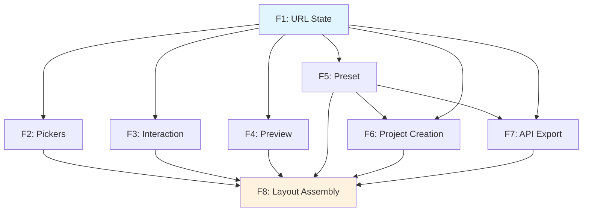

# ds-customizer Pilot

> ds-customizer는 Team Orchestration 규칙을 검증하는 **첫 consumer**다. 이 문서는 범용 규칙을 덮어쓰지 않고, generic 계약이 실제 복합 blueprint 프로젝트에 어떻게 투영되는지를 보여주는 pilot 예시다.

---

## 프로젝트 개요

shadcn/ui Design System Customizer를 8개 Feature로 분리하여 처음부터 구현하는 프로젝트. 각 Feature가 독립된 P1~P7 기획 + A~E 개발 파이프라인을 거친다.

---

## 8 Feature 요약

| # | Feature | slug | Wave | 의존 |
|---|---------|------|:----:|------|
| F1 | URL 상태 관리 기반 | `ds-url-state` | 0 | 없음 |
| F2 | Picker 컴포넌트 시스템 | `ds-picker-system` | 1 | F1 |
| F3 | 히스토리+랜덤+리셋 | `ds-interaction-system` | 1 | F1 |
| F4 | Preview 시스템 | `ds-preview-system` | 1 | F1 |
| F5 | 프리셋 코드 시스템 | `ds-preset-system` | 1 | F1 |
| F6 | 프로젝트 생성+CLI | `ds-project-creation` | 2 | F1, F5 |
| F7 | API Routes+v0 Export | `ds-api-export` | 2 | F1, F5 |
| F8 | 레이아웃+통합 조립 | `ds-layout-assembly` | 3 | F2~F7 |

---

## 의존성 그래프



### YAML

```yaml
version: "1.0"
project: ds-customizer

features:
  - id: f1
    slug: ds-url-state
    name: "URL 상태 관리 기반"
    depends_on: []
    complexity: medium

  - id: f2
    slug: ds-picker-system
    name: "Picker 컴포넌트 시스템"
    depends_on: [f1]
    complexity: medium

  - id: f3
    slug: ds-interaction-system
    name: "히스토리+랜덤+리셋"
    depends_on: [f1]
    complexity: medium

  - id: f4
    slug: ds-preview-system
    name: "Preview 시스템"
    depends_on: [f1]
    complexity: large

  - id: f5
    slug: ds-preset-system
    name: "프리셋 코드 시스템"
    depends_on: [f1]
    complexity: small

  - id: f6
    slug: ds-project-creation
    name: "프로젝트 생성+CLI"
    depends_on: [f1, f5]
    complexity: medium

  - id: f7
    slug: ds-api-export
    name: "API Routes+v0 Export"
    depends_on: [f1, f5]
    complexity: large

  - id: f8
    slug: ds-layout-assembly
    name: "레이아웃+통합 조립"
    depends_on: [f2, f3, f4, f5, f6, f7]
    complexity: medium
```

---

## Wave 도출

| Wave | Features | 동시 실행 | 비고 |
|:----:|----------|:---------:|------|
| 0 | F1 | 1 | Foundation, 순차 |
| 1 | F2, F3, F4, F5 | 3+1 | 슬롯 제한으로 F5는 대기 후 빈 슬롯 재활용 |
| 2 | F6, F7 | 2 | F5 완료 후 |
| 3 | F8 | 1 | 통합, 순차 |

### 슬롯 제한 적용 (Eager 전략)

```
Wave 0: [F1]                      → 1 슬롯
Wave 1: [F2, F3, F4] 먼저 spawn   → 3 슬롯 (F5 대기)
         F3 완료 → F5 즉시 spawn   → 3 슬롯 유지
Wave 2: [F6, F7]                   → 2 슬롯
Wave 3: [F8]                       → 1 슬롯
```

---

## Phase Gate 조건

| Gate | 조건 | 검증 방법 |
|------|------|----------|
| Wave 0 → 1 | F1 `/dev-verify` PASS | stage-manifest 확인 |
| Wave 1 → 2 | F5 `/dev-verify` PASS | F2~F4는 독립 진행 가능 |
| Wave 2 → 3 | F1~F7 전체 `/dev-verify` PASS | 전체 상태 확인 |

---

## F1/F8 특수 역할

### F1: Foundation

- URL 상태 관리의 핵심 인프라
- 공유 타입, utility, 기반 hooks를 정의
- 다른 모든 Feature가 F1에 의존
- **F1 실패 시 모든 후속 Feature 대기** (유일한 전체 차단 규칙)

### F8: App Shell + 통합

- 전체 레이아웃 조립
- F1~F7 결과를 하나의 앱으로 통합
- 모든 Feature 완료 후에만 실행 가능

---

## Ownership Matrix (Hard Dependency와 분리)

컴포넌트/파일 ownership은 DAG가 아니라 이 ownership matrix에서 관리한다.

| 컴포넌트 | 소유 Feature | 다른 Feature의 사용 |
|---------|-------------|-------------------|
| `useQueryState` hook | F1 | F2~F7 import |
| `ColorPicker` | F2 | F8 조립 |
| `LockButton` | F3 | F8 조립 |
| `PreviewPane` | F4 | F8 조립 |
| `PresetPicker` | F5 | F6, F8 import |
| 공유 types (`DesignToken` 등) | F1 | 전체 import |

### Shared Code 승격 규칙

```
1개 route에서만 사용 → route-local (해당 Feature 내부)
2+ route에서 사용   → app-shared (앱 루트로 승격)
3+ route 또는 패키지 → package 추출 (packages/ 로 이동)
```

---

## 팀 구성 시나리오

```
─── Wave 0 ─────────────────────────────────
  Team Lead + Agent-F1
  Agent-F1: F1(ds-url-state) P1→...→E → F1 완료

─── Wave 1 (sub-wave a) ────────────────────
  Team Lead + Agent-F2 + Agent-F3 + Agent-F4
  → F3 먼저 완료 → Agent-F3 종료

─── Wave 1 (sub-wave b) ────────────────────
  Team Lead + Agent-F2(계속) + Agent-F5 + Agent-F4(계속)
  Agent-F5: F3 슬롯 재활용 → F2, F4, F5 순차 완료

─── Wave 2 ─────────────────────────────────
  Team Lead + Agent-F6 + Agent-F7 → 병렬 완료

─── Wave 3 ─────────────────────────────────
  Team Lead + Agent-F8 → 전체 완료
```

### 진행 보고 테이블

```
┌────┬───────────────────┬──────┬─────────┬────────┐
│ ID │ Feature           │ Wave │ Stage   │ Status │
├────┼───────────────────┼──────┼─────────┼────────┤
│ F1 │ URL State         │ 0    │ E       │ done   │
│ F2 │ Picker System     │ 1    │ P5      │ active │
│ F3 │ Interaction       │ 1    │ D       │ active │
│ F4 │ Preview System    │ 1    │ P3      │ active │
│ F5 │ Preset System     │ 1    │ —       │ queued │
│ F6 │ Project Creation  │ 2    │ —       │ blocked│
│ F7 │ API Export        │ 2    │ —       │ blocked│
│ F8 │ Layout Assembly   │ 3    │ —       │ blocked│
└────┴───────────────────┴──────┴─────────┴────────┘
Progress: 1/8 done, 3 active, 1 queued, 3 blocked
```

---

## 실행 타임라인

```mermaid
gantt
    title ds-customizer — Wave 기반 실행 타임라인
    dateFormat X
    axisFormat %s

    section Wave 0
    F1 URL State          :f1, 0, 5

    section Wave 1
    F2 Picker System      :f2, 5, 11
    F3 Interaction        :f3, 5, 10
    F4 Preview System     :f4, 5, 13
    F5 Preset System      :f5, 10, 13

    section Wave 2
    F6 Project Creation   :f6, 13, 18
    F7 API Export         :f7, 13, 19

    section Wave 3
    F8 Layout Assembly    :f8, 19, 24
```



---

## 관련 문서

| 문서 | 설명 |
|------|------|
| [00-overview.md](./00-overview.md) | 범용 설계 원칙 |
| [03-scheduler-and-dependencies.md](./03-scheduler-and-dependencies.md) | DAG 스케줄링 (범용) |
| `.plans/blueprints/ds-customizer/` | ds-customizer 블루프린트 원본 |
