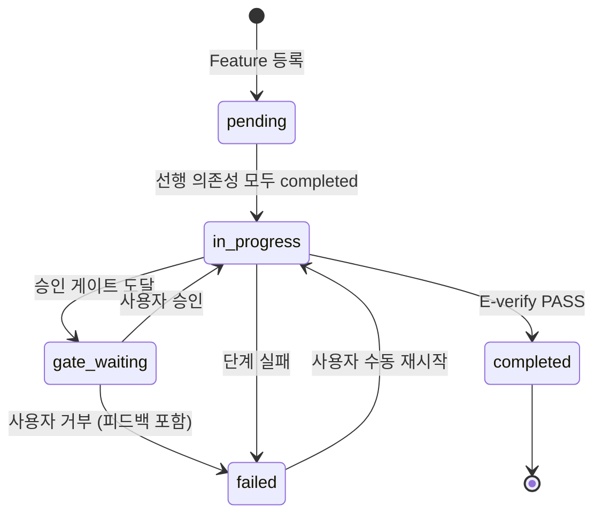
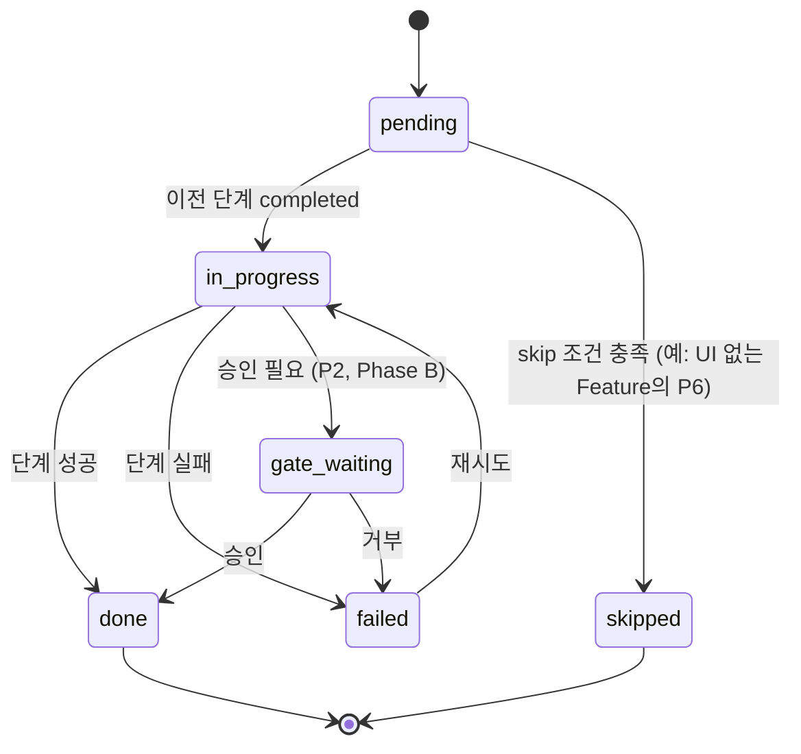
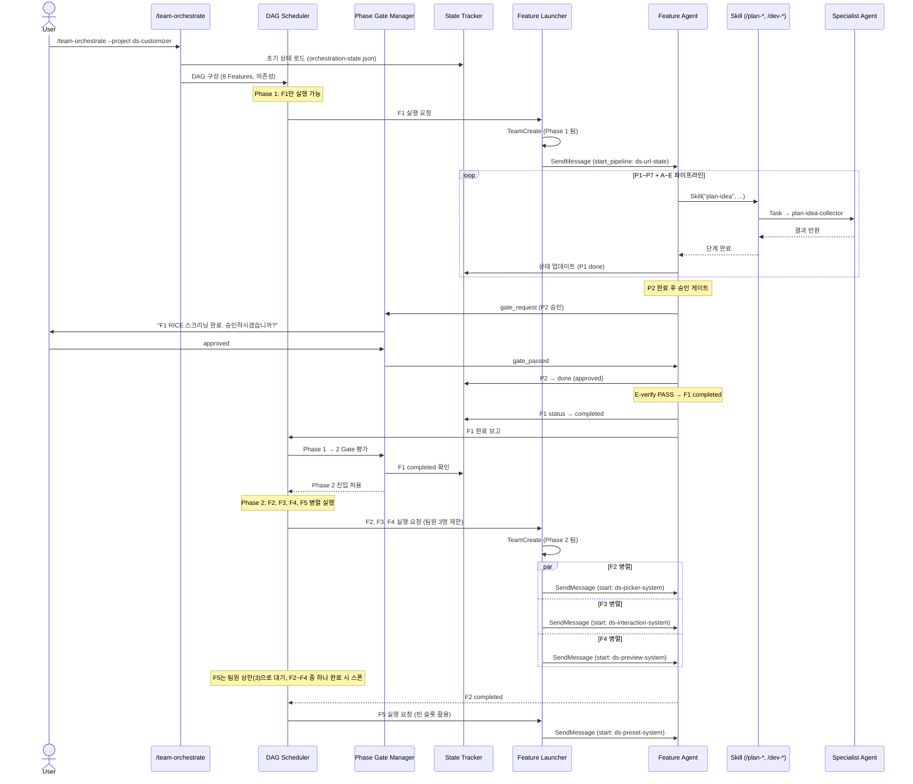

# Team Orchestration 아키텍처

> 3-Layer 아키텍처로 기존 claude-kit 인프라 위에 Orchestration Layer를 추가하여, 다수 Feature의 병렬 파이프라인 실행을 조율한다.

---

## 1. 3-Layer 아키텍처

### 다이어그램

```mermaid
graph TB
    subgraph OL["Orchestration Layer (신규)"]
        DS[DAG Scheduler]
        PGM[Phase Gate Manager]
        ST[State Tracker]
        FL[Feature Launcher]
    end

    subgraph PL["Pipeline Layer (기존)"]
        subgraph PLAN["Plan Pipeline"]
            PI[/plan-idea]
            PS[/plan-screen]
            PD[/plan-draft]
            PP[/plan-prd]
            PW[/plan-wireframe]
            PST[/plan-stitch]
            PB[/plan-bridge]
            PR[/plan-review]
        end
        subgraph DEV["Dev Pipeline"]
            DF[/dev-feature]
            DR[/dev-run]
            DV[/dev-verify]
            DC[/dev-commit]
        end
    end

    subgraph AL["Agent Layer (기존)"]
        subgraph PA["Plan Agents"]
            PIC[plan-idea-collector]
            PIS[plan-idea-screener]
            PPW[plan-prd-writer]
            PWD[plan-wireframe-designer]
            PSI[plan-stitch-integrator]
            PRV[plan-reviewer]
        end
        subgraph DA["Dev Agents"]
            DAR[dev-architect]
            DCR[dev-code-reviewer]
            DDB[dev-database-reviewer]
            DDU[dev-doc-updater]
            DSR[dev-security-reviewer]
            DVA[dev-verify-agent]
            DFR[dev-frontend-reviewer]
        end
    end

    DS --> FL
    PGM --> DS
    ST --> PGM

    FL -->|Skill tool| PI
    FL -->|Skill tool| PS
    FL -->|Skill tool| PP
    FL -->|Skill tool| DF
    FL -->|Skill tool| DR
    FL -->|Skill tool| DV

    PI -->|Task tool| PIC
    PS -->|Task tool| PIS
    PP -->|Task tool| PPW
    PW -->|Task tool| PWD
    PST -->|Task tool| PSI
    PR -->|Task tool| PRV
    DV -->|Task tool| DVA
```

### Layer 역할

| Layer | 상태 | 역할 | 주요 컴포넌트 |
|-------|------|------|--------------|
| **Orchestration** | 신규 | Feature 간 조율, 의존성 관리, 상태 추적 | DAG Scheduler, Phase Gate Manager, State Tracker, Feature Launcher |
| **Pipeline** | 기존 | 단일 Feature의 P1~P7 + A~E 실행 | /plan-* 커맨드 8개, /dev-* 커맨드 20개, 스킬 23개 |
| **Agent** | 기존 | 전문 역할 수행 (코드 생성, 리뷰, 검증) | 13개 specialist 에이전트 |

### 각 컴포넌트 상세

**DAG Scheduler**: Feature 간 의존성 그래프를 관리한다. 선행 Feature가 모두 완료되면 후행 Feature를 실행 대기열에 추가한다. Wave 그룹화를 통해 병렬 실행 가능한 Feature를 묶는다.

**Phase Gate Manager**: Phase 전환 조건을 평가한다. 자동 게이트(테스트/빌드 통과)는 State Tracker에서 확인하고, 수동 게이트(사용자 승인)는 작업을 일시 중단하고 사용자 입력을 대기한다.

**State Tracker**: `orchestration-state.json`을 읽고 쓴다. 모든 Feature의 현재 단계, 상태, 타임스탬프를 기록한다. Feature Launcher와 Phase Gate Manager가 결정을 내리기 위해 State Tracker를 조회한다.

**Feature Launcher**: 실제로 Feature 에이전트를 스폰하는 컴포넌트. TeamCreate로 팀을 구성하고, SendMessage로 Feature 에이전트에게 파이프라인 실행을 지시한다.

---

## 2. 기존 시스템 통합 지점

### Agent Teams API 통합

```yaml
# TeamCreate: Feature 팀 생성
TeamCreate:
  용도: Phase별 Feature 에이전트 팀 구성
  예시:
    - Phase 2 팀: Lead + F2-Agent + F3-Agent + F4-Agent (최대 3 팀원)
    - Phase 2 추가: F5-Agent는 별도 팀 또는 순차 스폰
  제약: 리더 1 + 팀원 최대 3

# SendMessage: 에이전트 간 통신
SendMessage:
  용도: Feature 에이전트에게 파이프라인 단계 실행 지시
  메시지 유형:
    - start_pipeline: 파이프라인 시작 지시 (slug, 시작 단계 포함)
    - stage_complete: 단계 완료 보고
    - gate_request: 사용자 승인 요청
    - error_report: 실패 보고
    - shutdown_request: 작업 완료 후 종료 지시

# TaskCreate / TaskUpdate: Feature 태스크 관리
TaskCreate:
  용도: 각 Feature의 파이프라인 단계를 Task로 등록
  필드:
    - name: "F2: P1 아이디어 등록"
    - description: slug, 단계, 입력 경로
    - addBlockedBy: 선행 Task ID (의존성)

TaskUpdate:
  용도: Task 상태 업데이트 (in_progress, completed, failed)
  트리거: Feature 에이전트가 각 단계 완료 시 호출
```

### Skill tool 통합

```yaml
# 기존 /plan-*, /dev-* 커맨드를 Skill tool로 호출
Skill_tool:
  호출 패턴:
    - Feature 에이전트가 자신의 파이프라인 단계에서 Skill tool 사용
    - 예: F2 에이전트가 /plan-idea 실행 → plan-idea-collector 에이전트 스폰

  호출 순서 (Standard Feature):
    P1: Skill("plan-idea", args: "{feature description}")
    P2: Skill("plan-screen", args: "{IDEA-ID}")
    P3: Skill("plan-draft", args: "{IDEA-ID}")
    P4: Skill("plan-prd", args: "{first-pass path}")
    P5: Skill("plan-wireframe", args: "{PRD path}")
    P6: Skill("plan-stitch", args: "{PRD + Wireframe path}")
    P7: Skill("plan-bridge", args: "{PRD path}")
    A:  Skill("dev-feature", args: "{approved PRD path}")
    D:  Skill("dev-run")
    E:  Skill("dev-verify") → Skill("dev-commit")
```

---

## 3. 상태 저장소 설계

### orchestration-state.json 스키마

```jsonc
{
  "version": "1.0.0",
  "project": "ds-customizer",
  "status": "in_progress",       // pending | in_progress | paused | completed | failed
  "currentPhase": 2,

  "phases": {
    "1": {
      "status": "completed",
      "features": ["ds-url-state"],
      "gate": { "type": "auto", "condition": "F1 /dev-verify PASS", "passedAt": "2026-04-01T12:00:00+09:00" }
    },
    "2": {
      "status": "in_progress",
      "features": ["ds-picker-system", "ds-interaction-system", "ds-preview-system", "ds-preset-system"],
      "gate": { "type": "auto", "condition": "F5 /dev-verify PASS", "passedAt": null }
    },
    "3": { "status": "pending", "features": ["ds-project-creation", "ds-api-export"], "gate": { "type": "auto", "condition": "F1~F7 PASS" } },
    "4": { "status": "pending", "features": ["ds-layout-assembly"], "gate": null }
  },

  "features": {
    "ds-url-state": {
      "id": "F1", "phase": 1, "status": "completed", "dependsOn": [],
      "currentStage": "done",
      "stages": {
        "P1-idea":      { "status": "done", "completedAt": "..." },
        "P2-screen":    { "status": "done", "completedAt": "..." },
        "P5-wireframe": { "status": "skipped", "reason": "순수 로직" },
        "P6-stitch":    { "status": "skipped", "reason": "UI 없음" },
        "E-verify":     { "status": "done", "completedAt": "..." }
        // P3, P4, P7, A~D 동일 패턴
      },
      "artifacts": {
        "idea": ".plans/ideas/20-approved/IDEA-20260401-001.md",
        "prd": ".plans/prd/10-approved/prd-2026-04-01-ds-url-state/prd.md"
      }
    }
    // ... 나머지 7개 Feature 동일 구조
  },

  "dag": {
    "ds-url-state":          { "dependsOn": [] },
    "ds-picker-system":      { "dependsOn": ["ds-url-state"] },
    "ds-interaction-system":  { "dependsOn": ["ds-url-state"] },
    "ds-preview-system":     { "dependsOn": ["ds-url-state"] },
    "ds-preset-system":      { "dependsOn": ["ds-url-state"] },
    "ds-project-creation":   { "dependsOn": ["ds-url-state", "ds-preset-system"] },
    "ds-api-export":         { "dependsOn": ["ds-url-state", "ds-preset-system"] },
    "ds-layout-assembly":    { "dependsOn": ["ds-picker-system", "ds-interaction-system", "ds-preview-system", "ds-preset-system", "ds-project-creation", "ds-api-export"] }
  }
}
```

### 상태 전이 다이어그램



### Feature 단계(Stage) 상태 전이



---

## 4. 데이터 흐름

### 전체 시퀀스 다이어그램



---

## 5. 에러 복구 전략

### 실패 유형별 대응

| 실패 유형 | 예시 | 감지 방법 | 복구 전략 |
|-----------|------|----------|----------|
| **단계 실패** | P4 PRD 리뷰 FAIL | Skill 반환값 | 해당 단계 재실행 (최대 2회) |
| **빌드 에러** | D-dev-run 타입 에러 | dev-verify-agent 결과 | Feature 에이전트가 수정 후 재실행 |
| **에이전트 무응답** | Feature 에이전트 5분 초과 | SendMessage 타임아웃 | Task 재배정 또는 새 에이전트 스폰 |
| **Foundation 실패** | F1 테스트 실패 | State Tracker | 모든 후속 Feature 일시 정지, 사용자 알림 |
| **Gate 거부** | 사용자가 P2 거부 | Phase Gate Manager | 피드백 반영 후 해당 단계 재실행 |
| **순환 의존성** | DAG 구성 시 감지 | DAG Scheduler | 즉시 중단, 의존성 그래프 출력, 사용자 수정 요청 |

### 재시도 정책

```yaml
retry_policy:
  max_retries: 2
  scope: stage          # 전체 파이프라인이 아닌, 실패한 단계만 재시도
  backoff: none         # 즉시 재시도 (에이전트 작업이므로 backoff 불필요)
  escalation:
    after_max_retries: "pause_feature"  # Feature를 paused 상태로 전환
    notification: "user"                # 사용자에게 알림
```

### 부분 재시작 (Resume)

Feature가 중간 단계에서 실패 후 수동 개입으로 문제를 해결한 경우, 해당 단계부터 재시작할 수 있다.

```yaml
# 재시작 예시: F2가 P4-prd에서 실패 후 재시작
resume:
  feature: ds-picker-system
  from_stage: P4-prd
  action: State Tracker가 P4-prd 상태를 pending으로 리셋 → Feature Launcher가 재스폰
```

### Checkpoint 저장

각 단계 완료 시 `orchestration-state.json`이 즉시 업데이트된다. 세션이 비정상 종료되어도 마지막 성공 단계부터 재개할 수 있다.

---

## 6. 확장 지점

### 커스텀 파이프라인 단계 추가

Team Orchestration은 고정된 P1~P7 + A~E 파이프라인을 전제하지만, 프로젝트별로 단계를 추가하거나 건너뛸 수 있다.

#### 단계 추가 / 건너뛰기

- **추가**: Feature의 `stages`에 커스텀 단계를 삽입. `after` 필드로 실행 위치, `command` 필드로 호출할 커맨드 지정.
- **건너뛰기**: UI 없는 Feature의 P5/P6은 `status: "skipped"` + `reason` 기록. Lite 판정 Feature는 P4~P6 생략.

#### 새 프로젝트 적용

프로젝트 정의 파일(`orchestration-config.yaml`)에 Feature 목록, Phase 구성, DAG 의존성, Gate 조건을 선언하면 동일한 오케스트레이션 엔진을 재사용할 수 있다. 상세 스키마는 `07-extension-guide.md`(예정)에서 다룬다.

### Agent Teams 제한 대응

Agent Teams는 리더 1 + 팀원 최대 3으로 제한된다. Phase 2처럼 4개 Feature를 병렬 실행해야 하는 경우:

```yaml
# 전략 1: 순차 스폰 (팀원 완료 시 다음 스폰)
phase_2_execution:
  wave_1: [F2, F3, F4]    # 3명 동시
  wave_2: [F5]             # F2~F4 중 하나 완료 후 빈 슬롯에 스폰

# 전략 2: 복수 팀 (2개 팀으로 분할)
phase_2_teams:
  team_1: [F2, F3, F4]    # Lead 1 + 팀원 3
  team_2: [F5]             # 별도 세션에서 실행 (수동)

# 전략 3: Self-Claim (v6 패턴 활용)
phase_2_self_claim:
  initial: [F2, F3, F4]   # 3명 시작
  on_complete:             # 완료한 에이전트가 F5를 자동 청구
    - agent_finished: F3
    - claims: F5
```

권장 전략은 **전략 1 (순차 스폰)**이다. v6의 Self-Claim 메커니즘과 결합하여, 작업을 마친 Feature 에이전트가 자동으로 다음 미할당 Feature를 선택한다.

---

## 관련 문서

| 문서 | 설명 |
|------|------|
| `00-overview.md` | 설계 원칙, 유스케이스, 기존 인프라 현황 |
| `02-dag-scheduler.md` (예정) | DAG 구성, Wave 그룹화, Phase Gate 로직 상세 |
| `03-state-management.md` (예정) | orchestration-state.json 영속성, 동시성 |
| `claude-forge/skills/team-orchestrator/SKILL.md` | v6 Team Orchestrator 스킬 |
| `claude-forge/commands/orchestrate.md` | v6 /orchestrate 커맨드 |
