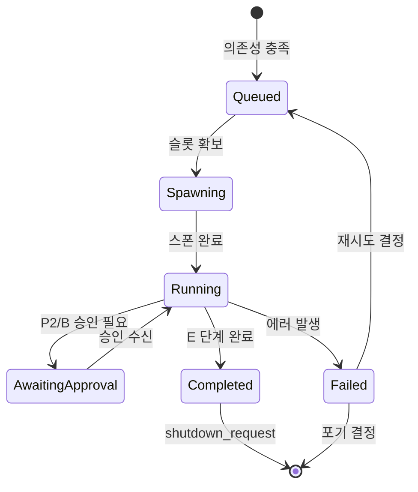

```mermaid
gantt
    title Phase 2 Wave 기반 에이전트 재활용
    dateFormat X
    axisFormat %s

    section Slot 1
    F2 Picker System     :f2, 0, 6
    (idle or F5)         :f5a, after f2, 2

    section Slot 2
    F3 Interaction       :f3, 0, 5
    F5 Preset System     :f5, after f3, 3

    section Slot 3
    F4 Preview System    :f4, 0, 8
```

# Team Model — 팀 구성 및 역할 정의

> **한 줄 요약**: Team Lead 1명 + Feature Agent N명 + Review Agent(선택)로 구성된 hub-and-spoke 팀 모델. Claude Code의 동시 에이전트 제한(4)을 Wave 기반 재활용으로 극복한다.

---

## 1. 역할 정의

### 1.1 Team Lead (1명)

팀의 중앙 허브. 모든 Feature Agent는 Team Lead를 통해서만 통신한다.

| 책임 | 설명 |
|------|------|
| DAG 스케줄링 | dependency-engine으로부터 Ready 큐를 받아 Feature Agent 스폰 결정 |
| Phase 게이트 | Phase 전환 조건 충족 여부 판단, 다음 Wave 시작 |
| 승인 큐 관리 | Feature Agent의 P2/B 승인 요청을 수집, 사용자에게 전달, 결과 회신 |
| 진행 보고 | 전체 Feature 상태를 테이블로 사용자에게 주기적 보고 |
| 에이전트 생명주기 | Feature Agent 스폰, 모니터링, 종료 관리 |
| 실패 처리 | Feature Agent 실패 시 재시도 또는 의존 Feature block 처리 |

```
Team Lead는 교통 관제탑과 같다.
활주로(동시 슬롯)가 제한되어 있으므로, 이착륙(스폰/종료) 순서를 조율하고
비행기(Feature Agent) 간 충돌을 방지한다.
```

### 1.2 Feature Agent (N명)

Feature 1개를 전담하는 general-purpose 에이전트. P1~E 파이프라인을 순차 실행한다.

| 책임 | 설명 |
|------|------|
| 파이프라인 실행 | 할당된 Feature의 P1→P2→...→P7→A→B→C→D→E 순차 진행 |
| 스킬 호출 | 각 단계에서 기존 `plan-*` / `dev-*` 스킬을 Task tool로 호출 |
| 상태 보고 | 각 단계 완료/실패 시 Team Lead에게 SendMessage |
| 승인 요청 | P2(스크리닝), B(Human Review) 단계에서 Team Lead에게 승인 요청 |
| 산출물 격리 | Feature slug 기준 폴더에 모든 산출물 생성 |

### 1.3 Review Agent (선택, 0~1명)

교차 검증 전담. Phase 완료 시점에 투입된다.

| 책임 | 설명 |
|------|------|
| 교차 검증 | Feature 간 인터페이스 호환성, 공유 타입 일관성 검증 |
| 통합 테스트 | Phase 2→3 전환 시 F1+F2~F5 통합 빌드 확인 |
| 품질 게이트 | `/dev-verify` 결과를 독립적으로 재검증 |

> Review Agent는 동시 에이전트 슬롯을 1개 소비하므로, Phase 2처럼 Feature Agent가 3개 필요한 구간에서는 비활성화한다.

---

## 2. 팀 크기 전략

### 2.1 Claude Code 제한

```
┌─────────────────────────────────┐
│  Main Session (Team Lead)   = 1 │
│  Teammates (Feature Agent)  ≤ 3 │
│  ──────────────────────────     │
│  동시 최대                  = 4 │
└─────────────────────────────────┘
```

### 2.2 Phase별 최적 팀 크기

| Phase | Feature 수 | Team Lead | Feature Agent | Review Agent | 합계 | 비고 |
|-------|-----------|-----------|---------------|--------------|------|------|
| 1 | 1 (F1) | 1 | 1 | 0 | 2 | Foundation, 직렬 |
| 2 | 4 (F2~F5) | 1 | 3 | 0 | 4 | 최대 병렬, Wave 2회 |
| 3 | 2 (F6~F7) | 1 | 2 | 0 | 3 | 병렬 2개 |
| 4 | 1 (F8) | 1 | 1 | 0 | 2 | 통합, 직렬 |

### 2.3 Wave 기반 에이전트 재활용

Phase 2에서 4개 Feature를 3개 슬롯으로 처리하는 전략:

```
Phase 2 — Wave 분배

Wave 2a: F2, F3, F4  (3 Agent 동시)
Wave 2b: F5           (1 Agent — F2/F3/F4 중 먼저 끝난 슬롯 재활용)

※ F5는 F1만 의존하므로 Wave 2a에 넣어도 되지만,
   슬롯 제한(3)으로 Wave 2b로 밀림.
   단, F2/F3/F4 중 하나가 먼저 완료되면 즉시 F5 스폰 가능.
```



---

## 3. Feature Agent 생명주기



### 3.1 스폰 조건

Feature Agent가 스폰되려면 **두 조건 모두** 충족해야 한다:

1. **의존성 충족**: `depends_on`의 모든 Feature가 `completed` 상태
2. **슬롯 가용**: 현재 활성 Feature Agent 수 < 3

### 3.2 할당

스폰 시 Feature Agent에게 전달되는 컨텍스트:

```yaml
assignment:
  feature_id: f2
  feature_slug: ds-picker-system
  feature_name: "Picker 컴포넌트 시스템"
  plan_path: .plans/ds-customizer/features/f2-picker-system/plan.md
  pipeline_start: P1       # 시작 단계 (재시도 시 중간부터 가능)
  approval_gates: [P2, B]  # 승인 필요 단계 목록
```

### 3.3 실행

Feature Agent는 파이프라인 단계를 순차적으로 실행한다:

```
P1 → P2(승인) → P3 → P4 → P5 → P6 → P7 → A → B(승인) → C → D → E
```

각 단계에서 기존 스킬을 Task tool로 호출한다:

| 단계 | 호출 스킬 |
|------|----------|
| P1 | `/plan-idea` |
| P2 | `/plan-screen` → 승인 대기 |
| P3 | `/plan-draft` |
| P4 | `/plan-prd` |
| P5 | `/plan-wireframe` |
| P6 | `/plan-stitch` |
| P7 | `/plan-bridge` |
| A | `/dev-feature` |
| B | Human Review → 승인 대기 |
| C | Package Generation (자동) |
| D | `/dev-run` |
| E | `/dev-verify` → `/dev-commit` |

### 3.4 승인 대기

```
Feature Agent                    Team Lead                     User
     │                              │                            │
     ├─ SendMessage ───────────────>│                            │
     │  {type: "approval_request",  │                            │
     │   stage: "P2",               ├─ 진행 보고 + 승인 요청 ──>│
     │   feature: "f2"}             │                            │
     │                              │<── 승인/거부 ──────────────┤
     │<── SendMessage ──────────────┤                            │
     │  {type: "approval_response", │                            │
     │   approved: true}            │                            │
     ├─ P3 진행...                  │                            │
```

### 3.5 완료 보고

```yaml
completion_report:
  feature_id: f2
  status: completed          # completed | failed
  stages_completed: [P1, P2, P3, P4, P5, P6, P7, A, B, C, D, E]
  artifacts:
    - .plans/features/active/ds-picker-system/
  commit_hash: "abc1234"
  verify_result: PASS        # /dev-verify 결과
```

### 3.6 종료

Team Lead가 `shutdown_request`를 보내면 Feature Agent는 정리 후 종료한다.

---

## 4. 통신 프로토콜

### 4.1 메시지 타입

| 타입 | 방향 | 용도 |
|------|------|------|
| `status_update` | Agent → Lead | 단계 진입/완료 보고 |
| `approval_request` | Agent → Lead | P2/B 승인 요청 |
| `approval_response` | Lead → Agent | 승인/거부 응답 |
| `error_report` | Agent → Lead | 에러 발생 알림 |
| `shutdown_request` | Lead → Agent | 종료 지시 |
| `assignment` | Lead → Agent | Feature 할당 (스폰 시) |

### 4.2 상태 보고 메시지 형식

```yaml
message:
  type: status_update
  from: feature-agent-f2
  to: team-lead
  payload:
    feature_id: f2
    current_stage: P4
    stage_status: completed    # started | completed | failed
    progress: "7/12"           # 완료 단계 / 전체 단계
    timestamp: "2026-03-25T10:30:00Z"
```

### 4.3 에러 알림

```yaml
message:
  type: error_report
  from: feature-agent-f4
  to: team-lead
  payload:
    feature_id: f4
    current_stage: D
    error_type: test_failure   # test_failure | build_error | verify_fail
    error_detail: "3 tests failed in preview-iframe.test.ts"
    retryable: true
    retry_count: 0
```

---

## 5. 기존 에이전트와의 관계

### 5.1 3-Depth 계층 구조

```
Team Lead (Main Session)
  └── Feature Agent (Teammate — general-purpose)
        └── Existing Agent (Task tool 호출)
            예: plan-idea, plan-prd, dev-run, dev-verify ...
```

- **Team Lead**: 오케스트레이션 전담. 코드를 직접 생성하지 않음
- **Feature Agent**: general-purpose 타입. 파이프라인 단계를 순차 실행하며, 각 단계에서 기존 스킬/에이전트를 Task tool로 호출
- **Existing Agent**: claude-kit의 기존 13 에이전트 + 23 스킬. Feature Agent의 Task tool 내부에서 실행

### 5.2 호출 예시

```
Feature Agent (f2: ds-picker-system)
  │
  ├─ Task: /plan-idea        → plan-idea 스킬 실행
  ├─ Task: /plan-screen      → plan-screening-workflow 스킬 실행
  ├─ Task: /plan-draft        → plan-draft 스킬 실행
  ├─ Task: /plan-prd          → plan-prd-authoring 스킬 실행
  ├─ Task: /plan-wireframe    → plan-wireframe-design 스킬 실행
  ├─ Task: /plan-stitch       → plan-stitch-workflow 스킬 실행
  ├─ Task: /plan-bridge       → plan-bridge 스킬 실행
  ├─ Task: /dev-feature       → dev-feature-plan 스킬 실행
  ├─ (B: Human Review — 승인 대기)
  ├─ Task: /dev-run           → dev-workflow 스킬 실행 (TDD)
  └─ Task: /dev-verify        → dev-verification-engine 스킬 실행
```

---

## 6. ds-customizer 예시 — 구체적 팀 구성 시나리오

### 전체 실행 흐름

```
─── Phase 1 ─────────────────────────────────
  Team Lead + Agent-F1

  Agent-F1: F1(ds-url-state) P1→...→E
  → F1 완료, Agent-F1 종료

─── Phase 2 (Wave 2a) ──────────────────────
  Team Lead + Agent-F2 + Agent-F3 + Agent-F4

  Agent-F2: F2(ds-picker-system)  P1→...→E
  Agent-F3: F3(ds-interaction)    P1→...→E
  Agent-F4: F4(ds-preview-system) P1→...→E

  → F3 먼저 완료 → Agent-F3 종료

─── Phase 2 (Wave 2b) ──────────────────────
  Team Lead + Agent-F2(계속) + Agent-F5 + Agent-F4(계속)

  Agent-F5: F5(ds-preset-system)  P1→...→E  (F3 슬롯 재활용)

  → F2, F4, F5 순차 완료

─── Phase 3 ─────────────────────────────────
  Team Lead + Agent-F6 + Agent-F7

  Agent-F6: F6(ds-project-creation) P1→...→E
  Agent-F7: F7(ds-api-export)       P1→...→E

  → 병렬 완료

─── Phase 4 ─────────────────────────────────
  Team Lead + Agent-F8

  Agent-F8: F8(ds-layout-assembly) P1→...→E  (통합)
  → 전체 완료
```

### 진행 보고 테이블 (Team Lead가 사용자에게 제공)

```
┌────┬───────────────────┬────────┬─────────┬────────┐
│ ID │ Feature           │ Phase  │ Stage   │ Status │
├────┼───────────────────┼────────┼─────────┼────────┤
│ F1 │ URL State         │ 1      │ E       │ done   │
│ F2 │ Picker System     │ 2      │ P5      │ active │
│ F3 │ Interaction       │ 2      │ D       │ active │
│ F4 │ Preview System    │ 2      │ P3      │ active │
│ F5 │ Preset System     │ 2      │ —       │ queued │
│ F6 │ Project Creation  │ 3      │ —       │ blocked│
│ F7 │ API Export        │ 3      │ —       │ blocked│
│ F8 │ Layout Assembly   │ 4      │ —       │ blocked│
└────┴───────────────────┴────────┴─────────┴────────┘
Progress: 1/8 done, 3 active, 1 queued, 3 blocked
```
