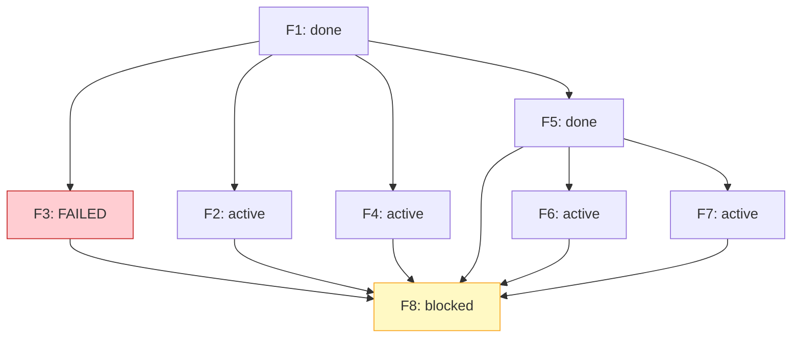
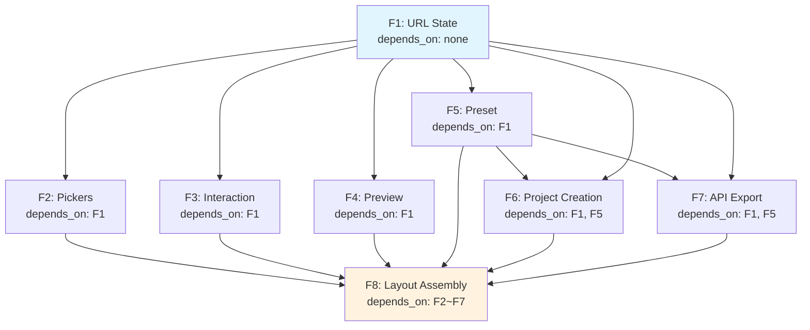

# Dependency Engine — 의존 그래프 및 DAG 스케줄링

> **한 줄 요약**: YAML로 Feature 의존 그래프를 정의하고, 위상 정렬 기반 DAG 스케줄러가 Wave를 자동 도출하여 Phase 게이트와 실패 전파를 관리한다.

---

## 1. Feature 의존 그래프 정의 형식

### 1.1 YAML Schema

```yaml
# .plans/{project}/dependency-graph.yaml
version: "1.0"
project: ds-customizer
description: "Design System Customizer — 8 Feature 의존 그래프"

features:
  - id: f1
    slug: ds-url-state
    name: "URL 상태 관리 기반"
    depends_on: []
    plan_path: .plans/ds-customizer/features/f1-url-state/plan.md
    complexity: medium          # small | medium | large
    estimated_stages: 12       # P1~E = 12 단계

  - id: f2
    slug: ds-picker-system
    name: "Picker 컴포넌트 시스템"
    depends_on: [f1]
    plan_path: .plans/ds-customizer/features/f2-picker-system/plan.md
    complexity: medium
    estimated_stages: 12

  - id: f3
    slug: ds-interaction-system
    name: "히스토리+랜덤+리셋"
    depends_on: [f1]
    plan_path: .plans/ds-customizer/features/f3-interaction-system/plan.md
    complexity: medium
    estimated_stages: 12

  - id: f4
    slug: ds-preview-system
    name: "Preview 시스템"
    depends_on: [f1]
    plan_path: .plans/ds-customizer/features/f4-preview-system/plan.md
    complexity: large
    estimated_stages: 12

  - id: f5
    slug: ds-preset-system
    name: "프리셋 코드 시스템"
    depends_on: [f1]
    plan_path: .plans/ds-customizer/features/f5-preset-system/plan.md
    complexity: small
    estimated_stages: 12

  - id: f6
    slug: ds-project-creation
    name: "프로젝트 생성+CLI"
    depends_on: [f1, f5]
    plan_path: .plans/ds-customizer/features/f6-project-creation/plan.md
    complexity: medium
    estimated_stages: 12

  - id: f7
    slug: ds-api-export
    name: "API Routes+v0 Export"
    depends_on: [f1, f5]
    plan_path: .plans/ds-customizer/features/f7-api-export/plan.md
    complexity: large
    estimated_stages: 12

  - id: f8
    slug: ds-layout-assembly
    name: "레이아웃+통합 조립"
    depends_on: [f2, f3, f4, f5, f6, f7]
    plan_path: .plans/ds-customizer/features/f8-layout-assembly/plan.md
    complexity: medium
    estimated_stages: 12
```

### 1.2 필드 설명

| 필드 | 타입 | 필수 | 설명 |
|------|------|------|------|
| `id` | string | Y | 고유 식별자 (`f1`, `f2`, ...) |
| `slug` | string | Y | Feature slug — 폴더명/파일명에 사용 |
| `name` | string | Y | 사람이 읽을 수 있는 Feature 이름 |
| `depends_on` | string[] | Y | 선행 Feature id 목록 (빈 배열 = root) |
| `plan_path` | string | Y | Feature 상세 계획서 경로 |
| `complexity` | enum | N | `small` / `medium` / `large` — 예상 소요 참고 |
| `estimated_stages` | number | N | 파이프라인 단계 수 (기본값: 12) |

---

## 2. DAG 스케줄링 알고리즘

### 2.1 개요

```
의존 그래프는 택배 물류 센터의 작업 순서와 같다.
포장(F1)이 끝나야 라벨링(F2~F5)을 시작할 수 있고,
라벨링이 끝나야 배차(F6~F7)가 가능하다.
DAG 스케줄러는 이 순서를 자동으로 계산하여 병렬 처리할 수 있는 작업을 찾아낸다.
```

### 2.2 위상 정렬 (Topological Sort)

의존 그래프에서 실행 가능한 순서를 도출한다.

**의사코드:**

```
function topological_sort(features):
    in_degree = {}
    for each feature in features:
        in_degree[feature.id] = len(feature.depends_on)

    queue = [f for f in features if in_degree[f.id] == 0]
    sorted_order = []

    while queue is not empty:
        current = queue.pop()
        sorted_order.append(current)

        for each feature in features:
            if current.id in feature.depends_on:
                in_degree[feature.id] -= 1
                if in_degree[feature.id] == 0:
                    queue.append(feature)

    if len(sorted_order) != len(features):
        raise CyclicDependencyError(sorted_order, features)

    return sorted_order
```

### 2.3 Ready 큐

현재 시점에서 실행 가능한 Feature 목록을 관리한다.

```
function get_ready_queue(features, completed_set):
    ready = []
    for each feature in features:
        if feature.id in completed_set:
            continue
        if feature.id in running_set:
            continue
        if all(dep in completed_set for dep in feature.depends_on):
            ready.append(feature)
    return ready
```

### 2.4 Wave 자동 도출

Wave = DAG의 longest path level. 같은 Wave에 속한 Feature는 병렬 실행 가능하다.

**의사코드:**

```
function compute_waves(features):
    level = {}

    # BFS — longest path 기준 레벨 할당
    for each feature in topological_sort(features):
        if feature.depends_on is empty:
            level[feature.id] = 0
        else:
            level[feature.id] = max(level[dep] for dep in feature.depends_on) + 1

    # Wave별 그룹핑
    waves = {}
    for feature_id, wave_num in level.items():
        waves.setdefault(wave_num, []).append(feature_id)

    return waves
```

---

## 3. Phase 게이트 로직

### 3.1 Feature 완료 조건

Feature가 `completed`로 전환되려면 **두 조건 모두** 충족해야 한다:

```
feature.status = completed
  IFF
    /dev-verify result == PASS
    AND
    /dev-commit result == SUCCESS
```

### 3.2 의존 Feature Ready 조건

```
feature.is_ready = true
  IFF
    for ALL dep IN feature.depends_on:
        dep.status == completed
```

### 3.3 Wave 전환 시점

두 가지 전략 중 선택 가능:

| 전략 | 설명 | 장점 | 단점 |
|------|------|------|------|
| **Strict** | 현재 Wave의 모든 Feature 완료 후 다음 Wave 시작 | 예측 가능, 단순 | 느린 Feature가 병목 |
| **Eager** (권장) | 의존성 충족된 Feature는 즉시 스폰 | 처리량 최대화 | 상태 추적 복잡 |

**Eager 전략 의사코드:**

```
function on_feature_completed(feature_id):
    completed_set.add(feature_id)
    release_agent_slot(feature_id)

    ready_queue = get_ready_queue(all_features, completed_set)

    while ready_queue is not empty AND available_slots > 0:
        next_feature = ready_queue.pop_highest_priority()
        spawn_feature_agent(next_feature)
        available_slots -= 1
```

### 3.4 Phase 게이트 체크리스트

| 게이트 | 조건 | 확인 항목 |
|--------|------|----------|
| Phase 1 → 2 | F1 completed | F1 `/dev-verify` PASS, `/dev-commit` SUCCESS |
| Phase 2 → 3 | F5 completed | F5 `/dev-verify` PASS (F2~F4는 F6/F7과 무관) |
| Phase 3 → 4 | F1~F7 모두 completed | 7개 Feature 전부 `/dev-verify` PASS |

---

## 4. 순환 의존성 검출

### 4.1 DFS 기반 Cycle Detection

```
function detect_cycles(features):
    WHITE, GRAY, BLACK = 0, 1, 2
    color = {f.id: WHITE for f in features}
    parent = {}
    cycles = []

    function dfs(node_id):
        color[node_id] = GRAY

        for each dep_id in reverse_deps[node_id]:  # node_id에 의존하는 Feature들
            if color[dep_id] == GRAY:
                # Cycle 발견 — back edge
                cycle = extract_cycle(dep_id, node_id, parent)
                cycles.append(cycle)
            elif color[dep_id] == WHITE:
                parent[dep_id] = node_id
                dfs(dep_id)

        color[node_id] = BLACK

    for each feature in features:
        if color[feature.id] == WHITE:
            dfs(feature.id)

    return cycles
```

### 4.2 에러 메시지 및 해결 안내

```
ERROR: Circular dependency detected!

  Cycle: f2 → f4 → f2

  Affected features:
    - f2 (ds-picker-system) depends_on: [f1, f4]
    - f4 (ds-preview-system) depends_on: [f1, f2]

  Resolution options:
    1. Remove f4 from f2.depends_on (f2가 f4 없이 독립 개발 가능한 경우)
    2. Remove f2 from f4.depends_on (f4가 f2 없이 독립 개발 가능한 경우)
    3. Extract shared dependency into a new Feature (공통 부분을 별도 Feature로 분리)

  Hint: 대부분의 순환 의존은 인터페이스 계약(interface contract)을
        먼저 정의하면 해소됩니다. Feature A가 Feature B의 타입만 필요하다면,
        공유 타입 패키지를 선행 Feature로 분리하세요.
```

---

## 5. 실패 전파 규칙

### 5.1 전파 원칙

```
실패 전파는 도미노와 같다.
넘어진 도미노(실패 Feature)에 직접 닿는 도미노(직접 의존)만 넘어진다.
간접 의존은 직접 의존이 block되면 자동으로 block된다.
```

| 규칙 | 설명 |
|------|------|
| **직접 block** | Feature X 실패 → X에 직접 의존하는 Feature만 `blocked` 상태 전환 |
| **간접 전파** | blocked Feature에 의존하는 Feature도 Ready 조건 미충족으로 자동 blocked |
| **격리** | X에 의존하지 않는 Feature는 영향 없음 — 계속 진행 |
| **재시도** | 실패한 Feature를 재시도하면, 성공 시 blocked Feature들이 자동 unblock |

### 5.2 실패 전파 예시



F3 실패 시:
- **F8만 blocked**: F3에 직접 의존하므로
- **F2, F4, F5, F6, F7**: F3에 의존하지 않으므로 계속 진행
- F3 재시도 성공 시 → F8 자동 unblock (단, F8의 다른 의존도 모두 completed여야 Ready)

### 5.3 재시도 정책

```yaml
retry_policy:
  max_retries: 2               # Feature당 최대 재시도 횟수
  retry_from: last_failed_stage # 실패한 단계부터 재시작 (P1부터가 아님)
  backoff: none                 # 즉시 재시도 (에이전트 기반이므로 backoff 불필요)
  manual_override: true         # 사용자가 재시도/포기 결정 가능
```

---

## 6. ds-customizer 예시 — 8 Feature DAG → 4 Wave 자동 도출

### 6.1 의존 그래프



### 6.2 Wave 자동 도출 과정

**Step 1: Longest Path Level 계산**

```
F1: depends_on = []       → level = 0
F2: depends_on = [F1]     → level = max(0) + 1 = 1
F3: depends_on = [F1]     → level = max(0) + 1 = 1
F4: depends_on = [F1]     → level = max(0) + 1 = 1
F5: depends_on = [F1]     → level = max(0) + 1 = 1
F6: depends_on = [F1, F5] → level = max(0, 1) + 1 = 2
F7: depends_on = [F1, F5] → level = max(0, 1) + 1 = 2
F8: depends_on = [F2, F3, F4, F5, F6, F7] → level = max(1,1,1,1,2,2) + 1 = 3
```

**Step 2: Wave 그룹핑**

| Wave | Level | Features | 동시 실행 수 |
|------|-------|----------|-------------|
| Wave 0 | 0 | F1 | 1 |
| Wave 1 | 1 | F2, F3, F4, F5 | 4 (슬롯 제한으로 3+1 분할) |
| Wave 2 | 2 | F6, F7 | 2 |
| Wave 3 | 3 | F8 | 1 |

**Step 3: 슬롯 제한 적용 (Eager 전략)**

```
Wave 0: [F1]                     → 1 슬롯 사용
Wave 1: [F2, F3, F4] 먼저 스폰   → 3 슬롯 사용 (F5는 대기)
         F3 완료 → F5 즉시 스폰   → 3 슬롯 유지
         F5 완료 → F6, F7 ready 확인
Wave 2: [F6, F7]                 → 2 슬롯 사용
Wave 3: [F8]                     → 1 슬롯 사용
```

### 6.3 Master Plan Phase와의 매핑

| Master Plan Phase | Dependency Engine Wave | 비고 |
|-------------------|----------------------|------|
| Phase 1 | Wave 0 (F1) | 일치 |
| Phase 2 | Wave 1 (F2~F5) | 일치 — 슬롯 제한으로 실제 2 sub-wave |
| Phase 3 | Wave 2 (F6~F7) | 일치 |
| Phase 4 | Wave 3 (F8) | 일치 |

> Wave는 의존 그래프에서 자동 도출되므로, Master Plan의 Phase 구분과 자연스럽게 일치한다. 의존성 구조가 곧 Phase 구조를 결정한다.

### 6.4 전체 실행 타임라인

```mermaid
gantt
    title ds-customizer — Wave 기반 실행 타임라인
    dateFormat X
    axisFormat %s

    section Wave 0
    F1 URL State          :f1, 0, 5

    section Wave 1
    F2 Picker System      :f2, 5, 11
    F3 Interaction        :f3, 5, 10
    F4 Preview System     :f4, 5, 13
    F5 Preset System      :f5, 10, 13

    section Wave 2
    F6 Project Creation   :f6, 13, 18
    F7 API Export         :f7, 13, 19

    section Wave 3
    F8 Layout Assembly    :f8, 19, 24
```



> 숫자는 상대적 시간 단위. 실제 소요 시간은 Feature 복잡도와 승인 대기 시간에 따라 변동된다.
