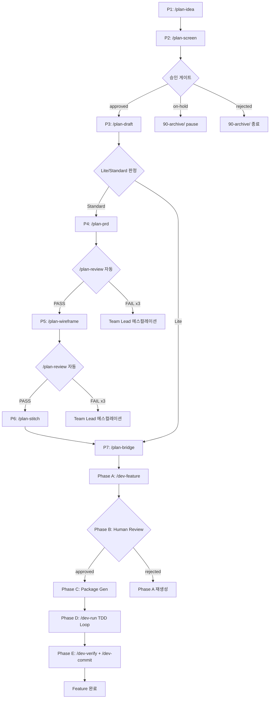
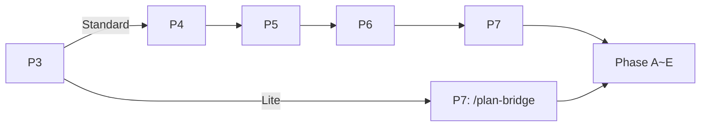
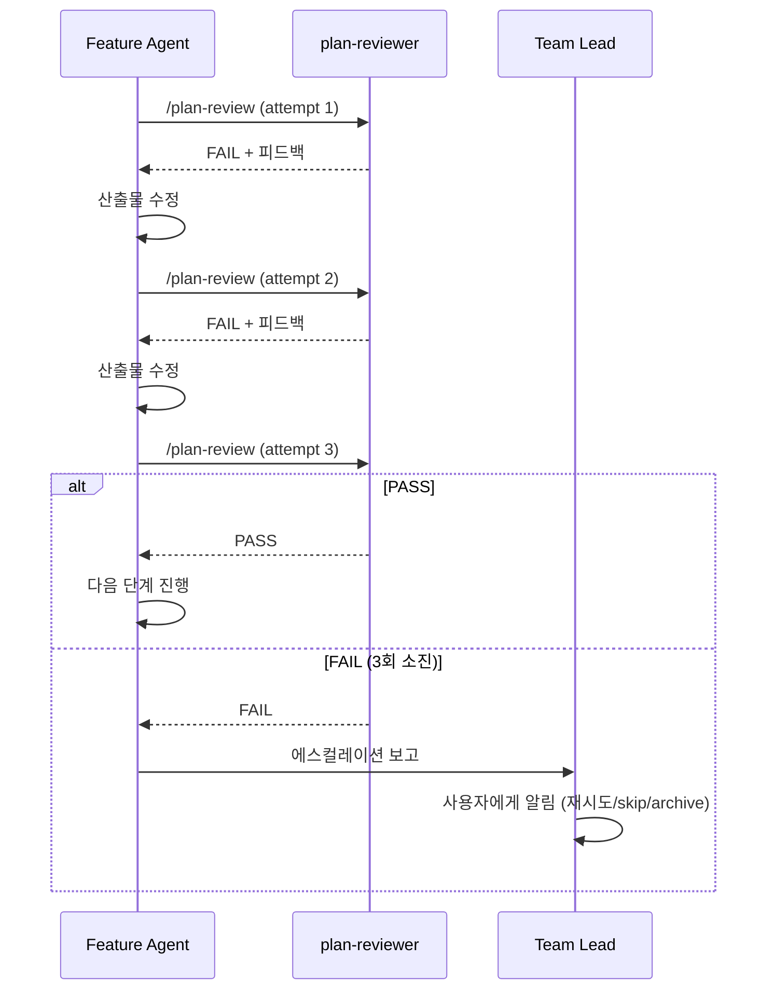
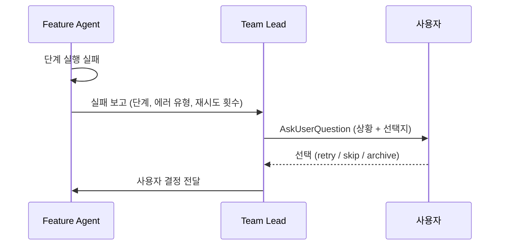
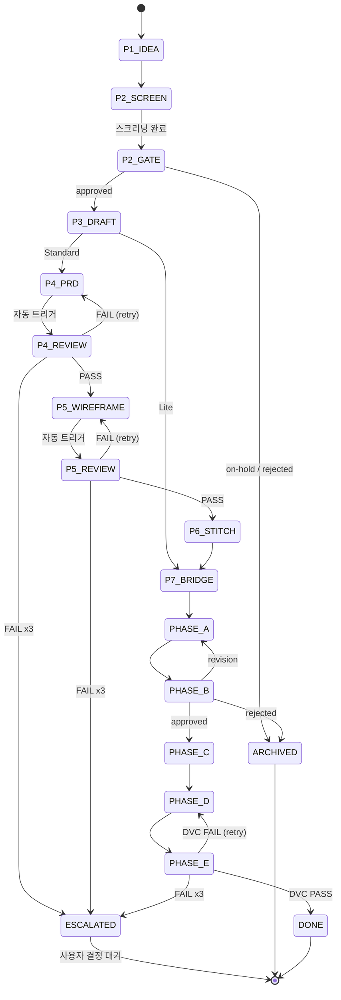

# Pipeline Orchestrator

Feature Agent가 Planning Pipeline(P1~P7)과 Development Pipeline(A~E)을
단일 실행 흐름으로 자동 오케스트레이션하는 설계 문서다.

---

## 1. 전체 실행 흐름

### 1.1 Flowchart



### 1.2 단계별 요약

| Phase | 단계 | 커맨드 | 실행 주체 | 핵심 행위 |
|:-----:|------|--------|-----------|-----------|
| P | P1 | `/plan-idea` | Feature Agent | 아이디어 구조화 등록 |
| P | P2 | `/plan-screen` | Feature Agent | RICE 5축 평가 + 승인 요청 |
| P | P3 | `/plan-draft` | Feature Agent | Lite/Standard 판정 + First-Pass |
| P | P4 | `/plan-prd` | Feature Agent | PRD 10개 섹션 상세 작성 |
| P | P5 | `/plan-wireframe` | Feature Agent | ASCII/Mermaid 와이어프레임 생성 |
| P | P6 | `/plan-stitch` | Feature Agent | PRD + Wireframe 통합 디자인 |
| P | P7 | `/plan-bridge` | Feature Agent | 기획 -> 개발 핸드오프 |
| A~E | A | `/dev-feature` | Feature Agent | Feature Package + Overview 생성 |
| A~E | B | (사용자 승인) | Team Lead | Overview 리뷰 + 승인/수정/반려 |
| A~E | C | (자동) | Feature Agent | Package 11개 문서 생성 + DPC 검증 |
| A~E | D | `/dev-run` | Feature Agent | TDD Loop (Red-Green-Improve) |
| A~E | E | `/dev-verify` | Feature Agent | DVC 6항목 검증 + `/dev-commit` |

---

## 2. Pre-condition / Post-condition 테이블

| 단계 | Pre-condition | Post-condition |
|------|--------------|----------------|
| **P1** | 자연어 아이디어 텍스트 존재 | `IDEA-{YYYYMMDD}-{NNN}.md` 생성, `backlog.md` 인덱스 갱신 |
| **P2** | IDEA 파일이 `00-inbox/`에 존재 | RICE 점수 산출, `screening-matrix.md` 갱신, PCC-01 PASS |
| **P2 Gate** | P2 완료 + 사용자 응답 | `approved` -> `20-approved/` 이동; `on-hold/rejected` -> `90-archive/` |
| **P3** | IDEA가 `20-approved/`에 존재 + `approved` 상태 | First-Pass 생성 OR Lite Plan 생성, PCC-02 PASS, Lite/Standard 판정 결과 |
| **P4** | First-Pass 존재 + Standard 판정 | PRD 10개 섹션 작성, `/plan-review` PASS, PCC-03 PASS |
| **P5** | PRD PASS + `10-approved/` OR `00-draft/` 승인 | 와이어프레임 전체 화면 생성, `/plan-review` PASS, PCC-04 PASS |
| **P6** | 와이어프레임 PASS | Stitch HTML + design-notes 생성, PCC-05 PASS |
| **P7** | PRD + Wireframe + Stitch 존재 | Bridge context 파일 생성, PRD `10-approved/` 배치 확인 |
| **Phase A** | `10-approved/` PRD 경로 | Feature Overview 생성, PDC PASS, AIR PASS, slug/key 확정 |
| **Phase B** | Overview 생성 완료 | 사용자 승인 (Section 7 미결정 0건), 승인 시 Phase C 자동 시작 |
| **Phase C** | Phase B 승인 | Package 11개 문서 생성, DPC PASS |
| **Phase D** | Package 생성 + DPC PASS | 모든 TASK `done` 상태, Quality Gate 5종 통과 |
| **Phase E** | 모든 TASK `done` | DVC 6항목 PASS, git commit 생성 |

---

## 3. 단계별 스킬 호출 매핑

| 단계 | 스킬/커맨드 | 에이전트 | 입력 | 출력 |
|------|------------|----------|------|------|
| P1 | `/plan-idea` | plan-idea-collector (sonnet) | Free text / 파일 경로 | `IDEA-*.md` + `backlog.md` |
| P2 | `/plan-screen` | plan-idea-screener (sonnet) | IDEA ID | `SCREENING-*.md` + `screening-matrix.md` |
| P3 | `/plan-draft` | routing (model 자동 선택) | Approved IDEA ID | `first-pass.md` OR `{slug}.md` (Lite) |
| P4 | `/plan-prd` | plan-prd-writer (opus) | First-Pass 경로 | `prd.md` + `appendix/` |
| P4-R | `/plan-review --type=prd` | plan-reviewer (opus, read-only) | PRD 경로 | Review report + manifest 갱신 |
| P5 | `/plan-wireframe` | plan-wireframe-designer (opus) | Approved PRD 경로 | `wireframes/{slug}/` |
| P5-R | `/plan-review --type=wireframe` | plan-reviewer (opus, read-only) | Wireframe 경로 | Review report + manifest 갱신 |
| P6 | `/plan-stitch` | plan-stitch-integrator (sonnet) | PRD + Wireframe 경로 | `stitch/{slug}/` |
| P7 | `/plan-bridge` | routing | PRD + Wireframe + Stitch | Bridge context 파일들 |
| A | `/dev-feature` | dev-feature (opus) | PRD 경로 | Feature Overview + 00-context/ |
| B | (AskUserQuestion) | Team Lead | Overview 요약 | approved / revision / rejected |
| C | (자동) | dev-feature (opus) | Overview | `02-package/` 11개 문서 |
| D | `/dev-run` | dev-runner (opus) | Package 경로 | 구현 코드 + 테스트 |
| E-V | `/dev-verify` | dev-verifier | Feature 경로 | DVC 결과 리포트 |
| E-C | `/dev-commit` | dev-committer | DVC PASS | git commit |

---

## 4. Lite vs Standard 분기 처리

### 4.1 판정 시점

P3 `/plan-draft` 실행 시 6개 Standard 트리거를 자동 평가한다.

| # | Standard 트리거 | 예시 |
|---|----------------|------|
| 1 | 상태머신 / 다단계 플로우 | 주문 상태 전이 |
| 2 | 외부 연동 / 재시도 정책 | 결제 API, 웹훅 |
| 3 | 멱등성 / 정산 / 감사 도메인 | 정산 중복 방지 |
| 4 | API 변경 2개 이상 | 신규 + 기존 수정 |
| 5 | DB 테이블 2개 이상 변경 | 신규 + 마이그레이션 |
| 6 | 고위험 도메인 | 정산, 감사, 권한 |

하나라도 해당하면 Standard, 모두 미해당이면 Lite.
`--force-standard` 옵션으로 Lite 판정을 강제 무시할 수 있다.

### 4.2 경로 비교



| 항목 | Lite | Standard |
|------|------|----------|
| P4~P6 실행 | Skip | 전부 실행 |
| PRD | plan-bridge가 간소화 PRD 자동 추출 | plan-prd-writer가 10개 섹션 작성 |
| /plan-review | 없음 | P4, P5 완료 시 자동 트리거 |
| PCC | PCC-02만 | PCC-02 ~ PCC-05 전부 |
| 예상 소요 | 짧음 (1~2 단계) | 김 (4단계 + 리뷰 루프) |

### 4.3 Feature Agent 분기 로직

Feature Agent는 P3 판정 결과에 따라 분기한다:
- **Standard**: P3 -> P4(+review) -> P5(+review) -> P6 -> P7 -> Phase A~E
- **Lite**: P3 -> P7 -> Phase A~E (P4~P6 전체 skip)

---

## 5. 자동 리뷰 트리거

### 5.1 트리거 조건

| 시점 | 트리거 커맨드 | 리뷰 에이전트 | PCC 포함 |
|------|-------------|-------------|:--------:|
| P4 완료 | `/plan-review --type=prd` | plan-reviewer (opus) | PCC-03 |
| P5 완료 | `/plan-review --type=wireframe` | plan-reviewer (opus) | PCC-04 |

### 5.2 리뷰 루프



### 5.3 심각도별 행동

| 심각도 | 행동 | FAIL 판정 기준 |
|--------|------|---------------|
| ERROR | 차단 -- 수정 필수 | ERROR >= 1이면 FAIL |
| FLAG | 경고 -- 사람 확인 후 진행 | FLAG >= 1이면 WARN (진행 가능) |
| WARN | 기록 -- 진행 가능 | 단독으로 FAIL 발생 안 함 |

---

## 6. 에러 핸들링

### 6.1 보고 체계



### 6.2 실패 유형별 처리

| 실패 유형 | 재시도 가능 | 처리 방법 |
|-----------|:----------:|-----------|
| 에이전트 실행 오류 | O | 최대 3회 재시도, 3회 실패 시 에스컬레이션 |
| /plan-review FAIL | O | 수정 -> 재리뷰 (최대 3회) |
| PCC ERROR | O | 산출물 수정 -> 재검증 |
| 사용자 승인 거부 (rejected) | X | `90-archive/`로 이동, Feature 종료 |
| 사용자 승인 보류 (on-hold) | -- | `90-archive/`로 이동, 재개 가능 |
| Quality Gate 3회 실패 (Phase D) | X | TASK `blocked` 처리, 수동 개입 요청 |
| DVC FAIL (Phase E) | O | 수정 -> 재검증 (최대 3회) |

### 6.3 사용자 선택지

Team Lead가 AskUserQuestion으로 제시하는 3가지 옵션:

| 옵션 | 행동 | 적용 시점 |
|------|------|-----------|
| **retry** | 해당 단계를 처음부터 재실행 | 에이전트 오류, 일시적 실패 |
| **skip** | 해당 단계를 건너뛰고 다음으로 진행 | FLAG 수준 이슈, 사용자 판단 |
| **archive** | Feature를 `90-archive/`로 이동하고 종료 | 근본적 문제, 폐기 결정 |

---

## 7. 병렬 실행 시 파일 격리

### 7.1 slug 기반 폴더 분리

각 Feature는 고유 slug를 기반으로 완전히 격리된 폴더 구조를 갖는다.
Feature Agent 간 파일 충돌이 발생하지 않는다.

```
.plans/
  features/
    drafts/
      realtime-filter/     <-- Feature F2 전용
        first-pass.md
      batch-export/        <-- Feature F3 전용
        first-pass.md
    active/
      realtime-filter/     <-- Feature F2 전용
        00-context/
        02-package/
      batch-export/        <-- Feature F3 전용
        00-context/
        02-package/
  prd/
    00-draft/
      prd-2026-03-25-realtime-filter/
      prd-2026-03-25-batch-export/
    10-approved/
      prd-2026-03-25-realtime-filter/
      prd-2026-03-25-batch-export/
```

### 7.2 공유 인덱스 파일 동시 쓰기 이슈

| 파일 | 쓰기 시점 | 충돌 가능성 |
|------|----------|:-----------:|
| `backlog.md` | P1 (아이디어 등록) | 높음 |
| `screening-matrix.md` | P2 (스크리닝 완료) | 높음 |
| `stage-manifest.json` | 매 단계 완료 시 | 중간 |

### 7.3 해결책: Lock-Free Append + Reconcile

| 전략 | 설명 |
|------|------|
| **Append-Only 쓰기** | 인덱스 파일에 행 추가만 수행, 기존 행 수정/삭제 금지 |
| **Feature-scoped 마커** | 각 행에 Feature slug 포함하여 소유자 명확화 |
| **Reconcile on Read** | 읽기 시 중복 감지 -> 최신 타임스탬프 유지, 상태 불일치 -> 실제 폴더 위치 기준 보정 |
| **manifest slug 키 분리** | manifest.json은 Feature slug 키 단위 구분, 각 Agent는 자기 섹션만 갱신 |

---

## 8. Feature Agent 상태 머신 요약



---

## 관련 문서

| 문서 | 설명 |
|------|------|
| [01-planning-pipeline.md](../01-planning-pipeline.md) | 기획 파이프라인 P1~P7 상세 |
| [08-dev-workflow.md](../08-dev-workflow.md) | 개발 워크플로우 Phase A~E 상세 |
| [07-review-pcc.md](../07-review-pcc.md) | /plan-review + PCC 5종 검증 |
| [05-approval-gates.md](./05-approval-gates.md) | 승인 게이트 3종 상세 설계 |
| [03-dag-engine.md](./03-dag-engine.md) | DAG 기반 의존성 관리 엔진 |
