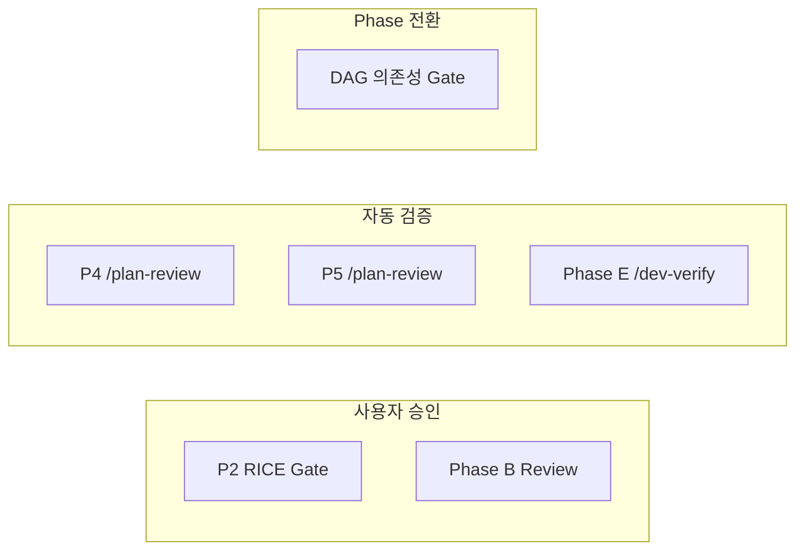
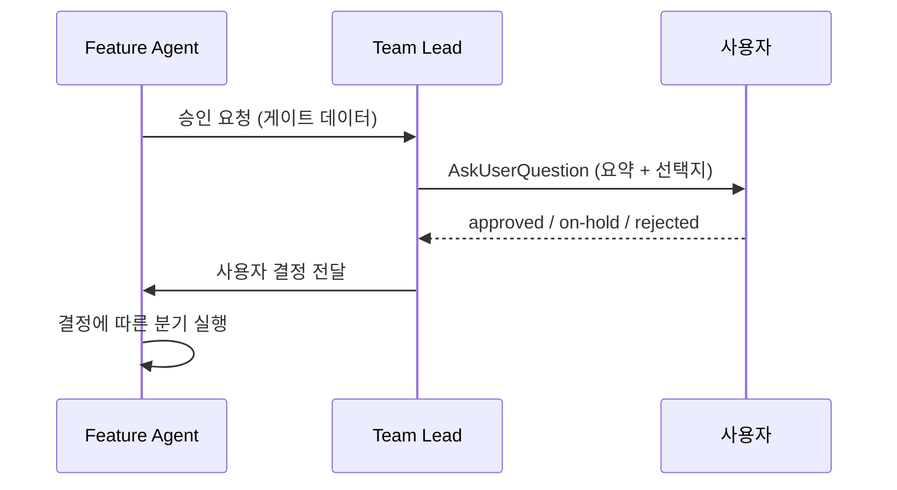
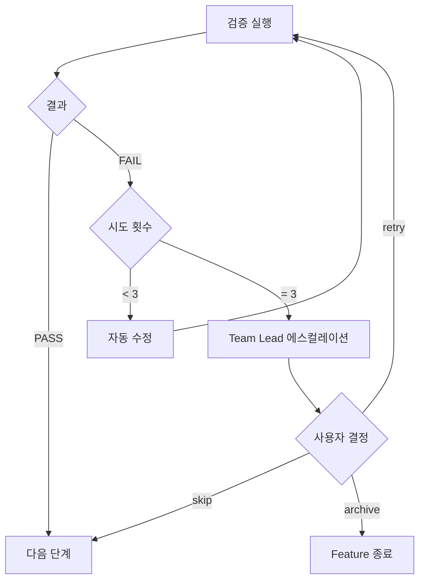
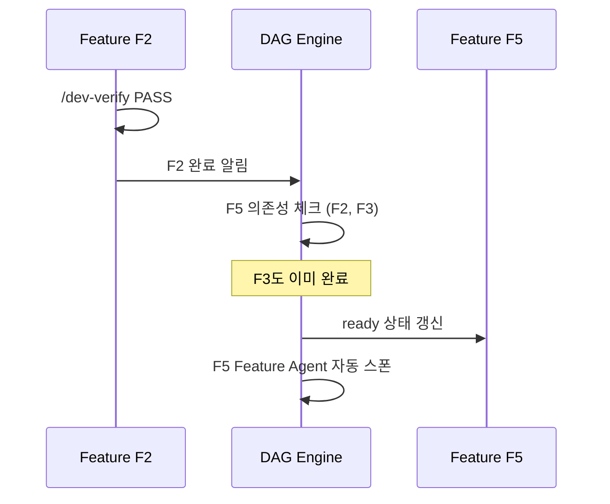

# Approval Gates

Pipeline 전체에 걸쳐 품질과 진행을 통제하는 3종 게이트의 상세 설계 문서다.
사용자 승인, 자동 검증, Phase 전환의 세 가지 유형으로 분류하여
각각의 UX, 실패 처리, 타임아웃 정책을 정의한다.

---

## 1. 게이트 3종 분류

| 유형 | 게이트 | 시점 | 트리거 주체 | 차단 여부 |
|------|--------|------|------------|:---------:|
| 사용자 승인 | P2 RICE 승인 | P2 완료 후 | Team Lead | Blocking |
| 사용자 승인 | Phase B Human Review | Phase A 완료 후 | Team Lead | Blocking |
| 자동 검증 | P4 /plan-review | P4 완료 시 | Feature Agent | Blocking |
| 자동 검증 | P5 /plan-review | P5 완료 시 | Feature Agent | Blocking |
| 자동 검증 | Phase E /dev-verify | Phase D 완료 후 | Feature Agent | Blocking |
| Phase 전환 | DAG 의존성 충족 | /dev-verify PASS 후 | DAG Engine | Auto |



---

## 2. 사용자 승인 게이트 UX 설계

### 2.1 통신 메커니즘

Team Lead가 `AskUserQuestion`을 통해 사용자에게 승인을 요청한다.
Feature Agent는 승인 대기 상태로 전환되며, 사용자 응답을 기다린다.



### 2.2 단일 Feature 승인 (P2 Gate)

P2 완료 후 Team Lead가 RICE 점수 요약 + 에이전트 제안(Go/Hold/Kill)을 포함하여
`approved / on-hold / rejected ?` 형태로 질문한다.

| 응답 | 행동 |
|------|------|
| `approved` | `20-approved/`로 이동, P3 자동 시작 |
| `on-hold` | `90-archive/`로 이동, 재개 가능 |
| `rejected` | `90-archive/`로 이동, 종료 |

### 2.3 Batch 승인

여러 Feature가 동시에 P2를 완료한 경우 일괄 승인을 지원한다.
Team Lead가 Feature 목록 + RICE + 제안을 테이블로 표시 후
`일괄 승인(Y)`, `개별 지정(F2=approved, F4=rejected)`, `N(하나씩 질문)` 중 선택.

### 2.4 Phase B Human Review

Phase A Overview를 사용자가 리뷰한다. Section 7 미결정 0건 확인 후 승인 요청.

| 응답 | 행동 |
|------|------|
| `approved` | Phase C 자동 시작 |
| `revision` | Phase A6으로 돌아가 Overview 갱신 후 다시 Phase B |
| `rejected` | Phase A 완전 되돌림 (Overview 재생성) |

### 2.5 승인 대기 중 병렬 진행

승인 대기는 해당 Feature만 차단한다. 다른 Feature는 독립적으로 계속 진행된다.

---

## 3. 승인 거부 처리

### 3.1 rejected 처리

| 게이트 | rejected 행동 |
|--------|--------------|
| P2 Gate | IDEA를 `90-archive/`로 이동, Feature 종료 |
| Phase B | Feature Overview 폐기, Phase A 재생성 (PRD 재분석부터) |

P2 rejected 시 `backlog.md` 상태를 `rejected`로 갱신하고
해당 Feature Agent는 종료된다.

### 3.2 on-hold 처리

on-hold된 Feature는 `90-archive/`로 이동되지만 재개가 가능하다.

**재개 방법**:
```
/plan-screen IDEA-20260325-001 --resume
```

on-hold IDEA를 `00-inbox/`로 복원하고 P2부터 재실행한다.
이전 RICE 점수는 참고용으로 보존된다.

### 3.3 Phase B rejected -> Phase A 되돌림

Phase B에서 rejected된 경우:

1. 기존 Feature Overview를 `90-archive/`로 이동
2. `/dev-feature` 를 다시 실행하여 Overview를 처음부터 재생성
3. 새 Overview로 Phase B를 다시 진입

revision과 달리 부분 수정이 아닌 전체 재생성이다.

---

## 4. 자동 검증 게이트 상세

### 4.1 /plan-review (P4, P5)

PCC(Planning Consistency Check) 5종 중 해당 항목을 포함하여 검증한다.

**심각도 -> 판정 매핑**:

| 심각도 | 의미 | 판정 영향 |
|--------|------|-----------|
| ERROR | 필수 항목 누락/불일치 | BLOCK -- ERROR 1개 이상이면 FAIL |
| FLAG | 주요 불일치 (수동 확인 필요) | WARN -- 사람 확인 후 진행 가능 |
| WARN | 경미한 불일치 | LOG -- 기록만, 진행에 영향 없음 |

**P4 리뷰 범위**: PRD 8항목 + PCC-03 (Feature <-> PRD) 5항목
**P5 리뷰 범위**: Wireframe 7항목 + PCC-04 (PRD <-> Wireframe) 4항목

### 4.2 /dev-verify (Phase E)

DVC(Development Verification Check) 6항목을 검증한다.

| ID | 검증 항목 | 심각도 | 설명 |
|----|----------|--------|------|
| DVC-01 | REQ Coverage | FLAG | 모든 요구사항이 코드에 반영됨 |
| DVC-02 | TC Implementation | FLAG | 모든 테스트 케이스가 구현됨 |
| DVC-03 | TASK Completion | ERROR | 모든 TASK가 `done` 상태 |
| DVC-04 | Pattern Compliance | WARN | 아키텍처 패턴 준수 |
| DVC-05 | Edge Case Discovery | WARN | Edge case 테스트 존재 |
| DVC-06 | Scope Alignment | FLAG | 구현이 Package 범위 내 |

**DVC 판정 규칙**: ERROR 1개 이상이면 FAIL. 모든 항목 PASS 필수.

### 4.3 FAIL 시 자동 재시도



| 시도 | 행동 |
|:----:|------|
| 1차 | Feature Agent가 피드백 기반으로 산출물 자동 수정 후 재검증 |
| 2차 | 동일 (다른 수정 전략 시도) |
| 3차 | 마지막 시도 |
| 3차 FAIL | Team Lead에 에스컬레이션, 사용자에게 retry/skip/archive 제시 |

---

## 5. Phase 전환 게이트

### 5.1 DAG 기반 자동 관리

DAG Engine이 Feature 간 의존성을 추적하고,
선행 Feature의 `/dev-verify` PASS를 감지하여 후행 Feature의 상태를 자동 갱신한다.



### 5.2 의존성 충족 조건

| 조건 | 설명 |
|------|------|
| 모든 선행 Feature `/dev-verify` PASS | 의존하는 Feature가 전부 Phase E 통과 |
| 해당 Feature가 `blocked` 아님 | 수동 차단 상태가 아님 |
| Team Lead가 일시정지하지 않음 | Feature가 pause 상태가 아님 |

세 조건 모두 충족 시 DAG Engine이 해당 Feature를 `ready`로 전환하고
Team Lead에게 자동 스폰을 요청한다.

### 5.3 Phase 전환 흐름 (단일 Feature)

```
Phase A 완료 -> Phase B Gate (사용자 승인)
Phase B 승인 -> Phase C 자동 시작
Phase C 완료 -> Phase D 자동 시작
Phase D 완료 -> Phase E Gate (자동 검증)
Phase E PASS -> Feature 완료 -> DAG 의존성 갱신
```

Phase B만 사용자 승인이 필요하고, C->D는 무조건 자동 전환이다.

---

## 6. 게이트 상태 추적

### 6.1 manifest 기록 구조

모든 게이트 결과는 `stage-manifest.json`에 Feature slug 단위로 기록된다.

```json
{
  "realtime-filter": {
    "currentPhase": "Phase D",
    "gates": {
      "p2-approval": { "status": "approved", "decidedBy": "user", "decidedAt": "2026-03-25T10:30:00Z" },
      "p4-review": { "status": "PASS", "attempts": 2, "pccResults": { "PCC-03": "PASS" } },
      "p5-review": { "status": "PASS", "attempts": 1, "pccResults": { "PCC-04": "PASS" } },
      "phaseB-approval": { "status": "approved", "decidedBy": "user" },
      "phaseE-verify": { "status": "pending", "attempts": 0 }
    }
  }
}
```

### 6.2 게이트 필드 정의

| 필드 | 설명 |
|------|------|
| `status` | `pending` / `in-progress` / `PASS` / `FAIL` / `approved` / `rejected` / `on-hold` / `escalated` |
| `attempts` | 시도 횟수 (최대 3) |
| `decidedBy` | `user` / `auto` / `dag` |
| `decidedAt` | ISO 8601 |
| `pccResults` / `dvcResults` | 검증 결과 (해당 시) |
| `escalatedAt` / `timeoutAt` | 에스컬레이션/타임아웃 시각 |

---

## 7. 타임아웃 처리

### 7.1 정책

사용자 승인 게이트가 장시간 응답 없이 대기하는 경우를 처리한다.

| 게이트 | 기본 타임아웃 | 알림 주기 |
|--------|:-----------:|:---------:|
| P2 RICE 승인 | 24시간 | 8시간마다 리마인더 |
| Phase B Review | 12시간 | 4시간마다 리마인더 |

### 7.2 타임아웃 동작

1. 타이머 시작 -> 리마인더 주기마다 알림 -> 타임아웃 도달 시 `on-hold` 자동 전환
2. 사용자 응답이 오면 타이머 해제, 정상 흐름 진행
3. 타임아웃은 `rejected`가 아닌 `on-hold`로 처리 -- `--resume`으로 재개 가능

---

## 관련 문서

| 문서 | 설명 |
|------|------|
| [04-pipeline-orchestrator.md](./04-pipeline-orchestrator.md) | 파이프라인 오케스트레이션 전체 흐름 |
| [03-dag-engine.md](./03-dag-engine.md) | DAG 기반 의존성 관리 엔진 |
| [07-review-pcc.md](../07-review-pcc.md) | /plan-review + PCC 5종 상세 |
| [08-dev-workflow.md](../08-dev-workflow.md) | Phase A~E + DVC 상세 |
