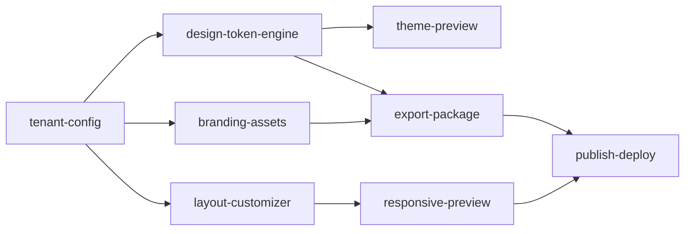

# Agent-Skill Mapping: 오케스트레이션 역할 매핑

> claude-kit 기존 13 에이전트 + 23 스킬을 Team Orchestration에서 어떻게 활용하는지 정의한다.
> 핵심 원칙: **기존 컴포넌트 수정 ZERO, 추가만 필요**.

---

## 1. 기존 에이전트 -> 오케스트레이션 역할 매핑

### 1.1 기획 에이전트 (Plan Domain, 6개)

| 기존 에이전트 | 모델 | 오케스트레이션 역할 | 호출 시점 | 호출 방법 |
|---|---|---|---|---|
| `plan-idea-collector` | sonnet | Feature Agent P1 | `/plan-idea` | Task tool (subagent) |
| `plan-idea-screener` | sonnet | Feature Agent P2 | `/plan-screen` | Task tool |
| `plan-prd-writer` | opus | Feature Agent P4 | `/plan-prd` | Task tool |
| `plan-wireframe-designer` | opus | Feature Agent P5 | `/plan-wireframe` | Task tool |
| `plan-stitch-integrator` | sonnet | Feature Agent P6 | `/plan-stitch` | Task tool |
| `plan-reviewer` | opus | Feature Agent P4.5, P5.5 | `/plan-review` | Task tool (read-only) |

**호출 흐름 (Plan)**:

```
Team Lead
  ├── P1: plan-idea-collector      (아이디어 수집)
  ├── P2: plan-idea-screener       (RICE 스크리닝 + 사용자 승인 게이트)
  ├── P3: (직접 처리)              (1차 기능 기획, Lite/Standard 판정)
  ├── P4: plan-prd-writer          (PRD 작성)
  ├── P4.5: plan-reviewer          (PRD 리뷰, read-only)
  ├── P5: plan-wireframe-designer  (와이어프레임 생성)
  ├── P5.5: plan-reviewer          (와이어프레임 리뷰, read-only)
  └── P6: plan-stitch-integrator   (Stitch 통합)
```

### 1.2 개발 에이전트 (Dev Domain, 7개)

| 기존 에이전트 | 모델 | 오케스트레이션 역할 | 호출 시점 | 호출 방법 |
|---|---|---|---|---|
| `dev-architect` | sonnet | Dev Phase A (아키텍처 분석) | Feature 개발 시작 전 | Task tool (subagent) |
| `dev-code-reviewer` | opus | Dev Phase C (코드 리뷰) | 구현 완료 후 | Task tool (read-only) |
| `dev-database-reviewer` | opus | Dev Phase B.db (DB 변경 시) | DB 스키마/쿼리 변경 감지 | Task tool (read-only, conditional) |
| `dev-doc-updater` | sonnet | Dev Phase D (문서 동기화) | 코드 리뷰 통과 후 | Task tool |
| `dev-security-reviewer` | opus | Dev Phase C.sec (보안 리뷰) | 코드 리뷰와 병렬 | Task tool (read-only) |
| `dev-verify-agent` | sonnet | Dev Phase E (검증 파이프라인) | 모든 리뷰 통과 후 | Task tool |
| `dev-frontend-reviewer` | opus | Dev Phase C.fe (프론트엔드 리뷰) | 프론트엔드 코드 변경 시 | Task tool (read-only, conditional) |

**호출 흐름 (Dev)**:

```
Team Lead
  ├── A: dev-architect              (아키텍처 분석 + 기술 의사결정)
  ├── B: (구현, Team Lead 직접 실행)
  │   └── B.db: dev-database-reviewer (DB 변경 시 conditional)
  ├── C: [병렬 리뷰]
  │   ├── dev-code-reviewer         (코드 품질)
  │   ├── dev-security-reviewer     (OWASP Top 10)
  │   └── dev-frontend-reviewer     (접근성/CVA, conditional)
  ├── D: dev-doc-updater            (문서 + 코드맵)
  └── E: dev-verify-agent           (빌드/타입/린트/테스트)
```

---

## 2. 기존 스킬 -> 파이프라인 단계 매핑

### 2.1 Plan 파이프라인 (P1 ~ P6)

| 단계 | 커맨드 | 스킬 | 내부 에이전트 | 변경 필요 여부 |
|------|--------|------|-------------|:---:|
| P1 | `/plan-idea` | `plan-idea-management` | `plan-idea-collector` | 없음 |
| P2 | `/plan-screen` | `plan-screening-workflow` | `plan-idea-screener` | 없음 |
| P3 | `/plan-draft` | `plan-pipeline` | (직접 처리) | 없음 |
| P4 | `/plan-prd` | `plan-prd-authoring` | `plan-prd-writer` | 없음 |
| P4.5 | `/plan-review` | `plan-review-criteria` | `plan-reviewer` | 없음 |
| P5 | `/plan-wireframe` | `plan-wireframe-design` | `plan-wireframe-designer` | 없음 |
| P5.5 | `/plan-review` | `plan-review-criteria` | `plan-reviewer` | 없음 |
| P6 | `/plan-stitch` | `plan-stitch-workflow` | `plan-stitch-integrator` | 없음 |

### 2.2 Dev 파이프라인 (A ~ E)

| 단계 | 커맨드 | 스킬 | 내부 에이전트 | 변경 필요 여부 |
|------|--------|------|-------------|:---:|
| A | (수동 호출) | `dev-layered-architecture`, `dev-domain-modeling` | `dev-architect` | 없음 |
| B | `/dev-feature` | `dev-tdd-workflow`, `dev-workflow` | (Team Lead 직접) | 없음 |
| B.db | (DB 변경 시) | -- | `dev-database-reviewer` | 없음 |
| C | `/dev-review` | `dev-security-pipeline` | `dev-code-reviewer` | 없음 |
| C.sec | `/dev-security-review` | `dev-security-pipeline` | `dev-security-reviewer` | 없음 |
| C.fe | `/dev-verify-fe` | `dev-frontend-patterns` | `dev-frontend-reviewer` | 없음 |
| D | `/dev-sync-docs` | -- | `dev-doc-updater` | 없음 |
| E | `/dev-handoff-verify` | `dev-verification-engine` | `dev-verify-agent` | 없음 |

### 2.3 Cross-cutting 스킬 (Core Domain)

| 스킬 | 사용 시점 | 변경 필요 여부 |
|------|----------|:---:|
| `continuous-learning` | 매 단계 완료 후 패턴 학습 | 없음 |
| `session-wrap` | 오케스트레이션 세션 종료 시 | 없음 |

> **결론: 기존 23개 스킬 중 변경이 필요한 것은 0개이다.**

---

## 3. 신규 컴포넌트 최소 목록

### 3.1 신규 에이전트: `team-lead.md`

**위치**: `src/core/agents/team-lead.md` -> `.claude/agents/team-lead.md`

**역할**: Feature Dependency Graph를 읽고, DAG 순서에 따라 Feature별 P1~E 파이프라인을 오케스트레이션한다.

**프롬프트 구조**:

```yaml
# team-lead.md 프롬프트 골격
model: opus
role: Team Lead - Feature Orchestration

responsibilities:
  - dependency-graph.yaml 파싱 및 실행 순서 결정
  - Feature별 P1 ~ E 순차 파이프라인 실행
  - Wave 기반 병렬 Feature 스폰 (Phase 2)
  - 단계별 결과 검증 및 에러 복구
  - 사용자 승인 게이트 관리 (P2, Phase B)

tools:
  - Task (subagent 호출)
  - Read/Write (산출물 읽기/쓰기)
  - Bash (검증 커맨드 실행)

constraints:
  - 기존 에이전트의 프롬프트/인터페이스 수정 금지
  - 파이프라인 단계 순서 변경 금지 (P1->P2->...->E 고정)
  - 승인 게이트 자동 통과 금지 (--auto-approve-rice 옵션 제외)
```

**상태 관리**: Team Lead는 `stage-manifest.json`을 업데이트하여 각 Feature의 현재 단계를 추적한다.

### 3.2 신규 스킬: `team-orchestrate/SKILL.md`

**위치**: `src/core/skills/team-orchestrate/SKILL.md` -> `.claude/skills/team-orchestrate/SKILL.md`

**진입점**: `/team-orchestrate` 커맨드

**파라미터**:

| 파라미터 | 타입 | 필수 | 설명 |
|----------|------|:---:|------|
| `--graph` | path | Y | dependency-graph.yaml 경로 |
| `--parallel-limit` | number | N | 동시 Feature 수 (기본: 1, Phase 2에서 활용) |
| `--auto-approve-rice` | flag | N | P2 RICE 승인 자동 통과 |
| `--skip-stitch` | flag | N | P6 Stitch 단계 건너뛰기 (Lite Feature용) |
| `--dry-run` | flag | N | 실행 없이 실행 계획만 출력 |

**실행 흐름**:

```
/team-orchestrate --graph .plans/ds-customizer/dependency-graph.yaml
  │
  ├── 1. dependency-graph.yaml 파싱
  ├── 2. DAG 토폴로지 정렬 -> Wave 생성
  ├── 3. Wave별 Feature 실행
  │     └── Feature N: P1 -> P2 -> P3 -> P4 -> P4.5 -> P5 -> P5.5 -> P6 -> A -> B -> C -> D -> E
  ├── 4. 결과 집계 + stage-manifest.json 업데이트
  └── 5. 완료 리포트 출력
```

### 3.3 신규 템플릿: `feature-dependency-graph.yaml`

**위치**: `src/core/templates/feature-dependency-graph.yaml` -> `.claude/templates/feature-dependency-graph.yaml`

**스키마 정의**:

```yaml
# feature-dependency-graph.yaml 스키마
version: "1.0"
project: <string>           # 프로젝트 slug (e.g., ds-customizer)
created: <ISO8601>

features:
  - id: <string>             # Feature slug (e.g., tenant-config)
    name: <string>           # 한글 Feature명
    type: standard | lite    # Lite는 P4~P6 생략
    depends_on: [<string>]   # 의존 Feature ID 목록 (빈 배열 = root)
    priority: high | medium | low
    rice_score: <number>     # P2에서 산출 (초기값 null)
    tags: [<string>]         # 분류 태그

# 예시:
features:
  - id: tenant-config
    name: "테넌트 설정 관리"
    type: standard
    depends_on: []
    priority: high
    tags: [core, multi-tenant]

  - id: design-token-engine
    name: "디자인 토큰 엔진"
    type: standard
    depends_on: [tenant-config]
    priority: high
    tags: [core, design-system]

  - id: theme-preview
    name: "테마 미리보기"
    type: standard
    depends_on: [design-token-engine]
    priority: medium
    tags: [ux, preview]
```

**DAG 시각화** (위 예시 기준):



### 3.4 (선택) 신규 훅: `team-orchestrate-hook.js`

**트리거**: `PostToolUse` - Task tool 완료 시

**동작**: NON-BLOCKING

**기능**:
- 오케스트레이션 진행 상황을 `stage-manifest.json`에 자동 기록
- 실패 단계 감지 및 알림
- 오케스트레이션 세션 외에서는 no-op

> 이 훅은 Phase 3 (에러 복구) 구현 시에만 필요하므로, Phase 1~2에서는 생략 가능하다.

---

## 4. 기존 파일 수정 여부

| 카테고리 | 수정 필요 여부 | 근거 |
|----------|:---:|------|
| 기존 에이전트 (13개) | 없음 | Task tool로 기존 인터페이스 그대로 호출 |
| 기존 커맨드 (28개) | 없음 | 커맨드는 에이전트의 진입점일 뿐, 호출 방식 동일 |
| 기존 스킬 (23개) | 없음 | 스킬은 에이전트 내부에서 자동 활성화 |
| 기존 훅 (8개) | 없음 | 기존 훅은 오케스트레이션 맥락에서도 동일 동작 |
| 기존 룰 (6개) | 없음 | 룰은 모든 에이전트에 동일 적용 |
| `profile.json` | 없음 | core 도메인에 배치되므로 별도 도메인 설정 불필요 |
| `stage-manifest.json` | 읽기/쓰기 | Team Lead가 상태 업데이트 (스키마 변경 없음) |

**변경 영향 요약**:

```
추가 파일:
  + src/core/agents/team-lead.md                          (신규 에이전트)
  + src/core/skills/team-orchestrate/SKILL.md             (신규 스킬)
  + src/core/templates/feature-dependency-graph.yaml      (신규 템플릿)
  + src/core/hooks/team-orchestrate-hook.js               (선택, Phase 3)

수정 파일:
  (없음)

삭제 파일:
  (없음)
```

---

## 부록: 에이전트 호출 인터페이스 일관성

모든 에이전트는 동일한 패턴으로 호출된다:

```
Task tool call:
  description: "P4: PRD 작성 - {feature_name}"
  prompt: |
    {feature_context}
    /plan-prd
```

Team Lead는 이 패턴만 사용하므로, 기존 에이전트의 프롬프트나 스킬을 수정할 필요가 없다. 오케스트레이션 로직은 전적으로 `team-lead.md` + `team-orchestrate/SKILL.md`에 캡슐화된다.
