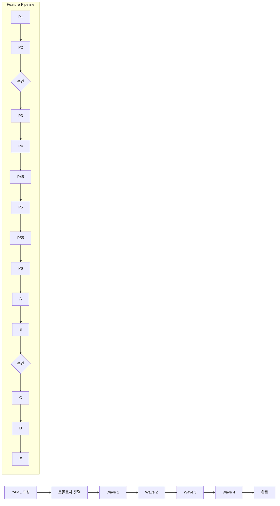

# Integration Plan: Team Orchestration 통합 계획

> dependency-graph.yaml 기반으로 다수 Feature의 P1~E 파이프라인을 자동 실행하는 Team Orchestration의 통합 계획.

---

## 1. claude-kit 도메인 구조에서의 위치

오케스트레이션은 Plan과 Dev 도메인 모두를 조율하므로 **core 도메인**에 배치한다.

```
src/
├── core/                              <- Team Orchestration 위치
│   ├── agents/
│   │   └── team-lead.md               (신규)
│   ├── skills/
│   │   └── team-orchestrate/
│   │       └── SKILL.md               (신규)
│   ├── templates/
│   │   └── feature-dependency-graph.yaml (신규)
│   └── hooks/
│       └── team-orchestrate-hook.js   (선택, Phase 3)
│
├── dev/   <- 기존 유지, 수정 없음
│   ├── agents/ (7개)
│   ├── skills/ (14개)
│   └── hooks/ (2개)
│
└── plan/  <- 기존 유지, 수정 없음
    ├── agents/ (6개)
    ├── skills/ (7개)
    └── hooks/ (1개)
```

**의존성 방향 유지**:

```
plan ──> core <── dev
              ↑
        team-orchestrate (core에 위치, plan + dev를 Task tool로 호출)
```

core가 plan/dev에 직접 의존하지 않는다. Team Lead는 Task tool (subagent)을 통해 간접 호출하므로, 도메인 간 교차 의존이 발생하지 않는다.

---

## 2. 설치 시 추가 파일 목록

`claude-kit install` 실행 시 다음 파일이 타겟 프로젝트에 복사된다:

```
.claude/agents/team-lead.md                          (신규)
.claude/skills/team-orchestrate/SKILL.md             (신규)
.claude/templates/feature-dependency-graph.yaml       (신규)
```

**기존 파일과의 충돌**: 없음. 신규 파일명은 기존 78개 컴포넌트와 겹치지 않는다.

**네이밍 컨벤션**: core 도메인이므로 접두사 없음 (`team-lead`, `team-orchestrate`).

**도메인 선택**: `profile.json`의 `domains`에 관계없이 core는 항상 설치되므로, 별도 설정 불필요.

---

## 3. 설정 인터페이스 (사용자 관점)

### 3.1 dependency-graph.yaml 작성 방법

사용자는 `.plans/{project}/dependency-graph.yaml`에 Feature 목록과 의존 관계를 정의한다:

```yaml
# .plans/ds-customizer/dependency-graph.yaml
version: "1.0"
project: ds-customizer
created: "2026-04-01T00:00:00+09:00"

features:
  # Wave 1: 의존성 없는 root Feature
  - id: tenant-config
    name: "테넌트 설정 관리"
    type: standard
    depends_on: []
    priority: high

  - id: branding-assets
    name: "브랜딩 에셋 관리"
    type: standard
    depends_on: []
    priority: medium

  # Wave 2: Wave 1에 의존
  - id: design-token-engine
    name: "디자인 토큰 엔진"
    type: standard
    depends_on: [tenant-config]
    priority: high

  - id: layout-customizer
    name: "레이아웃 커스터마이저"
    type: standard
    depends_on: [tenant-config]
    priority: medium

  # Wave 3: Wave 2에 의존
  - id: theme-preview
    name: "테마 미리보기"
    type: standard
    depends_on: [design-token-engine]
    priority: medium

  - id: export-package
    name: "디자인 에셋 내보내기"
    type: lite
    depends_on: [design-token-engine, branding-assets]
    priority: low

  # Wave 4: Wave 3에 의존
  - id: responsive-preview
    name: "반응형 미리보기"
    type: standard
    depends_on: [layout-customizer, theme-preview]
    priority: medium

  - id: publish-deploy
    name: "배포 파이프라인"
    type: standard
    depends_on: [export-package, responsive-preview]
    priority: high
```

### 3.2 `/team-orchestrate` 커맨드 사용법

```bash
# 기본 실행 (순차, parallel-limit=1)
/team-orchestrate --graph .plans/ds-customizer/dependency-graph.yaml

# 병렬 실행 (최대 4 Feature 동시)
/team-orchestrate --graph .plans/ds-customizer/dependency-graph.yaml --parallel-limit 4

# Dry run (실행 계획만 출력)
/team-orchestrate --graph .plans/ds-customizer/dependency-graph.yaml --dry-run

# RICE 자동 승인 + Stitch 건너뛰기
/team-orchestrate --graph .plans/ds-customizer/dependency-graph.yaml \
  --auto-approve-rice --skip-stitch
```

### 3.3 옵션 상세

| 옵션 | 기본값 | 설명 |
|------|--------|------|
| `--graph <path>` | (필수) | dependency-graph.yaml 경로 |
| `--parallel-limit <n>` | `1` | 동시 실행 Feature 수. 1 = 순차 |
| `--auto-approve-rice` | `false` | P2 RICE 스크리닝 결과를 자동 승인 |
| `--skip-stitch` | `false` | P6 Stitch 단계 건너뛰기 |
| `--dry-run` | `false` | 실행 없이 Wave 계획 + 단계 목록만 출력 |
| `--start-from <stage>` | `P1` | 특정 단계부터 재개 (e.g., `B` = 개발부터) |
| `--feature <id>` | (전체) | 특정 Feature만 실행 |

---

## 4. 실행 커맨드 상세

### 4.1 실행 예시

```bash
/team-orchestrate --graph .plans/ds-customizer/dependency-graph.yaml --parallel-limit 4
```

### 4.2 실행 시 화면 출력

**초기 계획 출력**:

```
=== Team Orchestration: ds-customizer ===
Features: 8 | Waves: 4 | Parallel Limit: 4

Wave Plan:
  Wave 1: tenant-config, branding-assets
  Wave 2: design-token-engine, layout-customizer
  Wave 3: theme-preview, export-package (lite)
  Wave 4: responsive-preview, publish-deploy

Pipeline per Feature (standard):
  P1 -> P2 -> [approve] -> P3 -> P4 -> P4.5 -> P5 -> P5.5 -> P6 -> A -> B -> [approve] -> C -> D -> E
```

**진행 상황 테이블** (실시간 업데이트):

```
Feature               | P1 | P2 | P3 | P4 |P4.5| P5 |P5.5| P6 | A  | B  | C  | D  | E  | Status
─────────────────────┼────┼────┼────┼────┼────┼────┼────┼────┼────┼────┼────┼────┼────┼────────
tenant-config         | OK | OK | OK | OK | OK | OK | OK | OK | OK | >> |    |    |    | Phase B
branding-assets       | OK | OK | OK | OK | OK | OK | OK | OK | OK | OK | OK | OK | OK | DONE
design-token-engine   | OK | OK | OK | >> |    |    |    |    |    |    |    |    |    | Phase P4
layout-customizer     | OK | OK | >> |    |    |    |    |    |    |    |    |    |    | Phase P3
theme-preview         |    |    |    |    |    |    |    |    |    |    |    |    |    | WAITING
export-package (lite) |    |    |    |    |    |    |    |    |    |    |    |    |    | WAITING
responsive-preview    |    |    |    |    |    |    |    |    |    |    |    |    |    | WAITING
publish-deploy        |    |    |    |    |    |    |    |    |    |    |    |    |    | WAITING

Legend: OK=완료 >>=진행중 !!=실패 --=건너뜀
Progress: 28/96 steps (29.2%) | Elapsed: 2h 15m
```

**승인 게이트 프롬프트**:

```
[APPROVAL GATE] P2 완료 - tenant-config
RICE Score: 82 (threshold: 60)
계속 진행하시겠습니까? (y/n/edit):
```

---

## 5. 구현 순서 (3 Phase)

### Impl Phase 1: 순차 실행

Team Lead가 1개 Feature씩 P1~E 전체 파이프라인을 순차 실행한다.

**구현 범위**: `team-lead.md` + `team-orchestrate/SKILL.md` (순차 모드) + `feature-dependency-graph.yaml` + DAG 파싱/토폴로지 정렬 + `stage-manifest.json` 업데이트

**검증**: 2-Feature 순차 파이프라인 E2E 테스트

### Impl Phase 2: 병렬 실행

DAG 기반 Wave 스폰으로 독립 Feature를 병렬 실행한다.

**구현 범위**: `--parallel-limit` 옵션 + Wave 스케줄링 (의존성 해소 시 다음 Wave 스폰) + 병렬 subagent 관리 + `stage-manifest.json` 동시성 관리 (Team Lead만 쓰기)

**검증**: 4-Feature 병렬 파이프라인 (Wave 1~2) 테스트

### Impl Phase 3: 승인 게이트 + 에러 복구

사용자 승인 게이트와 단계 실패 시 자동 복구 메커니즘을 추가한다.

**구현 범위**: P2/Phase B 승인 게이트 + 단계 실패 자동 재시도 (최대 2회) + 실패 시 일시 중지 + `--start-from` 재개 옵션 + `team-orchestrate-hook.js` (선택)

**검증**: 의도적 실패 주입 테스트 (P4 리뷰 실패 -> 재시도 -> 성공)

---

## 6. 테스트 전략

| 레벨 | 대상 | 시나리오 | 검증 기준 |
|------|------|----------|----------|
| Unit | DAG 스케줄러 | 토폴로지 정렬, Wave 생성, 순환 감지, parallel-limit | 의존성 순서 보장, CyclicDependencyError |
| Integration | 2-Feature 순차 | feature-a -> feature-b (의존) | feature-a 완료 후 feature-b 시작, manifest done |
| E2E | ds-customizer 8-Feature | 전체 dependency-graph, parallel-limit=4 | 96단계 완료, Wave 순서, 승인 16회 |

---

## 7. 성공 지표

| 지표 | 목표값 | 측정 방법 |
|------|--------|----------|
| 자동 실행 단계 수 | 96단계 (8 Feature x 12 steps) | `stage-manifest.json` status=done 카운트 |
| 병렬 실행 (Phase 2) | 4 Feature 동시 진행 | Wave 1에서 2개, Wave 2에서 2개 병렬 확인 |
| 사용자 개입 횟수 | 16회 (P2 승인 8 + Phase B 승인 8) | 승인 게이트 프롬프트 카운트 |
| 기존 컴포넌트 수정 | 0개 | `git diff` 기존 파일 변경 없음 |
| 신규 파일 수 | 3~4개 | 에이전트 1 + 스킬 1 + 템플릿 1 + 훅 0~1 |
| 파이프라인 재개 성공률 | 100% | `--start-from` 옵션으로 중단 지점 재개 테스트 |

---

## 8. 리스크 및 완화 방안

| 리스크 | 영향 | 완화 방안 |
|--------|------|----------|
| Context window 초과 | Team Lead가 8 Feature 컨텍스트를 유지하지 못함 | Feature별 독립 subagent 실행, 결과만 수집 |
| 병렬 subagent 동시성 | `stage-manifest.json` 동시 쓰기 충돌 | Team Lead만 manifest 쓰기, subagent는 결과 반환만 |
| 승인 게이트 대기 | 사용자 부재 시 파이프라인 정지 | `--auto-approve-rice` 옵션, 배치 승인 UI |
| 단계 실패 전파 | 1개 Feature 실패가 후속 Wave 차단 | 실패 Feature만 일시 중지, 독립 Feature는 계속 진행 |
| Plan/Dev 도메인 미설치 | 기획 에이전트 없이 오케스트레이션 시도 | graph 파싱 시 필요 도메인 존재 여부 검증, 미설치 시 에러 |

---

## 부록: 실행 흐름


