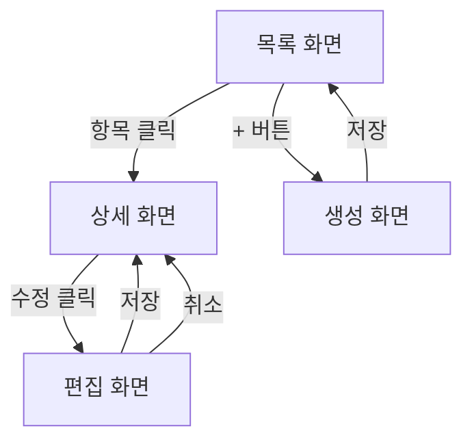

<!-- kit-convert generated: 2026-04-16 -->
---
name: plan-wireframe-design
description: >
  와이어프레임 설계 원칙, ASCII/Mermaid 도구 사용, 화면 구조, 네비게이션 플로우 설계. Use when: 와이어프레임 생성, UI 설계, 화면 구조 정의 시.
---

## Overview

마크다운 기반 와이어프레임 설계 원칙과 도구 사용법을 정의합니다. ASCII art로 레이아웃을, Mermaid로 네비게이션 플로우를 표현하며, 컴포넌트 명세를 포함합니다.

## Prerequisites

- 승인된 PRD가 `.plans/prd/10-approved/`에 존재할 것
- PRD의 Functional Requirements와 UX Requirements 섹션이 작성되어 있을 것

## Workflow Steps

1. **화면 목록 추출**: PRD 요구사항에서 필요한 화면(Screen) 식별
2. **화면 ID 채번**: SCR-{NNN} 형식
3. **레이아웃 설계**: 화면별 ASCII art 레이아웃
4. **네비게이션 플로우**: Mermaid flowchart로 화면 간 전환 표현
5. **컴포넌트 명세**: 각 UI 요소의 타입, 상태, 동작 정의
6. **반응형 고려**: desktop/tablet/mobile 3단계

## ASCII 레이아웃 규칙

```
┌─────────────────────────────────────┐
│ Header                              │  ← 고정 영역
├───────────┬─────────────────────────┤
│ Sidebar   │ Main Content            │  ← 콘텐츠 영역
│           │                         │
│ Nav Item  │  ┌──────┐ ┌──────┐     │
│ Nav Item  │  │Card 1│ │Card 2│     │
│ Nav Item  │  └──────┘ └──────┘     │
│           │                         │
├───────────┴─────────────────────────┤
│ Footer / CTA                        │  ← 액션 영역
└─────────────────────────────────────┘
```

- 유니코드 박스 드로잉 문자 사용 (┌┐└┘├┤┬┴─│)
- 주요 영역에 레이블 표기
- 컴포넌트 위치를 시각적으로 표현

## Mermaid 네비게이션 규칙



- 화면은 사각형 `[화면명]`
- 전환 조건은 `|조건|`
- 양방향 전환이 있으면 명시적으로 표현

## 컴포넌트 명세 규칙

| 컴포넌트 | 타입 | 상태 | 동작 | PRD 요구사항 |
|---|---|---|---|---|
| {이름} | {Button/Input/Table/...} | {default/hover/active/disabled/error} | {클릭/입력 시 동작} | {REQ-ID} |

## 반응형 고려사항

| 뷰포트 | 너비 | 레이아웃 변경 |
|---|---|---|
| Desktop | 1280px+ | 사이드바 + 메인 콘텐츠 |
| Tablet | 768px-1279px | 접이식 사이드바, 2열 → 1열 |
| Mobile | ~767px | 바텀 네비게이션, 단일 열 |

## Output Format

- 디렉토리: `.plans/wireframes/{slug}/`
- 파일: `screens.md`, `navigation.md`, `components.md`

## Codex 참고 사항
- 이 파일은 authoring source이다.
- Claude sibling: src/claude/plan/skills/plan-wireframe-design/SKILL.md
